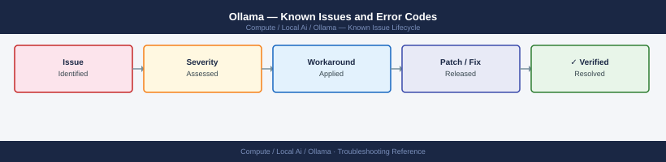

---
tags:
  - troubleshooting
  - ollama
  - local-ai
  - known-issues
---
# Ollama — Known Issues and Error Codes

<div class="kb-summary">
Catalog of known Ollama bugs, error codes, and workarounds covering model loading, GPU offload, and API server issues.

*Applies to: Ollama 0.3.x / 0.4.x*
</div>



```d2
direction: down

symptom: Identify Symptom {shape: diamond}
model_loading: "Model Loading" {shape: rectangle}
api_server: "API Server" {shape: rectangle}
performance: "Performance" {shape: rectangle}
resolution: Resolve or Escalate {shape: oval}

symptom -> model_loading: investigate
symptom -> api_server: investigate
symptom -> performance: investigate
model_loading -> resolution
api_server -> resolution
performance -> resolution
```

## Before you begin

- Ollama logs: `journalctl -u ollama` (systemd) or `ollama serve --verbose` for debug output.
- `ollama ps` shows currently loaded models and GPU/CPU memory allocation.
- GPU support requires CUDA 12.x; verify with `nvidia-smi` before assuming GPU offload.

## Model Loading

| Error / Symptom | Affected Versions | Cause | Workaround / Fix | Fixed In |
|---|---|---|---|---|
| `Error: model not found` | Ollama 0.3+ | Model name typo or model not pulled | Run `ollama pull <model>`; list with `ollama list` | N/A |
| Model runs on CPU only despite GPU present | Ollama 0.3+ | CUDA not found by Ollama; missing CUDA libraries | Install CUDA 12.x; verify `ldconfig -p | grep libcuda`; restart Ollama | N/A |
| `Context length exceeded` | Ollama 0.3+ | Prompt exceeds model's configured context window | Use `num_ctx` parameter in Modelfile or via API `options.num_ctx` | N/A |

## API Server

| Error / Symptom | Affected Versions | Cause | Workaround / Fix | Fixed In |
|---|---|---|---|---|
| Ollama API returning `connection refused` on port 11434 | Ollama 0.3+ | Ollama service not running | Start: `ollama serve` or `systemctl start ollama` | N/A |
| `Cannot bind to 0.0.0.0:11434 — port in use` | Ollama 0.3+ | Another process using port 11434 | Kill conflicting process: `lsof -i :11434`; restart Ollama | N/A |
| Remote clients cannot reach Ollama API | Ollama 0.3+ | Ollama bound to 127.0.0.1 only | Set: `OLLAMA_HOST=0.0.0.0` environment variable; restart Ollama | N/A |

## Performance

| Error / Symptom | Affected Versions | Cause | Workaround / Fix | Fixed In |
|---|---|---|---|---|
| Very slow inference on GPU | Ollama 0.3+ | Model too large for VRAM; partially offloaded to CPU | Use smaller quantized model (Q4_K_M); check `ollama ps` for GPU layers count | N/A |

## See also

- [GPU — Known Issues](../../gpu/troubleshooting/known-issues.md)
