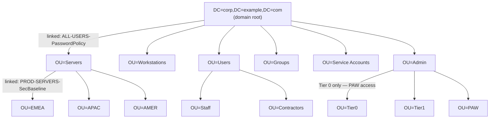
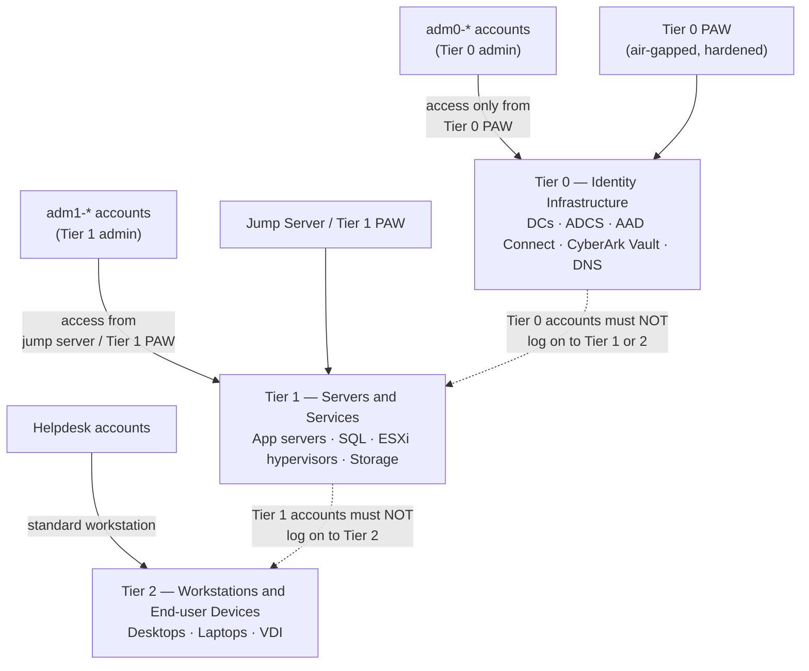

# Active Directory Standards


<div class="kb-summary">
Organisational standards for OU structure, naming conventions, group policy design, and privileged access. Consistent standards reduce delegation complexity, enable scoped GPO application, and simplify access reviews.
</div>
```text
┌─────────────── Security Active Directory Architecture — Architecture Design Standards ────────────────┐
│                                                                                                       │
│   ┌───────────────────────────────────────────────────────────────────────────────────────────────┐   │
│   │  Active Directory design standards: network isolation, redundancy, sizing, naming conventions │   │
│   │          Network: dedicated storage VLAN; jumbo frames for iSCSI; dual-fabric for FC          │   │
│   │          Redundancy: dual controllers, multipath I/O, and no single points of failure         │   │
│   │       Monitoring: set capacity and latency alerts; baseline performance after deployment      │   │
│   └───────────────────────────────────────────────────────────────────────────────────────────────┘   │
│                                                                                                       │
│    Requirements → architecture design → redundancy review → size → deploy                             │
│                                                                                                       │
│                  ▼                                ▼                                ▼                  │
│                                                                                                       │
│   ┌─────────────────────────────┐  ┌─────────────────────────────┐  ┌─────────────────────────────┐   │
│   │            Layer            │  │          Component          │  │            Notes            │   │
│   │             Core            │  │       Primary service       │  │        Main function        │   │
│   │          Management         │  │        Control plane        │  │         Admin access        │   │
│   │          Monitoring         │  │         Health/perf         │  │      Alerts/dashboards      │   │
│   │           Security          │  │         Auth/encrypt        │  │        Access control       │   │
│   │         Integration         │  │        APIs/plug-ins        │  │         Third-party         │   │
│   └─────────────────────────────┘  └─────────────────────────────┘  └─────────────────────────────┘   │
│                                                                                                       │
│                          ▼                                                 ▼                          │
│                                                                                                       │
│   ┌───────────────────────────────────────────────────────────────────────────────────────────────┐   │
│   │      Layer       │    Component     │      Function     │      Notes       │       Auth       │   │
│   │       Core       │ Primary service  │   Main function   │     See docs     │       RBAC       │   │
│   │    Management    │  Control plane   │    Admin access   │     See docs     │       RBAC       │   │
│   │    Monitoring    │   Health/perf    │  Alerts/dashboard │     See docs     │       RBAC       │   │
│   │     Security     │   Auth/encrypt   │   Access control  │     See docs     │       RBAC       │   │
│   └───────────────────────────────────────────────────────────────────────────────────────────────┘   │
│                                                                                                       │
│    Physical: Security Active Directory Architecture infrastructure · management network · monitoring  │
│                                                                                                       │
│    Key terms:                                                                                         │
│                                                                                                       │
│    Active Directory   = Security Active Directory Architecture platform overview and core concepts    │
│    Management         = management console and command-line interface for administration              │
│    Monitoring         = health and performance monitoring dashboards and alerting                     │
│    Automation         = REST API, scripting, and pipeline integration capabilities                    │
│    Security           = access control, authentication, and encryption configuration                  │
│    Backup             = backup and recovery procedures and schedule configuration                     │
│    Upgrade            = software version upgrades and firmware patching procedures                    │
│    Troubleshooting    = diagnostic procedures and common issue resolution steps                       │
│    Escalation         = vendor support escalation path and severity triage process                    │
│    Documentation      = vendor knowledge base and official product documentation                      │
│    Change management  = change ticket requirements for production modifications                       │
│    Audit log          = admin action logging for compliance and security review                       │
│                                                                                                       │
└───────────────────────────────────────────────────────────────────────────────────────────────────────┘
```


---
## OU and GPO Hierarchy



## OU Structure

Top-level OUs are functional (Servers, Workstations, Users, Groups, Service Accounts). Geographic sub-OUs are used where region-specific GPO or delegation is required.

```text
DC=corp,DC=example,DC=com
├── OU=Servers
│   ├── OU=EMEA
│   ├── OU=APAC
│   └── OU=AMER
├── OU=Workstations
│   ├── OU=EMEA
│   └── OU=AMER
├── OU=Users
│   ├── OU=Staff
│   ├── OU=Contractors
│   └── OU=External
├── OU=Groups
│   ├── OU=Security
│   └── OU=Distribution
├── OU=Service Accounts
│   └── OU=Managed
└── OU=Admin
    ├── OU=Tier0
    ├── OU=Tier1
    └── OU=PAW
```

Rules:
- Computers must always be in the correct OU before GPO applies — do not leave in the default `CN=Computers` container.
- User objects must not be placed in the `CN=Users` container.
- The `OU=Admin` subtree is protected with `AdminSDHolder`-style ACL review and delegated only to Tier 0 admins.

---

## Naming Conventions

### User Accounts

| Type | Format | Example |
|---|---|---|
| Standard user | `firstname.lastname` | `john.smith` |
| Admin account (Tier 1) | `adm1-jsmith` | `adm1-jsmith` |
| Admin account (Tier 0) | `adm0-jsmith` | `adm0-jsmith` |
| Service account | `svc-<appname>` | `svc-vcenter` |
| Generic / shared | `gen-<purpose>` | `gen-monitoring` |

### Group Accounts

| Scope | Prefix | Example |
|---|---|---|
| Global group | `GG_` | `GG_Server_Admins` |
| Domain Local group | `DL_` | `DL_FileShare_HR_RW` |
| Universal group | `UG_` | `UG_Enterprise_Admins` |
| Distribution list | `DL_DIST_` | `DL_DIST_IT_Team` |

Role-based access groups follow: `GG_<System>_<Role>` (e.g., `GG_vCenter_ReadOnly`, `GG_CyberArk_SafeOwners`).

### Computer Accounts

Format: `<SITE><TYPE><NN>` — e.g., `LDNDC01` (London Domain Controller 01), `NYCWS042` (New York Workstation 042).

---

## Group Policy Standards

### GPO Naming

Pattern: `ENV-SCOPE-PURPOSE`

| Example GPO Name | Description |
|---|---|
| `PROD-SERVERS-SecBaseline` | Security baseline for production servers |
| `PROD-WORKSTATIONS-BitLocker` | BitLocker enforcement on all workstations |
| `PROD-DCs-AuditPolicy` | Advanced audit policy for Domain Controllers |
| `LAB-SERVERS-SecBaseline` | Security baseline for lab servers |
| `ALL-USERS-PasswordPolicy` | Password policy applied at domain level |

### GPO Design Rules

- One GPO, one purpose — do not combine unrelated settings in a single GPO.
- Never edit the **Default Domain Policy** or **Default Domain Controllers Policy** directly. Create new GPOs for any changes and link at the appropriate level.
- Use **WMI filters** or **Security Filtering** to target sub-populations rather than creating OUs for GPO scoping alone.
- All GPOs must have a comment describing their purpose and the date last reviewed.

```powershell
# Set a GPO description / comment
Set-GPO -Name "PROD-SERVERS-SecBaseline" -Comment "CIS L1 baseline. Last reviewed 2025-11-01. Owner: infra-sec."

# Generate an HTML report for a GPO before changes
Get-GPOReport -Name "PROD-SERVERS-SecBaseline" -ReportType Html -Path "C:\Temp\pre-change-report.html"
```

---

## Password Policy Standards

Default domain policy and Fine-Grained Password Policies (PSOs):

| Policy | Min Length | Max Age | Complexity | Applies To |
|---|---|---|---|---|
| Domain Default | 14 chars | 90 days | Required | All users |
| PSO: Service Accounts | 20 chars | 90 days | Required | `svc-*` accounts |
| PSO: Admin Accounts | 20 chars | 60 days | Required | `adm0-*`, `adm1-*` |
| PSO: CyberArk Managed | 30 chars | Per CPM policy | N/A | Rotated by CPM |

```powershell
# View existing PSOs
Get-ADFineGrainedPasswordPolicy -Filter * | Select-Object Name, MinPasswordLength, MaxPasswordAge, Precedence

# Apply a PSO to a group
Add-ADFineGrainedPasswordPolicySubject -Identity "PSO_ServiceAccounts" -Subjects "GG_ServiceAccounts"
```

---

## Kerberos Settings

| Setting | Value |
|---|---|
| TGT lifetime | 10 hours |
| Max renewal period | 7 days |
| Clock skew tolerance | 5 minutes |
| Encryption types | AES256-CTS-HMAC-SHA1-96, AES128; RC4 disabled via GPO |

Disable RC4 via GPO: **Computer Config > Windows Settings > Security Settings > Local Policies > Security Options > Network security: Configure encryption types allowed for Kerberos**.

---

## Tiered Administration Model



## Privileged Access Model (Tiering)

| Tier | Scope | Examples |
|---|---|---|
| Tier 0 | AD, PKI, CyberArk Vault, DNS | `adm0-*` accounts; access from PAW only |
| Tier 1 | Servers, hypervisors, storage | `adm1-*` accounts; access from jump server |
| Tier 2 | Workstations, end-user devices | Helpdesk accounts; local admin via LAPS |

- Tier 0 accounts must not log on to Tier 1 or Tier 2 systems (enforced via logon restriction GPO and Authentication Policies).
- Privileged Access Workstations (PAWs) are dedicated hardened hosts for Tier 0 and Tier 1 administration.
- All Tier 0 and Tier 1 admin accounts are onboarded to CyberArk for credential management and session recording.
