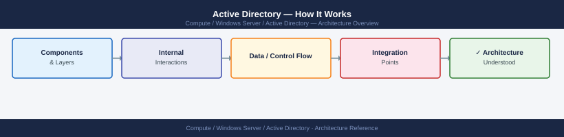
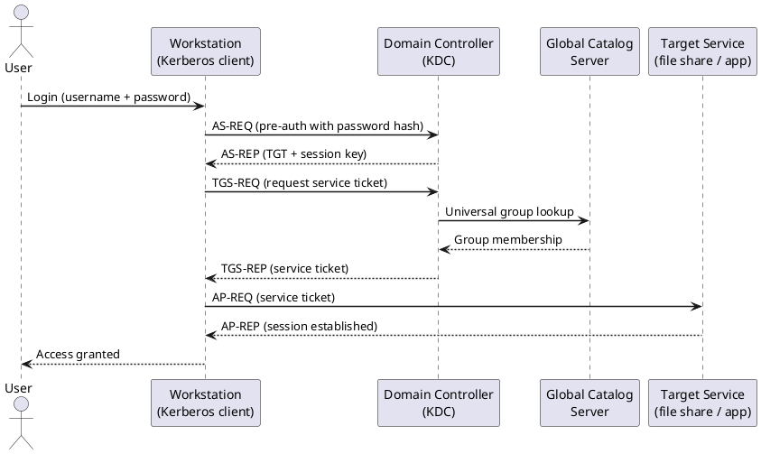
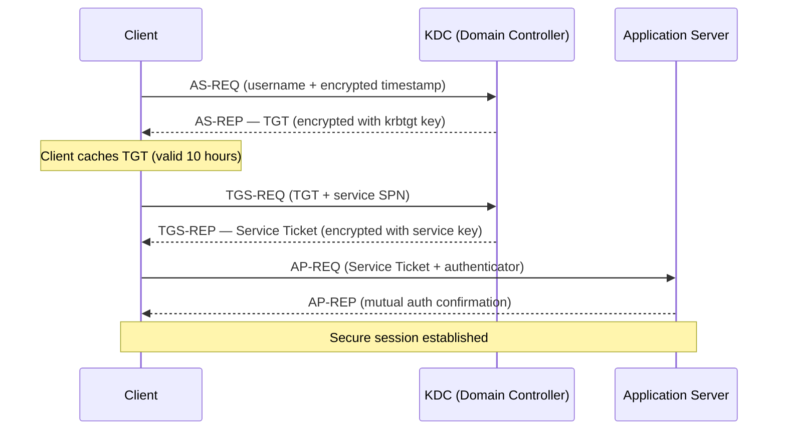
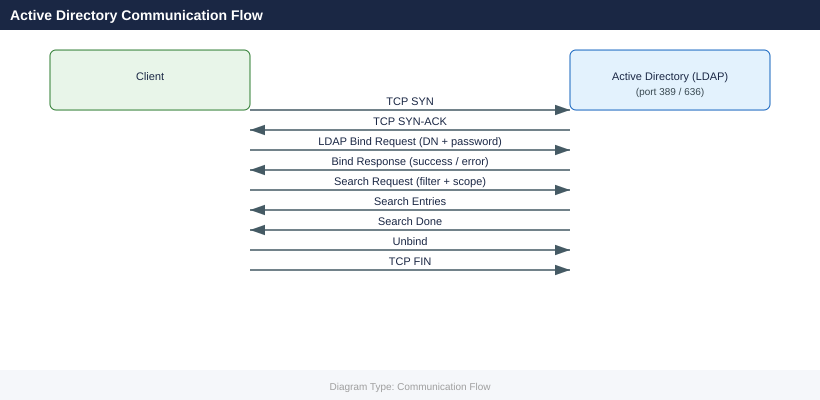

---
tags:
  - architecture
  - windows
description: "How It Works reference covering Forest and Domain Hierarchy, Core Components, FSMO Role Placement, Key Services and Ports, Replication Topology and 4 more..."
---
# Active Directory — How It Works

<div class="kb-summary">
How It Works reference covering Forest and Domain Hierarchy, Core Components, FSMO Role Placement, Key Services and Ports, Replication Topology and 4 more sections.

*Applies to: Active Directory (Windows Server 2019 / 2022)*
</div>




## Forest and Domain Hierarchy

Active Directory is organised in a Forest → Domain → OU hierarchy:

```d2
direction: right

FOREST: "AD Forest\n(security boundary" {shape: rectangle}
ROOT: "Forest Root Domain\ncorp.example.com" {shape: rectangle}
DC1: "DC-01 Site A\nPDC · RID · Infra Master" {shape: rectangle}
DC2: "DC-02 Site A\nGlobal Catalog" {shape: rectangle}
DC3: "DC-03 · DC-04\nSite B — replica DCs" {shape: rectangle}
CHILD: "Child Domain\ndivision.corp.example.com" {shape: rectangle}
CDC: "Child DC" {shape: rectangle}

FOREST -> ROOT
ROOT -> DC1
ROOT -> DC2
ROOT -> DC3
ROOT -> CHILD
CHILD -> CDC
```

The forest is the ultimate security boundary — Kerberos trust does not cross forest boundaries by default. Child domains share the forest schema and global catalog but have separate administrative boundaries.

---

## Core Components

| Component | Role |
|---|---|
| Forest Root Domain | Schema master, Enterprise Admins, trust anchor |
| Regional Domains | Administrative boundary per region or business unit |
| Domain Controller (DC) | Hosts AD database (NTDS.DIT), DNS, KDC, SYSVOL |
| Global Catalog (GC) | Partial attribute replica + universal group membership cache |
| FSMO Roles | Five single-master operations (see below) |
| Sites & Site Links | Control replication topology and DC/KDC selection |
| SYSVOL | Shared folder replicated via DFSR; holds GPO templates and logon scripts |

---

## FSMO Role Placement

| FSMO Role | Scope | Recommended DC |
|---|---|---|
| Schema Master | Forest-wide | Forest root DC 1 |
| Domain Naming Master | Forest-wide | Forest root DC 1 |
| PDC Emulator | Per domain | Most capable DC; close to users (time source) |
| RID Master | Per domain | Same site as PDC Emulator preferred |
| Infrastructure Master | Per domain | Not a GC DC (if single-domain, can be GC) |

```powershell
netdom query fsmo /domain:corp.local
Get-ADDomain | Select-Object InfrastructureMaster, RIDMaster, PDCEmulator
Get-ADForest | Select-Object SchemaMaster, DomainNamingMaster
```

---

## Key Services and Ports

| Service | Port | Protocol | Purpose |
|---|---|---|---|
| LDAP | 389 | TCP/UDP | Directory queries |
| LDAPS | 636 | TCP | Encrypted directory queries |
| Global Catalog | 3268 | TCP | Universal group membership |
| Global Catalog SSL | 3269 | TCP | Encrypted GC queries |
| Kerberos | 88 | TCP/UDP | Authentication tickets |
| DNS | 53 | TCP/UDP | Name resolution (AD-integrated DNS) |
| RPC (replication) | 135 + dynamic | TCP | DC-to-DC replication |
| SMB (SYSVOL) | 445 | TCP | SYSVOL/DFSR replication |
| WinRM | 5985/5986 | TCP | Remote management |

---

## Replication Topology

The KCC (Knowledge Consistency Checker) auto-generates the replication topology. Intra-site replication is frequent and near-real-time; inter-site replication is scheduled via site links.

```d2
direction: right

siteA: "Site A — London" {shape: rectangle}
dc01: "DC-01\nPDC Emulator\nRID Master" {shape: rectangle}
dc02: "DC-02\nGlobal Catalog" {shape: rectangle}
dc03: "DC-03\nSite A replica" {shape: rectangle}
siteB: "Site B — New York" {shape: rectangle}
dc04: "DC-04\nGlobal Catalog" {shape: rectangle}
dc05: "DC-05\nSite B replica" {shape: rectangle}
siteC: "Site C — Singapore" {shape: rectangle}
dc06: "DC-06\nSite C GC" {shape: rectangle}

siteA -> dc01
siteA -> dc02
siteA -> dc03
siteB -> dc04
siteB -> dc05
siteC -> dc06
```

```powershell
# Check replication health
repadmin /showrepl
repadmin /replsummary
dcdiag /test:replications /v
```

---

## DC High Availability Design

Minimum two Domain Controllers per site:

- DC1: PDC Emulator, RID Master for the site's domain
- DC2: Infrastructure Master, GC (if only one domain — GC on both)
- Both DCs act as DNS servers for the site

FSMO roles should be seized only if DC1 cannot be restored within 24 hours.

---

## Active Directory Database

The AD database file is `NTDS.DIT`:

```text
Location: C:\Windows\NTDS\NTDS.DIT
Log files: C:\Windows\NTDS\*.log (EDB transaction logs)
SYSVOL:    C:\Windows\SYSVOL\sysvol\<domain>\
```

```powershell
# System State backup includes NTDS.DIT
wbadmin start systemstatebackup -backupTarget:D:
```

---

## Kerberos Authentication



---

## LDAP Bind Flow



---

## See also

- [Active Directory — Design Standards](../design-standards/)
- [Active Directory — Integrations](../integrations/)
- [Active Directory — Deploy](../../deploy/)
