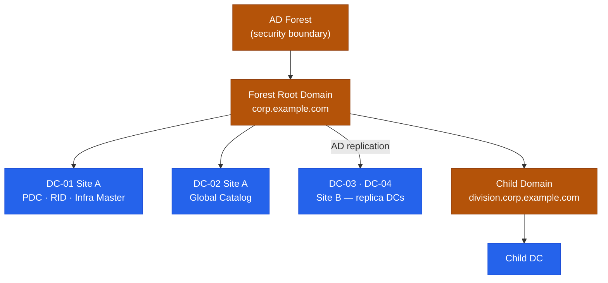

# Active Directory — Architecture

<div class="kb-summary">
Windows Server Active Directory forest with multi-site domain controllers, Kerberos authentication, LDAP directory services, and FSMO role delegation across primary and replica DCs.
</div>
```text
┌──────────────────────── Security Active Directory Architecture — Architecture ────────────────────────┐
│                                                                                                       │
│   ┌───────────────────────────────────────────────────────────────────────────────────────────────┐   │
│   │    Active Directory architecture overview: Security Active Directory Architecture platform    │   │
│   │                                  Protocols: Various protocols                                 │   │
│   │   Key components: Security Active Directory Architecture, Management, Monitoring, Automation  │   │
│   │          Design principles: HA, scalability, non-disruptive operations, and security          │   │
│   └───────────────────────────────────────────────────────────────────────────────────────────────┘   │
│                                                                                                       │
│    Design → deploy → configure → validate → monitor → optimise                                        │
│                                                                                                       │
│                  ▼                                ▼                                ▼                  │
│                                                                                                       │
│   ┌─────────────────────────────┐  ┌─────────────────────────────┐  ┌─────────────────────────────┐   │
│   │            Layer            │  │          Component          │  │            Notes            │   │
│   │             Core            │  │       Primary service       │  │        Main function        │   │
│   │          Management         │  │        Control plane        │  │         Admin access        │   │
│   │          Monitoring         │  │         Health/perf         │  │      Alerts/dashboards      │   │
│   │           Security          │  │         Auth/encrypt        │  │        Access control       │   │
│   │         Integration         │  │        APIs/plug-ins        │  │         Third-party         │   │
│   └─────────────────────────────┘  └─────────────────────────────┘  └─────────────────────────────┘   │
│                                                                                                       │
│                          ▼                                                 ▼                          │
│                                                                                                       │
│   ┌───────────────────────────────────────────────────────────────────────────────────────────────┐   │
│   │      Layer       │    Component     │      Function     │      Notes       │       Auth       │   │
│   │       Core       │ Primary service  │   Main function   │     See docs     │       RBAC       │   │
│   │    Management    │  Control plane   │    Admin access   │     See docs     │       RBAC       │   │
│   │    Monitoring    │   Health/perf    │  Alerts/dashboard │     See docs     │       RBAC       │   │
│   │     Security     │   Auth/encrypt   │   Access control  │     See docs     │       RBAC       │   │
│   └───────────────────────────────────────────────────────────────────────────────────────────────┘   │
│                                                                                                       │
│    Physical: Security Active Directory Architecture infrastructure · management network · monitoring  │
│                                                                                                       │
│    Key terms:                                                                                         │
│                                                                                                       │
│    Active Directory   = Security Active Directory Architecture platform overview and core concepts    │
│    Management         = management console and command-line interface for administration              │
│    Monitoring         = health and performance monitoring dashboards and alerting                     │
│    Automation         = REST API, scripting, and pipeline integration capabilities                    │
│    Security           = access control, authentication, and encryption configuration                  │
│    Backup             = backup and recovery procedures and schedule configuration                     │
│    Upgrade            = software version upgrades and firmware patching procedures                    │
│    Troubleshooting    = diagnostic procedures and common issue resolution steps                       │
│    Escalation         = vendor support escalation path and severity triage process                    │
│    Documentation      = vendor knowledge base and official product documentation                      │
│    Change management  = change ticket requirements for production modifications                       │
│    Audit log          = admin action logging for compliance and security review                       │
│                                                                                                       │
└───────────────────────────────────────────────────────────────────────────────────────────────────────┘
```


<div class="kb-grid kb-grid-3">

<a class="kb-card" href="how-it-works/">
  <strong>How It Works</strong>
  <span>Forest hierarchy, FSMO roles, Kerberos auth, replication topology, and LDAP flows.</span>
</a>

<a class="kb-card" href="integrations/">
  <strong>Integrations</strong>
  <span>Integration with other platforms and external systems.</span>
</a>

<a class="kb-card" href="design-standards/">
  <strong>Design Standards</strong>
  <span>Sizing guidelines, design standards, and best practices.</span>
</a>

</div>

## FSMO Roles

| FSMO Role | Scope | Recommended DC |
|---|---|---|
| Schema Master | Forest-wide | Forest root DC 1 |
| Domain Naming Master | Forest-wide | Forest root DC 1 |
| PDC Emulator | Per domain | Most capable DC; close to users (time source) |
| RID Master | Per domain | Same site as PDC Emulator preferred |
| Infrastructure Master | Per domain | Not a GC DC (if single-domain, can be GC) |

## Forest and Domain Hierarchy


