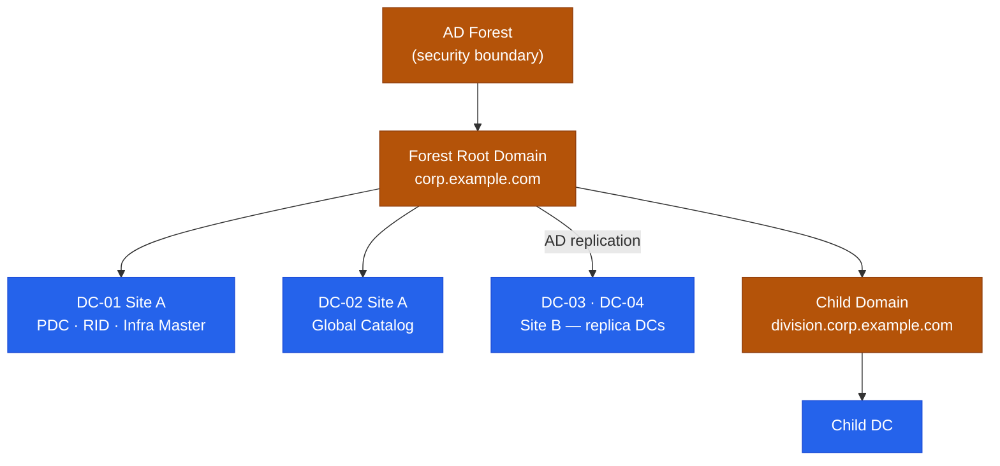

---
tags:
  - architecture
  - windows
---
# Active Directory — Architecture

<div class="kb-summary">
Windows Server Active Directory forest with multi-site domain controllers, Kerberos authentication, LDAP directory services, and FSMO role delegation across primary and replica DCs.

*Applies to: Active Directory (Windows Server 2019 / 2022)*
</div>

```text
┌─────────────────────── Active Directory — Identity and Directory Architecture ────────────────────────┐
│                                                                                                       │
│  AD DS on Windows DCs; LDAP + Kerberos; NTDS.dit database; multi-master replication;                  │
│  Sites and Services control topology; FSMO roles for single-master operations.                        │
│                                                                                                       │
│   ┌──────────────────────────────────────────────┐  ┌─────────────────────────────────────────────┐   │
│   │              Domain Controller               │  │             Directory Structure             │   │
│   │            NTDS.dit: AD database             │  │          Forest: top-level boundary         │   │
│   │            SYSVOL: GPO + scripts             │  │            Domain: admin boundary           │   │
│   │          Kerberos KDC: auth service          │  │           OU: Organizational Unit           │   │
│   │           LDAP 389/636: directory            │  │           Trust: cross-domain auth          │   │
│   │         DNS integrated: SRV records          │  │          Schema: object definitions         │   │
│   └──────────────────────────────────────────────┘  └─────────────────────────────────────────────┘   │
│                                                                                                       │
│  FSMO roles must be placed on reliable DCs; PDC Emulator is the most critical.                        │
│                                                                                                       │
│                          ▼                                                 ▼                          │
│                                                                                                       │
│   ┌──────────────────────────────────────────────┐  ┌─────────────────────────────────────────────┐   │
│   │             FSMO Roles (5 total)             │  │                 Replication                 │   │
│   │         Schema Master: 1 per forest          │  │         Multi-master: all DCs equal         │   │
│   │         Domain Naming: 1 per forest          │  │         USN: update sequence number         │   │
│   │          PDC Emulator: 1 per domain          │  │           KCC: auto-topology build          │   │
│   │           RID Master: 1 per domain           │  │           Sites: control WAN repl           │   │
│   │          Infra Master: 1 per domain          │  │          SYSVOL: DFS-R replication          │   │
│   └──────────────────────────────────────────────┘  └─────────────────────────────────────────────┘   │
│                                                                                                       │
│  Physical Infrastructure (the hardware everything above runs on):                                     │
│  2+ Domain Controllers per domain (HA); Windows Server 2019/2022 VMs; dedicated                       │
│  NIC; time sync critical (Kerberos 5-min skew tolerance); DNS on same VMs.                            │
│                                                                                                       │
│  Key terms:                                                                                           │
│                                                                                                       │
│  AD DS          = Active Directory Domain Services; the role providing identity                       │
│  DC             = Domain Controller; server running AD DS; holds NTDS.dit                             │
│  NTDS.dit       = Jet database file storing all AD objects and attributes                             │
│  SYSVOL         = shared folder on DCs; holds GPOs and logon scripts                                  │
│  FSMO           = Flexible Single Master Operations; 5 special AD roles                               │
│  PDC Emulator   = handles password changes, time sync, legacy NT auth                                 │
│  RID Master     = issues pools of RIDs to DCs so they can create unique SIDs                          │
│  KCC            = Knowledge Consistency Checker; automatically builds repl topology                   │
│  USN            = Update Sequence Number; tracks changes on each DC                                   │
│  Site           = AD Sites and Services; maps to IP subnets; controls repl cost                       │
│  Trust          = relationship between domains/forests; enables cross-domain auth                     │
│  DFS-R          = Distributed File System Replication; replicates SYSVOL                              │
│                                                                                                       │
└───────────────────────────────────────────────────────────────────────────────────────────────────────┘
```




<div class="kb-grid kb-grid-3">

<a class="kb-card" href="how-it-works/">
  <strong>How It Works</strong>
  <span>Forest hierarchy, FSMO roles, Kerberos auth, replication topology, and LDAP flows.</span>
</a>

<a class="kb-card" href="integrations/">
  <strong>Integrations</strong>
  <span>Integration with other platforms and external systems.</span>
</a>

<a class="kb-card" href="design-standards/">
  <strong>Design Standards</strong>
  <span>Sizing guidelines, design standards, and best practices.</span>
</a>

</div>

## FSMO Roles

| FSMO Role | Scope | Recommended DC |
|---|---|---|
| Schema Master | Forest-wide | Forest root DC 1 |
| Domain Naming Master | Forest-wide | Forest root DC 1 |
| PDC Emulator | Per domain | Most capable DC; close to users (time source) |
| RID Master | Per domain | Same site as PDC Emulator preferred |
| Infrastructure Master | Per domain | Not a GC DC (if single-domain, can be GC) |

## Forest and Domain Hierarchy


