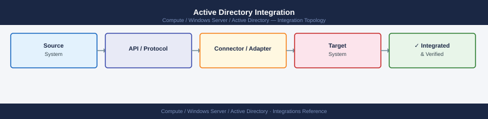
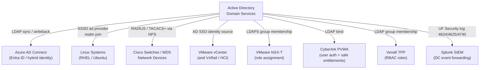

---
tags:
  - architecture
  - windows
---
# Active Directory Integration


<div class="kb-summary">
Active Directory serves as the central identity provider for the enterprise. Integrations span VMware infrastructure, Linux systems, network devices, security tooling, and SIEM platforms.

*Applies to: Active Directory (Windows Server 2019 / 2022)*
</div>



---

```d2
direction: right

center: "Active Directory" {shape: hexagon}
integration_overview: "Integration Overview" {shape: rectangle}
ad_integration_hub: "AD Integration Hub" {shape: rectangle}
service_account_standards: "Service Account Standards" {shape: rectangle}
vmware_vcenter_ldap_ad_sso_integrati: "VMware vCenter LDAP / AD SSO Integration" {shape: rectangle}
nsxt_ldap_integration: "NSX-T LDAP Integration" {shape: rectangle}
linux_sssd_pam_integration: "Linux SSSD / PAM Integration" {shape: rectangle}

center -> integration_overview
center -> ad_integration_hub
center -> service_account_standards
center -> vmware_vcenter_ldap_ad_sso_integrati
center -> nsxt_ldap_integration
center -> linux_sssd_pam_integration
```

## Integration Overview

| Integration | Method | Notes |
|---|---|---|
| Azure AD Connect (Entra ID) | LDAP sync + writeback | Password hash sync or PTA; staged rollout supported |
| Linux (SSSD/PAM) | SSSD `ad` provider | `realm join` for domain join; `/etc/sssd/sssd.conf` for config |
| Cisco switches / MDS | TACACS+ / RADIUS via NPS | NPS Network Policy maps AD groups to privilege levels |
| VMware vCenter | AD SSO integration | vCenter joined to AD domain; AD groups mapped to vCenter roles |
| VxRail / HCI | AD via vCenter SSO | Inherits vCenter AD integration; no separate join required |
| NSX-T | AD via LDAP | NSX Manager integrates directly via LDAPS for role assignment |
| SRM | AD via vCenter SSO | SRM uses vCenter SSO; no additional AD configuration required |
| CyberArk | LDAP bind from PVWA | Users authenticate via AD; safe access driven by AD group membership |
| Venafi TPP | LDAP / AD group membership | AD groups mapped to Venafi RBAC roles |
| Splunk (SIEM) | Windows Event Log forwarding | UF on DCs ships Security log; audit events 4624/4625/4740 indexed |

## AD Integration Hub



---

## Service Account Standards

All service accounts must follow these standards before being integrated with any platform:

- **Naming:** `svc-<appname>` (e.g., `svc-vcenter`, `svc-cyberark-ldap`)
- **OU placement:** `OU=Service Accounts,OU=Managed,DC=corp,DC=example,DC=com`
- **Password:** Minimum 30 characters; managed by CyberArk or a Fine-Grained Password Policy (PSO)
- **Kerberos delegation:** Disabled unless explicitly required; use constrained delegation only
- **SPNs:** Set explicitly with `setspn`; never use `setspn -A` without checking for conflicts

```powershell
# Create a service account with a strong random password
$pwd = ConvertTo-SecureString (New-Guid).Guid -AsPlainText -Force
New-ADUser -Name "svc-vcenter" `
  -SamAccountName "svc-vcenter" `
  -UserPrincipalName "svc-vcenter@corp.example.com" `
  -Path "OU=Service Accounts,OU=Managed,DC=corp,DC=example,DC=com" `
  -AccountPassword $pwd `
  -Enabled $true `
  -PasswordNeverExpires $false `
  -CannotChangePassword $true

# Check for duplicate SPNs before setting
setspn -Q "ldap/vcenter.corp.example.com"
setspn -S "ldap/vcenter.corp.example.com" svc-vcenter
```

---

## VMware vCenter LDAP / AD SSO Integration

vCenter uses the vSphere SSO domain (`vsphere.local`) as its primary identity source; AD is added as an additional identity source.

1. Navigate to **Administration > Single Sign On > Configuration > Identity Sources**.
2. Add source type: **Active Directory (Integrated Windows Authentication)** or **LDAP**.
3. For LDAPS, import the AD Domain Controller certificate into the vCenter trusted certificate store first.
4. Map AD groups to vCenter roles:

```powershell
# Verify LDAP connectivity from vCenter to AD (run on vCenter appliance)
ldapsearch -H ldaps://dc01.corp.example.com:636 \
  -D "svc-vcenter@corp.example.com" \
  -w '<password>' \
  -b "DC=corp,DC=example,DC=com" \
  "(sAMAccountName=testuser)" cn
```

---

## NSX-T LDAP Integration

NSX Manager connects to AD via LDAPS for user authentication and role mapping.

1. In NSX Manager, go to **System > User Management > LDAP**.
2. Add LDAP server with LDAPS (port 636); provide bind DN as `svc-nsx@corp.example.com`.
3. Test connection before saving.
4. Assign AD groups to NSX roles under **Role Assignments**.

Ensure the NSX service account has `Read` access to the domain and is placed in the service accounts OU.

---

## Linux SSSD / PAM Integration

```bash
# Install required packages (RHEL/CentOS)
yum install -y sssd sssd-ad realmd adcli oddjob oddjob-mkhomedir

# Join the domain (prompts for AD credentials with domain join rights)
realm join -U svc-linux-join corp.example.com

# Verify join
realm list

# Restrict login to a specific AD group
realm permit -g "Linux_Admins@corp.example.com"
```

Key `/etc/sssd/sssd.conf` settings:

```ini
[domain/corp.example.com]
id_provider        = ad
auth_provider      = ad
access_provider    = ad
ad_domain          = corp.example.com
ad_server          = dc01.corp.example.com, dc02.corp.example.com
ad_access_filter   = memberOf=CN=Linux_Admins,OU=Groups,DC=corp,DC=example,DC=com
fallback_homedir   = /home/%u
use_fully_qualified_names = False
```

---

## LDAPS Certificate Requirements

All integrations using LDAPS (port 636) require the following:

- The DC certificate must be issued by an internal CA trusted by the connecting system.
- The certificate Subject or SAN must match the DC hostname used in the LDAPS URI.
- Export the issuing CA certificate and import it into the trust store of each platform:

```bash
# Import CA cert into system trust store (RHEL/CentOS)
cp corp-issuing-ca.crt /etc/pki/ca-trust/source/anchors/
update-ca-trust

# Test LDAPS connectivity
openssl s_client -connect dc01.corp.example.com:636 -showcerts
```

---

## Splunk Universal Forwarder on Domain Controllers

```ini
# inputs.conf snippet for Security event log collection
[WinEventLog://Security]
disabled = 0
index = wineventlog
renderXml = true

# Recommended event IDs to index for AD monitoring:
# 4624 - Successful logon
# 4625 - Failed logon
# 4740 - Account lockout
# 4720 - User account created
# 4726 - User account deleted
# 4728/4732/4756 - Member added to security group
```

---

## See also

- [Active Directory — How It Works](how-it-works/)
- [Active Directory — Design Standards](design-standards/)
