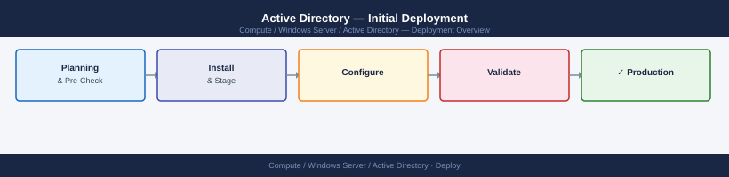

---
tags:
  - deployment
  - windows
search:
  boost: 1.5
---
# Active Directory — Initial Deployment

<div class="kb-summary">
Deploy a new Active Directory forest on Windows Server 2022 — first DC, DNS, NTP, replica DCs, OU structure, and security baseline GPO.

*Applies to: Windows Server 2019 / 2022*
</div>



## Before you begin

- **Access:** admin credentials for the target system and any upstream dependencies (DNS, NTP, vCenter, directory services)
- **Timing:** safe to run during a scheduled maintenance window; allow 1-2 hours for initial deployment
- **Dependencies:** network connectivity verified; DNS resolvable; NTP configured; any licence keys available
- **Logging:** record every IP address, hostname, and credential set assigned during this deployment

---


---

## Prerequisites — Hardware and Network

| Component | Minimum |
|-----------|---------|
| OS | Windows Server 2022 Standard or Datacenter |
| vCPU | 2 |
| RAM | 4 GB |
| Disk | 80 GB (separate volume for NTDS database recommended) |
| Network | Static IP, DNS resolvable FQDN |
| Time | NTP source reachable before promotion |

Confirm the server hostname resolves forward and reverse in DNS before proceeding.

```powershell
Resolve-DnsName <hostname>
```

---

## Install Active Directory Domain Services

Install the AD DS role and management tools on the server that will become the first domain controller.

```powershell
Install-WindowsFeature AD-Domain-Services -IncludeManagementTools
```

Verify the role installed successfully:

```powershell
Get-WindowsFeature AD-Domain-Services
```

Expected output: `Install State: Installed`.

---

## Promote the First Domain Controller (New Forest)

Promote the server and create the new forest. Replace `corp.local` and `CORP` with your domain name and NetBIOS name.

```powershell
Install-ADDSForest `
    -DomainName "corp.local" `
    -DomainNetbiosName "CORP" `
    -InstallDns `
    -SafeModeAdministratorPassword (Read-Host -AsSecureString) `
    -Force
```

The server will reboot automatically. After reboot, log in as `CORP\Administrator`.

Verify forest creation:

```powershell
Get-ADForest
Get-ADDomain
```

---

## Configure DNS Forwarders

After promotion the DNS Server role is active. Configure forwarders so internal clients can resolve external names.

```powershell
Set-DnsServerForwarder -IPAddress 8.8.8.8, 8.8.4.4
```

Verify forwarders are set:

```powershell
Get-DnsServerForwarder
```

Test external resolution from the DC:

```powershell
Resolve-DnsName google.com
```

---

## Configure NTP on Domain Controller

The PDC Emulator must synchronise with an external time source. All other DCs and domain members sync from the PDC Emulator automatically.

```powershell
w32tm /config /manualpeerlist:"time.windows.com" /syncfromflags:manual /reliable:yes /update
Restart-Service w32tm
w32tm /resync /force
```

Verify synchronisation:

```powershell
w32tm /query /status
```

Confirm `Stratum` is 2 or lower and `Last Successful Sync Time` is recent.

---

## Add Replica Domain Controllers

Deploying at least two DCs in every site provides fault tolerance. Repeat the steps below for each additional DC.

**Step 1 — Install the AD DS role on the new server:**

```powershell
Install-WindowsFeature AD-Domain-Services -IncludeManagementTools
```

**Step 2 — Promote as a replica DC:**

```powershell
Install-ADDSDomainController `
    -DomainName "corp.local" `
    -InstallDns `
    -Credential (Get-Credential) `
    -Force
```

The server reboots and joins the domain as a domain controller. Replication begins immediately after reboot.

Verify the new DC is registered:

```powershell
Get-ADDomainController -Filter *
```

---

## Create Organisational Unit Structure

A clear OU hierarchy is the foundation of GPO scope and delegation. Adjust the structure to your organisation.

```powershell
# Top-level OUs
New-ADOrganizationalUnit -Name "Servers"    -Path "DC=corp,DC=local"
New-ADOrganizationalUnit -Name "Workstations" -Path "DC=corp,DC=local"
New-ADOrganizationalUnit -Name "Users"      -Path "DC=corp,DC=local"
New-ADOrganizationalUnit -Name "Groups"     -Path "DC=corp,DC=local"
New-ADOrganizationalUnit -Name "ServiceAccounts" -Path "DC=corp,DC=local"

# Server sub-OUs
New-ADOrganizationalUnit -Name "Domain Controllers" -Path "OU=Servers,DC=corp,DC=local"
New-ADOrganizationalUnit -Name "Member Servers"     -Path "OU=Servers,DC=corp,DC=local"
New-ADOrganizationalUnit -Name "File Servers"       -Path "OU=Servers,DC=corp,DC=local"
```

Verify structure:

```powershell
Get-ADOrganizationalUnit -Filter * | Select-Object Name, DistinguishedName
```

---

## Apply Security Baseline GPO

Download the Microsoft Security Compliance Toolkit from Microsoft, extract the Windows Server 2022 Security Baseline GPO, and import it.

```powershell
# Import the GPO backup (adjust GpoName and Path to match your download)
Import-GPO -BackupGpoName "MSFT Windows Server 2022 - Domain Controller" `
           -Path "C:\SCT\GPOs" `
           -TargetName "Server Baseline - Domain Controllers" `
           -CreateIfNeeded
```

Link the GPO to the Domain Controllers OU:

```powershell
New-GPLink -Name "Server Baseline - Domain Controllers" `
           -Target "OU=Domain Controllers,OU=Servers,DC=corp,DC=local"
```

Force policy refresh and verify:

```powershell
gpupdate /force
gpresult /r
```

Confirm the GPO name appears under `Applied Group Policy Objects`.

---

## Validate the Deployment

Run all checks from an elevated PowerShell session on a DC.

**Replication health:**

```powershell
repadmin /showrepl
repadmin /replsummary
```

No failures should be listed. All DCs should show `0 consecutive failures`.

**DNS health:**

```powershell
dcdiag /test:dns /v
```

All tests should pass. Investigate any `FAIL` entries before proceeding.

**Secure channel and Kerberos:**

```powershell
nltest /sc_verify:corp.local
klist tickets
```

**General DC health:**

```powershell
dcdiag /test:replications /test:services /test:fsmocheck /v
```

**FSMO role placement:**

```powershell
netdom query fsmo
```

All five FSMO roles (Schema Master, Domain Naming Master, PDC Emulator, RID Master, Infrastructure Master) should be assigned.

---

## Verify

- Confirm the service or component is running and reachable
- Check management UI for any errors or warnings
- Run a basic functional test (login, read, write) to confirm end-to-end operation

---

## See also

- [Active Directory — Procedures](../operations/procedures/)
- [Active Directory — Common Issues](../troubleshooting/common-issues/)
- [Active Directory — How It Works](../architecture/how-it-works/)
