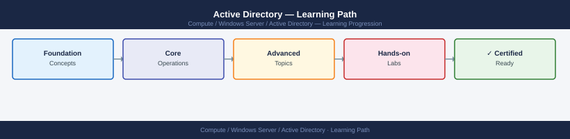

---
tags:
  - learning-path
  - windows
---
# Active Directory — Learning Path

Recommended reading order for Active Directory. Follow these stages in order to build a complete mental model before working with it in production.

*Applies to: Active Directory (Windows Server 2019 / 2022)*

| Stage | Focus | Time investment |
|-------|-------|----------------|
| 1 — Architecture | Forest/domain model, FSMO, Kerberos, sites | 5–6 h |
| 2 — Deployment | DC promotion, DNS, site/site-link, functional level | 3–4 h |
| 3 — Operations | repadmin, dcdiag, GPO, FSMO, Recycle Bin | ongoing |
| 4 — Security | Tiered access, Kerberos hardening, Protected Users | 3–4 h |
| 5 — Troubleshooting | Replication failures, Kerberos errors, lockouts | as needed |

---

## Stage 1 — Architecture

**Goal**: Understand the AD logical model (forest, domain, OU, trust) and physical model (sites, site links, DC placement) and how Kerberos authentication flows through the domain.

**Read in this order**:

- [How It Works](../architecture/how-it-works/) — forest and domain model (forest as security boundary, domain as admin boundary), FSMO roles (Schema Master, Domain Naming Master, PDC Emulator, RID Master, Infrastructure Master) and their failure impacts, the AD multi-master replication model (KCC-generated topology, USN and up-to-dateness vector), Kerberos authentication flow (AS_REQ → TGT → TGS_REQ → service ticket → service auth), and DNS as the AD locator mechanism
- [Design Standards](../architecture/design-standards/) — OU hierarchy design for GPO targeting and administrative delegation (not for organising by department — use groups instead), site and site-link design for replication cost and schedule control, DC placement (at least two DCs per site), and domain and forest functional level selection criteria
- [Integrations](../architecture/integrations/) — Entra Connect (Azure AD Connect) for hybrid identity synchronisation to Entra ID, LDAP integration for Linux/Unix and third-party application authentication, RADIUS via NPS for network device authentication, and trust relationships (external, forest, shortcut)

**Key concepts before moving on**:

- The PDC Emulator FSMO is the most critical role for day-to-day operations — it handles password changes, account lockout arbitration, Group Policy updates, and time synchronisation for the domain
- Site topology controls replication scheduling and costs; a missing site or site link for a remote office means replication traffic crosses WAN links uncontrolled
- SYSVOL replication (DFS-R in modern environments) distributes Group Policy templates and logon scripts — a SYSVOL replication failure causes GPOs to not apply even if AD replication is healthy
- Every Kerberos authentication relies on time synchronisation (5-minute skew tolerance) — if a DC or client clock drifts, authentication failures follow immediately

**Why first**: AD design decisions — OU hierarchy, site topology, trust scope, functional level — are extremely difficult to change after users and computers are in production. Get the logical and physical model right before promoting the first DC.

---

## Stage 2 — Deployment

**Goal**: Promote domain controllers with correct DNS and replication configuration, and establish a healthy initial forest.

**Read**:

- [Deploy](../deploy/) — forest creation (`Install-ADDSForest -DomainName corp.example.com`), DC promotion into existing domain, DNS delegation for child domains, initial site and site-link configuration, and Global Catalog placement decisions
- [Install & Upgrade](../operations/install-upgrade/) — in-place DC OS upgrade procedure (add new DC at higher OS version → transfer FSMO roles → demote old DC), raising domain and forest functional level, and adding a read-only DC (RODC) to a branch site

**Deployment principles**:

- Always have at least two DCs in the root domain — a single DC with all FSMO roles is a single point of failure that takes hours to recover if the hardware fails
- Deploy DNS on all DCs and configure AD-integrated zones — do not use a standalone DNS server as the AD locator
- Enable the AD Recycle Bin at forest functional level 2008 R2 or higher immediately after forest creation — it cannot be disabled once enabled and requires no maintenance

---

## Stage 3 — Operations

**Goal**: Keep AD healthy — monitoring replication, FSMO role availability, and GPO application on every shift.

**Read in this order**:

- [Health Checks](../operations/health-checks/) — run the routine first on every shift; `repadmin /replsummary` for replication failures, `dcdiag /test:replications /test:netlogons /test:services` for DC health, SYSVOL replication status via `dfsrdiag ReplicationState`, FSMO role holder confirmation with `netdom query fsmo`, and event log (Directory Service, DFS Replication) critical errors
- [CLI Reference](../operations/cli-reference/) — `dcdiag`, `repadmin /showrepl`, `nltest /sc_query:domain`, `netdom query fsmo`, `Get-ADUser`, `Get-ADComputer`, `Get-ADGroupMember`, `Get-GPO -All`, `gpresult /h report.html`, and `Get-ADReplicationFailure`
- [Procedures](../operations/procedures/) — seizing FSMO roles after DC failure (use `ntdsutil` or `Move-ADDirectoryServerOperationMasterRole -Force`), GPO link creation and block inheritance, OU delegation setup with `dsacls`, user/group lifecycle management including deprovisioning, and inter-forest trust validation with `nltest`
- [Backup & Restore](../operations/backup-restore/) — System State backup on at least two DCs in each domain, authoritative restore procedure for accidentally deleted objects (prefer AD Recycle Bin first), DSRM password rotation, and tombstone lifetime awareness (default 180 days)
- [Scripts](../operations/scripts/) — replication health daily report, stale computer account cleanup (>90 days since last logon), GPO settings export and comparison, FSMO role holder monitoring alert, and account lockout source identification script

**Daily rhythm**: `repadmin /replsummary` → `dcdiag` critical test subset → SYSVOL sync check → recent AD admin changes review.

---

## Stage 4 — Security

**Goal**: Protect privileged accounts, enforce Kerberos security, and detect lateral movement and credential theft across the domain.

**Read**:

- [Access Control](../security/access-control/) — tiered access model (Tier 0: DCs and AD, Tier 1: server admins, Tier 2: workstation admins), Protected Users security group (blocks NTLM, delegation, RC4 encryption, and credential caching), AdminSDHolder propagation for built-in admin group members, and fine-grained password policies via PSO for privileged accounts
- [Authentication](../security/authentication/) — Kerberos ticket policy (TGT lifetime 10h, renewal 7 days, max service ticket 10h), NTLM auditing and restriction (`Network Security: Restrict NTLM`), smart card / FIDO2 enforcement for Tier 0 accounts, and conditional access integration via Entra Connect
- [Encryption](../security/encryption/) — Kerberos AES256 enforcement (remove RC4/DES support), LDAP signing and channel binding (Event ID 2886 warning in DC logs), SMB signing enforcement on all DCs, and KRBTGT account password rotation procedure (two consecutive rotations required to invalidate all existing TGTs)
- [Hardening](../security/hardening/) — disabling LM and NTLMv1 via `Network security: LAN Manager authentication level` GPO, enabling Credential Guard on Tier 0 and Tier 1 workstations, auditing sensitive privilege use (Event IDs 4769 Kerberos ticket granted, 4776 NTLM auth, 4672 special privilege assigned), and tiered admin workstation (PAW) deployment for Tier 0 operations

---

## Stage 5 — Troubleshooting

**Goal**: Diagnose AD replication failures, Kerberos authentication errors, GPO application problems, and account lockouts accurately and quickly.

**Read**:

- [Common Issues](../troubleshooting/common-issues/) — replication failure (USN rollback — requires DC metadata cleanup and re-promotion; lingering objects — use `repadmin /removelingeringobjects`), Kerberos time skew (Event ID 14 in System log, clock drift > 5 minutes), GPO not applying (security group filter, WMI filter, loopback processing, OU block inheritance), and account lockout source (Event ID 4740 on PDC Emulator)
- [Diagnostics](../troubleshooting/diagnostics/) — `repadmin /showrepl * /errorsonly` for targeted replication failures, `dcdiag /v /test:all > dcdiag.txt` for full health output, `klist tickets` and `klist purge` for Kerberos ticket debugging, `NETLOGON.LOG` enable with `nltest /dbflag:0x2080ffff` for auth failures, `gpresult /h` for GPO application result, and Microsoft Account Lockout and Management Tools (ALTools)
- [Escalation](../troubleshooting/escalation/) — Microsoft CSS case with `dcdiag` and `repadmin /showrepl` output, Active Directory Recovery Mode (DSRM) boot for directory database repair, full forest recovery procedure for catastrophic multi-DC failure, and `ntdsutil` for authoritative restore and metadata cleanup

**Why last**: Troubleshooting makes most sense once you understand the replication topology, FSMO role dependencies, and how Kerberos token validation flows through the domain under normal conditions.

---

## See also

- [Active Directory — Deploy](../../deploy/)
- [Active Directory — Procedures](../../operations/procedures/)
- [Active Directory — Common Issues](../../troubleshooting/common-issues/)
