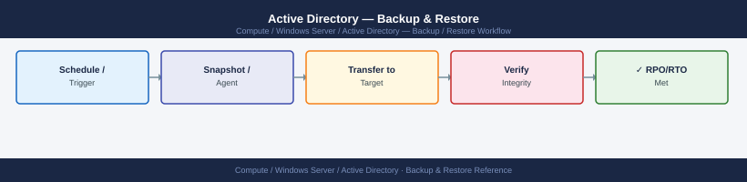
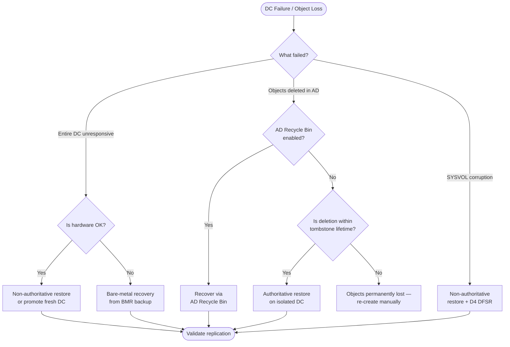

---
tags:
  - operations
  - windows
---
# Active Directory — Backup & Restore

<div class="kb-summary">
Protecting Active Directory requires regular System State backups of every Domain Controller, a tested restore procedure, and familiarity with AD-specific recovery modes.

*Applies to: Windows Server 2019 / 2022*
</div>


 This page covers the full lifecycle: backup strategy, restore decision logic, authoritative restore for accidentally deleted objects, and post-restore validation.

---

## Before you begin

- **Access:** Local Administrator or Domain Admin on target hosts
- **Timing:** safe to run during business hours unless a step is marked ⚠ (causes interruption)
- **Dependencies:** no active upgrades or migrations on the same infrastructure
- **Logging:** capture command output — paste into the change record on completion

---

## Backup Strategy Overview

| Backup Type | Scope | When to Use |
|---|---|---|
| System State | AD DS, SYSVOL, Registry, COM+ | Day-to-day DC protection |
| Bare-Metal Recovery (BMR) | Full OS + System State | DC hardware failure / rebuild |
| AD Database snapshot | ntds.dit + logs (VSS snapshot) | Read-only forensic/test copy |
| AD Recycle Bin | Tombstoned object recovery | Accidental object deletion (no backup required) |

**Minimum requirement:** At least one DC per domain per site must have a current System State backup that is within the tombstone lifetime (default 180 days).

---

## Windows Server Backup — System State

### Prerequisites

```powershell
# Install the Windows Server Backup feature on each DC
Install-WindowsFeature Windows-Server-Backup -IncludeManagementTools
```

### System State Backup to Network Share

```cmd
REM One-shot System State backup to a UNC path
wbadmin start systemstatebackup -backupTarget:\\backup-srv\DC-Backups -quiet

REM Check status / history
wbadmin get versions -backupTarget:\\backup-srv\DC-Backups
```

### Scheduled System State Backup (PowerShell)

```powershell
# Schedule daily System State backup at 02:00 to a local volume (D:)
$Policy = New-WBPolicy
$Target = New-WBBackupTarget -VolumePath "D:"
Add-WBBackupTarget -Policy $Policy -Target $Target
Add-WBSystemState -Policy $Policy
Set-WBSchedule -Policy $Policy -Schedule 02:00
Set-WBPolicy -Policy $Policy
```

> **Note:** System State backups cannot target a shared folder via the scheduled task GUI — use `wbadmin` from a scheduled Task or a dedicated backup agent.

### Bare-Metal Recovery (BMR) Backup

```cmd
REM Full BMR backup includes System State, boot volumes, and all critical volumes
wbadmin start backup ^
  -backupTarget:\\backup-srv\DC-BMR ^
  -include:C:,D: ^
  -allCritical ^
  -systemState ^
  -vssFull ^
  -quiet
```

---

## Restore Decision Flowchart



---

## Non-Authoritative Restore

Use when the DC's local AD database is corrupt or the DC was rebuilt, but other DCs in the domain hold the correct, up-to-date data. After restore, replication from surviving DCs overwrites the restored content.

### Procedure

1. Boot the DC into **Directory Services Restore Mode (DSRM)**:
   - At startup: press **F8** → *Directory Services Restore Mode*
   - Or: `bcdedit /set safeboot dsrepair` (reboot, then undo after restore)

2. Restore System State:

```cmd
REM List available backup versions
wbadmin get versions -backupTarget:\\backup-srv\DC-Backups

REM Restore (use the Version Identifier from the list above)
wbadmin start systemstaterecovery ^
  -version:MM/DD/YYYY-HH:MM ^
  -backupTarget:\\backup-srv\DC-Backups ^
  -authSysvol ^
  -quiet
```

3. Reboot normally. Replication will bring AD data current from other DCs.

---

## Authoritative Restore (Deleted Object Recovery)

Use when objects were deleted on a DC and that deletion has already replicated across the domain. You must restore an older copy of the database and mark the objects as authoritative so they replicate back out.

> **Warning:** Perform authoritative restore on a DC that is **isolated from the network** until after `ntdsutil` marking is complete.

### Procedure

1. Disconnect the DC from the network (or block AD replication ports).

2. Boot into DSRM and run a non-authoritative restore (steps above).

3. After restore completes, **do not reboot yet**. Open a command prompt in DSRM:

```cmd
ntdsutil
  activate instance ntds
  authoritative restore
  restore subtree "OU=Users,DC=corp,DC=example,DC=com"
  quit
  quit
```

For a single object:

```cmd
ntdsutil
  activate instance ntds
  authoritative restore
  restore object "CN=John Smith,OU=Users,DC=corp,DC=example,DC=com"
  quit
  quit
```

4. Reconnect the DC to the network and reboot normally.

5. The restored objects will replicate outbound with a higher USN, overriding the deletion on all other DCs.

---

## AD Recycle Bin Recovery

The AD Recycle Bin (available since Windows Server 2008 R2 Forest Functional Level) retains deleted objects with all their attributes intact for the duration of `msDS-deletedObjectLifetime` (defaults to tombstone lifetime).

### Enable the Recycle Bin (one-time, irreversible)

```powershell
Enable-ADOptionalFeature `
  -Identity 'Recycle Bin Feature' `
  -Scope ForestOrConfigurationSet `
  -Target (Get-ADForest).Name `
  -Confirm:$false
```

### Recover Deleted Objects

```powershell
# Find deleted objects by name
Get-ADObject -Filter {DisplayName -eq "John Smith"} -IncludeDeletedObjects

# Restore a single object
Get-ADObject -Filter {DisplayName -eq "John Smith"} -IncludeDeletedObjects |
  Restore-ADObject

# Restore an entire deleted OU and its contents
Get-ADObject -Filter {Name -eq "Marketing"} -IncludeDeletedObjects |
  Restore-ADObject

# Restore to an alternate parent OU
Restore-ADObject -Identity <ObjectGUID> -TargetPath "OU=Users,DC=corp,DC=example,DC=com"
```

---

## Tombstone Lifetime

The tombstone lifetime controls how long deleted objects remain in the AD database. After expiry, objects are permanently purged.

```powershell
# Check current tombstone lifetime (days)
(Get-ADObject `
  -Identity "CN=Directory Service,CN=Windows NT,CN=Services,CN=Configuration,DC=corp,DC=example,DC=com" `
  -Properties tombstoneLifetime).tombstoneLifetime

# Increase to 365 days (recommended for enterprises with offline DCs)
Set-ADObject `
  -Identity "CN=Directory Service,CN=Windows NT,CN=Services,CN=Configuration,DC=corp,DC=example,DC=com" `
  -Replace @{tombstoneLifetime=365}
```

| Forest Functional Level | Default Tombstone Lifetime |
|---|---|
| Windows 2000 / 2003 (original) | 60 days |
| Windows 2003 SP1+ and later | 180 days |
| Recommended enterprise value | 365 days |

---

## Bare-Metal Recovery for a Domain Controller

1. Boot the server from **Windows Server installation media**.
2. Select **Repair your computer** → **Troubleshoot** → **System Image Recovery**.
3. Point to the BMR backup location (\\backup-srv\DC-BMR or a locally attached drive).
4. Complete the recovery wizard — the full volume is restored.
5. After first boot, verify AD DS service starts, then validate replication (see below).

For a **critical DC** (e.g., PDC Emulator, only DC in site), restore from BMR rather than promoting a new DC from scratch to preserve all FSMOs and site-specific settings.

---

## Post-Restore Validation

### Replication Health

```cmd
REM Show inbound replication status for all naming contexts
repadmin /showrepl

REM Show replication summary across all DCs
repadmin /replsummary

REM Force replication from all partners
repadmin /syncall /AdeP

REM Check for replication errors
repadmin /showrepl * /errorsonly
```

### AD DS Service and Database

```powershell
# Verify AD DS service is running
Get-Service ADWS, NTDS, Netlogon, KDC | Select-Object Name, Status

# Check event logs for AD errors
Get-EventLog -LogName "Directory Service" -EntryType Error, Warning -Newest 20

# Verify SYSVOL is shared
net share | findstr SYSVOL

# Check DFSR SYSVOL replication state
dfsrdiag ReplicationState
```

### DNS and FSMO

```powershell
# Verify all FSMO roles are held by the expected DC
netdom query fsmo

# Check SRV records are registered
nslookup -type=SRV _ldap._tcp.dc._msdcs.corp.example.com

# Force DC to re-register DNS records
ipconfig /registerdns
nltest /dsregdns
```

### Functional Verification

```powershell
# Run DCDiag on the restored DC
dcdiag /test:replications /test:netlogons /test:services /test:dns /v

# Check that the DC is advertising itself correctly
nltest /dsgetdc:corp.example.com /force
```

---

## Key Reference Values

| Parameter | Recommended Value |
|---|---|
| Backup frequency | Daily System State; weekly BMR |
| Retention | 30 days minimum |
| Tombstone lifetime | 180–365 days |
| DSRM password | Must be documented in CyberArk / password vault |
| Recovery RPO target | ≤ 24 hours |
| Recovery RTO target | ≤ 4 hours per DC |

---

## Verify

- Confirm the operation completed without errors in the log or management UI
- Verify the expected state change is visible (service running, object created, config applied)
- Document the outcome in the change record

---

## See also

- [Active Directory — Procedures](procedures/)
- [Active Directory — Health Checks](health-checks/)
- [Active Directory — Common Issues](../troubleshooting/common-issues/)
