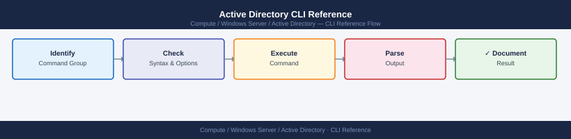
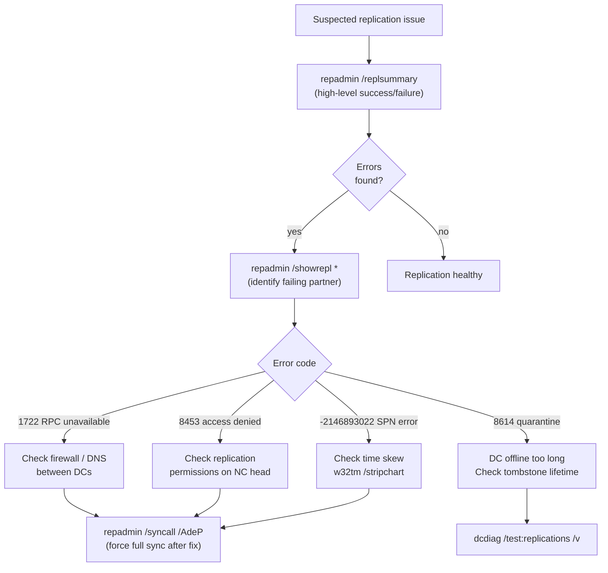

---
tags:
  - operations
  - windows
---
# Active Directory CLI Reference


<div class="kb-summary">
Active Directory management uses native tools (`repadmin`, `dcdiag`, `nltest`, `netdom`, `dsquery`) and the ActiveDirectory PowerShell module. All commands assume RSAT-AD-PowerShell is installed or the command is run on a Domain Controller.

*Applies to: Windows Server 2019 / 2022*
</div>



```d2
direction: right

hub: "Active Directory\nOperations" {shape: hexagon}
replication_health_triage_flow: "Replication Health Triage Flow" {shape: rectangle}
replication_health: "Replication Health" {shape: rectangle}
dc_diagnostics: "DC Diagnostics" {shape: rectangle}
fsmo_roles: "FSMO Roles" {shape: rectangle}
users_groups: "Users & Groups" {shape: rectangle}
computers: "Computers" {shape: rectangle}

hub -> replication_health_triage_flow
hub -> replication_health
hub -> dc_diagnostics
hub -> fsmo_roles
hub -> users_groups
hub -> computers
```

## Before you begin

- **Access:** Local Administrator or Domain Admin on target hosts
- **Timing:** safe to run during business hours unless a step is marked ⚠ (causes interruption)
- **Dependencies:** no active upgrades or migrations on the same infrastructure
- **Logging:** capture command output — paste into the change record on completion

---

## Replication Health Triage Flow



---

## Replication Health

Replication issues cause authentication failures and stale data. Check replication before and after any DC change.

```bash
# High-level replication health across all DCs
repadmin /replsummary

# Show replication partners and last sync time for a DC
repadmin /showrepl <DC_name>

# Show replication failures only
repadmin /showrepl * /errorsonly

# Force replication from all partners
repadmin /syncall /AdeP

# Check replication queue
repadmin /queue
```

---

## DC Diagnostics

```bash
# Full verbose DC diagnostic
dcdiag /v

# Replication-only test
dcdiag /test:replications

# DNS diagnostic
dcdiag /test:dns /v

# Run all tests on a remote DC
dcdiag /s:<DC_name> /v

# Locate a DC for a domain
nltest /dsgetdc:<domain_name>

# Verify secure channel to domain
nltest /sc_verify:<domain_name>

# Reset secure channel
nltest /sc_reset:<domain_name>
```

---

## FSMO Roles

```bash
# List all FSMO role holders
netdom query fsmo

# Transfer PDC emulator role (PowerShell)
Move-ADDirectoryServerOperationMasterRole -Identity <target_dc> -OperationMasterRole PDCEmulator

# Seize a role (only if holder is permanently offline)
Move-ADDirectoryServerOperationMasterRole -Identity <target_dc> -OperationMasterRole PDCEmulator -Force
```

---

## Users & Groups

```powershell
# List all users with password metadata
Get-ADUser -Filter * -Properties PasswordLastSet, PasswordExpired, LastLogonDate |
  Select SamAccountName, PasswordLastSet, PasswordExpired, LastLogonDate

# Find users inactive for 90+ days
$cutoff = (Get-Date).AddDays(-90)
Get-ADUser -Filter {LastLogonDate -lt $cutoff} -Properties LastLogonDate

# Find disabled accounts
Get-ADUser -Filter {Enabled -eq $false}

# Find users with passwords set to never expire
Get-ADUser -Filter {PasswordNeverExpires -eq $true} -Properties PasswordNeverExpires

# List members of a group
Get-ADGroupMember -Identity "<group_name>" -Recursive

# List all groups in an OU
Get-ADGroup -Filter * -SearchBase "OU=<ou>,DC=<domain>,DC=<tld>"
```

---

## Computers

```powershell
# List all computers with last logon
Get-ADComputer -Filter * -Properties LastLogonDate |
  Select Name, LastLogonDate | Sort-Object LastLogonDate -Descending

# Find stale computer accounts (90+ days)
$cutoff = (Get-Date).AddDays(-90)
Get-ADComputer -Filter {LastLogonDate -lt $cutoff} -Properties LastLogonDate

# Test and repair machine secure channel
Test-ComputerSecureChannel -Repair

# Check if a computer is joined to the domain
(Get-WmiObject Win32_ComputerSystem).PartOfDomain
```

---

## Domain Controllers

```powershell
# List all DCs in the domain
Get-ADDomainController -Filter * | Select Name, Site, IPv4Address, IsGlobalCatalog

# Show replication failures across the forest
Get-ADReplicationFailure -Scope Forest

# Check AD services on a DC
Get-Service adws, kdc, netlogon, dns | Select Name, Status
```

---

## Trusts

```bash
# List domain trusts
netdom trust <domain> /verify

# List all trusts via PowerShell
Get-ADTrust -Filter * | Select Name, TrustType, Direction, TrustAttributes
```

---

## Verify

- Confirm the operation completed without errors in the log or management UI
- Verify the expected state change is visible (service running, object created, config applied)
- Document the outcome in the change record

---

## See also

- [Active Directory — Procedures](procedures/)
- [Active Directory — Scripts](scripts/)
- [Active Directory — Health Checks](health-checks/)
