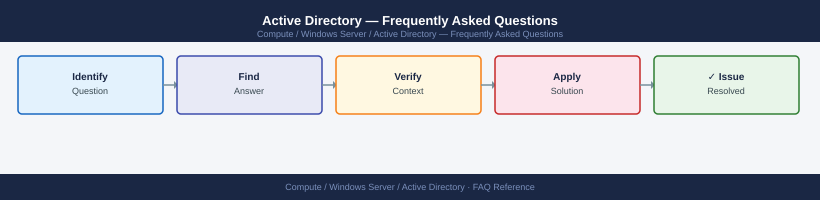

---
tags:
  - active-directory
  - faq
  - operations
---
# Active Directory — Frequently Asked Questions

Common questions about Active Directory operations, configuration, and troubleshooting. For step-by-step procedures, see the <a href="index.md">Operations</a> section.

## General

**Q: How do I check the Active Directory functional level?**
A: Run `Get-ADDomain | Select DomainMode` and `Get-ADForest | Select ForestMode` in PowerShell. Alternatively, in ADUC, right-click the domain → Raise Domain Functional Level to view current level.

**Q: How do I check the current Active Directory version?**
A: `Get-ADDomain | Select DomainMode, PDCEmulator`

## Configuration

**Q: What is the default password policy and when should it be changed?**
A: Default Domain Policy sets 7-character minimum, 42-day maximum age. Modern guidance (NIST 800-63B) recommends 12+ character minimum, no regular expiry, and breach detection instead. Use Fine-Grained Password Policies for service accounts.

**Q: How do I enable AD Recycle Bin?**
A: `Enable-ADOptionalFeature 'Recycle Bin Feature' -Scope ForestOrConfigurationSet -Target (Get-ADForest).Name`. Requires Forest Functional Level 2008 R2+. Objects are recoverable for `msDS-deletedObjectLifetime` days (default 180).

## Operations

**Q: How do I add a new Windows Server 2022 DC and decommission an old one?**
A: Promote the new DC (`dcpromo` or `Install-ADDSDomainController`). Verify replication (`repadmin /replsummary`). Transfer FSMO roles if needed (`Move-ADDirectoryServerOperationMasterRole`). Then demote the old DC (`dcpromo /forceremoval` if needed).

**Q: What is the correct procedure to add a new OU?**
A: Run `New-ADOrganizationalUnit -Name 'ServerOU' -Path 'DC=corp,DC=local' -ProtectedFromAccidentalDeletion $true`. Apply GPOs to the OU. Verify delegation is correct before moving objects in.

## Troubleshooting

**Q: Event ID 5805 — 'The session setup from computer X failed'. What does it mean?**
A: The machine account password is out of sync between the computer and the DC. Reset with `Test-ComputerSecureChannel -Repair` from the affected computer (requires domain admin). Alternatively, disjoin and rejoin the domain.

**Q: AD authentication is slow — where do I start?**
A: Check DC replication status (`repadmin /showrepl`). Review LDAP response times with `nltest /dsgetdc:<domain> /force`. Check DC CPU/memory. Verify DNS resolution is working correctly for all clients.

## Backup and Recovery

**Q: How often should I back up Active Directory?**
A: Daily Windows Server Backup or Veeam backup of all DCs. Ensure System State is included (contains SYSVOL and AD database). Protect at least one DC per site. Test AD restore quarterly using an isolated lab.

**Q: Can I restore a single deleted user without a full DC restore?**
A: Yes — use AD Recycle Bin: `Get-ADObject -Filter {DisplayName -eq 'John Smith'} -IncludeDeletedObjects | Restore-ADObject`. Without Recycle Bin, use an authoritative restore from backup (`ntdsutil`).

## See Also

- [Active Directory Operations](index.md)
- [Active Directory Troubleshooting](../../../troubleshooting/index.md)
