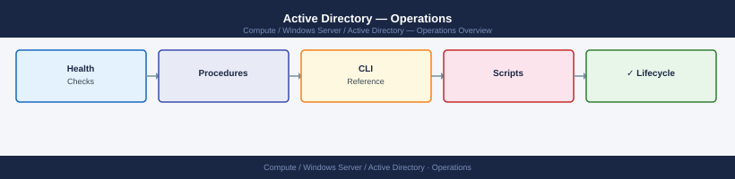

---
tags:
  - operations
  - windows
---
# Active Directory — Operations

Active Directory day-to-day operations — user and group management, GPO administration, replication health, and OU structure.

*Applies to: Windows Server 2019 / 2022*

<a class="kb-card" href="cli-reference/">
  <strong>CLI Reference</strong>
  Command reference for AD administration.
</a>

<a class="kb-card" href="health-checks/">
  <strong>Health Checks</strong>
  Daily checks, replication health, and DC status.
</a>

<a class="kb-card" href="procedures/">
  <strong>Procedures</strong>
  Change readiness, maintenance windows, and group/GPO procedures.
</a>

<a class="kb-card" href="install-upgrade/">
  <strong>Install &amp; Upgrade</strong>
  Version matrix, upgrade paths, and lifecycle management.
</a>

<a class="kb-card" href="backup-restore/">
  <strong>Backup &amp; Restore</strong>
  AD backup procedures and authoritative restore workflows.
</a>

<a class="kb-card" href="scripts/">
  <strong>Scripts</strong>
  Automation scripts for AD health, user audit, and operations.
</a>

