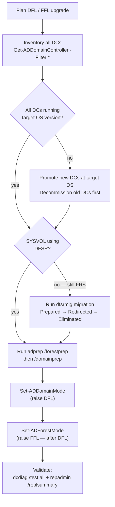

---
tags:
  - operations
  - windows
---
# Active Directory — Install & Upgrade


<div class="kb-summary">
Active Directory domain and forest functional levels determine which features are available and which DC OS versions are supported. Raising functional levels is a one-way operation and requires all DCs to run at least the corresponding Windows Server version.

*Applies to: Windows Server 2019 / 2022*
</div>
```text
┌───────────────────── Security Active Directory Operations — Install and Upgrade ──────────────────────┐
│                                                                                                       │
│   ┌───────────────────────────────────────────────────────────────────────────────────────────────┐   │
│   │    Active Directory installation and upgrade: deployment and version management procedures    │   │
│   │         Pre-upgrade: back up configuration, check compatibility, review release notes         │   │
│   │      Upgrade: rolling upgrade preserves service; non-disruptive on dual-controller arrays     │   │
│   │           Post-upgrade: verify all services running; run health check; notify users           │   │
│   └───────────────────────────────────────────────────────────────────────────────────────────────┘   │
│                                                                                                       │
│    Plan → backup config → upgrade staging → upgrade production → validate                             │
│                                                                                                       │
│                  ▼                                ▼                                ▼                  │
│                                                                                                       │
│   ┌─────────────────────────────┐  ┌─────────────────────────────┐  ┌─────────────────────────────┐   │
│   │            Layer            │  │          Component          │  │            Notes            │   │
│   │             Core            │  │       Primary service       │  │        Main function        │   │
│   │          Management         │  │        Control plane        │  │         Admin access        │   │
│   │          Monitoring         │  │         Health/perf         │  │      Alerts/dashboards      │   │
│   │           Security          │  │         Auth/encrypt        │  │        Access control       │   │
│   │         Integration         │  │        APIs/plug-ins        │  │         Third-party         │   │
│   └─────────────────────────────┘  └─────────────────────────────┘  └─────────────────────────────┘   │
│                                                                                                       │
│                          ▼                                                 ▼                          │
│                                                                                                       │
│   ┌───────────────────────────────────────────────────────────────────────────────────────────────┐   │
│   │      Layer       │    Component     │      Function     │      Notes       │       Auth       │   │
│   │       Core       │ Primary service  │   Main function   │     See docs     │       RBAC       │   │
│   │    Management    │  Control plane   │    Admin access   │     See docs     │       RBAC       │   │
│   │    Monitoring    │   Health/perf    │  Alerts/dashboard │     See docs     │       RBAC       │   │
│   │     Security     │   Auth/encrypt   │   Access control  │     See docs     │       RBAC       │   │
│   └───────────────────────────────────────────────────────────────────────────────────────────────┘   │
│                                                                                                       │
│    Physical: Security Active Directory Operations infrastructure · management network · monitoring    │
│                                                                                                       │
│    Key terms:                                                                                         │
│                                                                                                       │
│    Active Directory   = Security Active Directory Operations platform overview and core concepts      │
│    Management         = management console and command-line interface for administration              │
│    Monitoring         = health and performance monitoring dashboards and alerting                     │
│    Automation         = REST API, scripting, and pipeline integration capabilities                    │
│    Security           = access control, authentication, and encryption configuration                  │
│    Backup             = backup and recovery procedures and schedule configuration                     │
│    Upgrade            = software version upgrades and firmware patching procedures                    │
│    Troubleshooting    = diagnostic procedures and common issue resolution steps                       │
│    Escalation         = vendor support escalation path and severity triage process                    │
│    Documentation      = vendor knowledge base and official product documentation                      │
│    Change management  = change ticket requirements for production modifications                       │
│    Audit log          = admin action logging for compliance and security review                       │
│                                                                                                       │
└───────────────────────────────────────────────────────────────────────────────────────────────────────┘
```


 SYSVOL replication must be migrated from FRS to DFSR before the domain functional level can be raised to Windows Server 2008 R2 or higher.

## Before you begin

- **Access:** Local Administrator or Domain Admin on target hosts
- **Timing:** safe to run during business hours unless a step is marked ⚠ (causes interruption)
- **Dependencies:** no active upgrades or migrations on the same infrastructure
- **Logging:** capture command output — paste into the change record on completion

---

## Domain Functional Level Upgrade Flow




---
## Domain and Forest Functional Levels

| Domain Functional Level | Minimum DC OS | Key Feature Unlocked |
|---|---|---|
| Windows Server 2016 | Server 2016 | Privileged Access Management, PAC compression |
| Windows Server 2019 | Server 2019 | Feature parity with 2016 |
| Windows Server 2022 | Server 2022 | AES encryption improvements |

Raise domain functional level after confirming all DCs are running the target OS version:

```powershell
# Verify all DC OS versions before raising DFL
Get-ADDomainController -Filter * | Select-Object Name, OperatingSystem, OperatingSystemVersion

# Raise domain functional level
Set-ADDomainMode -Identity "corp.example.com" -DomainMode Windows2016Domain

# Raise forest functional level (requires DFL to already be at target level)
Set-ADForestMode -Identity "example.com" -ForestMode Windows2016Forest
```

---

## SYSVOL FRS to DFSR Migration

Run from the PDC Emulator. Do not skip states — wait for convergence at each stage.

```powershell
# Check current SYSVOL replication state
dfsrmig /GetMigrationState

# Advance through migration states: Prepared -> Redirected -> Eliminated
dfsrmig /SetGlobalState 1   # Prepared
dfsrmig /SetGlobalState 2   # Redirected
dfsrmig /SetGlobalState 3   # Eliminated

# Verify completion
dfsrmig /GetMigrationState
```

---

## AD Schema Updates

Schema updates are required before adding the first DC of a new OS version. Run `adprep` from the media of the highest new OS version being introduced.

```powershell
# From Windows Server installation media, run on the Schema Master:
adprep.exe /forestprep

# Run on each domain that will contain the new OS DC:
adprep.exe /domainprep

# Verify schema version
Get-ADObject (Get-ADRootDSE).schemaNamingContext -Property objectVersion |
  Select-Object objectVersion
```

Schema version reference: Server 2016 = 87, Server 2019 = 88, Server 2022 = 91.

---

## FSMO Role Management

```powershell
# Show current FSMO role holders
netdom query fsmo

# Transfer FSMO roles (preferred — run on the target DC)
Move-ADDirectoryServerOperationMasterRole -Identity "DC02" -OperationMasterRole `
  PDCEmulator, RIDMaster, InfrastructureMaster, SchemaMaster, DomainNamingMaster

# Seize FSMO roles (only when old DC is permanently offline)
ntdsutil
  roles
  connections
    connect to server DC02
    quit
  seize PDC
  seize RID master
  quit
quit
```

---

## DC Decommission Procedure

1. Confirm target DC is not holding any FSMO roles (transfer first if it is).
2. Confirm DNS and SYSVOL are healthy on remaining DCs.
3. Demote the DC gracefully:

```powershell
# Graceful demotion via PowerShell (preferred)
Uninstall-ADDSDomainController `
  -DemoteOperationMasterRole:$true `
  -RemoveDnsDelegation:$true `
  -Credential (Get-Credential)
```

4. If the DC is offline and cannot be demoted, clean up AD metadata:

```cmd
ntdsutil
  metadata cleanup
  remove selected server CN=DC01,OU=Domain Controllers,DC=corp,DC=example,DC=com
  quit
quit
```

5. Remove the associated DNS records and computer account from AD after demotion.

---

## AD Recycle Bin

Enable once per forest; requires DFL 2008 R2 or higher. Cannot be disabled after enabling.

```powershell
# Enable AD Recycle Bin
Enable-ADOptionalFeature 'Recycle Bin Feature' `
  -Scope ForestOrConfigurationSet `
  -Target "example.com"

# Restore a deleted object (default tombstone lifetime: 180 days)
Get-ADObject -Filter {DisplayName -eq "John Smith"} -IncludeDeletedObjects |
  Restore-ADObject
```

---

## Verify

- Confirm the operation completed without errors in the log or management UI
- Verify the expected state change is visible (service running, object created, config applied)
- Document the outcome in the change record
