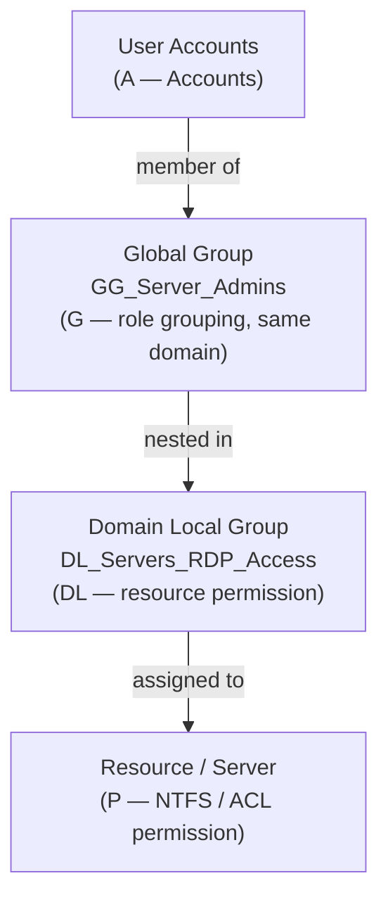

---
tags:
  - operations
  - windows
---
# Active Directory — Procedures


<div class="kb-summary">
Procedures reference covering AGDLP Group Design Flow, Groups, GPOs, Domain Controllers.

*Applies to: Windows Server 2019 / 2022*
</div>


## Before you begin

- **Access:** Local Administrator or Domain Admin on target hosts
- **Timing:** safe to run during business hours unless a step is marked ⚠ (causes interruption)
- **Dependencies:** no active upgrades or migrations on the same infrastructure
- **Logging:** capture command output — paste into the change record on completion

---

## AGDLP Group Design Flow



## Groups

AD groups control access to resources and distribution of email. Choosing the correct type and scope prevents replication overhead and simplifies permission management.

### Group Types and Scopes


| Scope | Can Contain | Used For | Replicates To |
|---|---|---|---|
| Domain Local | Users, Global, Universal from any domain | Assigning permissions to local resources | Domain only |
| Global | Users and Global from same domain | Grouping users by role | Entire forest |
| Universal | Users, Global, Universal from any domain | Cross-domain role assignments | Global Catalog |
| Distribution | Any | Email only (not security) | Domain only |

Best practice: follow AGDLP — Accounts in Global groups, Global in Domain Local groups, Domain Local assigned Permissions.

### Creating Groups


```powershell
# Create a security group (Global scope)
New-ADGroup -Name "SG-ServerAdmins" `
    -GroupScope Global `
    -GroupCategory Security `
    -Path "OU=Groups,DC=corp,DC=example,DC=com" `
    -Description "Server administrators"

# Create a distribution group
New-ADGroup -Name "DG-ITTeam" `
    -GroupScope Universal `
    -GroupCategory Distribution `
    -Path "OU=Groups,DC=corp,DC=example,DC=com"

# Create a Domain Local group for resource access
New-ADGroup -Name "DL-FileShare-Finance-RW" `
    -GroupScope DomainLocal `
    -GroupCategory Security `
    -Path "OU=Groups,DC=corp,DC=example,DC=com"
```

### Managing Group Membership


```powershell
# Add a single member
Add-ADGroupMember -Identity "SG-ServerAdmins" -Members "jsmith"

# Add multiple members
Add-ADGroupMember -Identity "SG-ServerAdmins" -Members "jsmith","bwilson","DC01$"

# Remove a member
Remove-ADGroupMember -Identity "SG-ServerAdmins" -Members "jsmith" -Confirm:$false

# List all members recursively
Get-ADGroupMember -Identity "SG-ServerAdmins" -Recursive

# List all groups a user belongs to
Get-ADPrincipalGroupMembership -Identity "jsmith" | Select-Object Name, GroupScope, GroupCategory
```

### Group Nesting


```powershell
# Add a Global group into a Domain Local group (AGDLP)
Add-ADGroupMember -Identity "DL-FileShare-Finance-RW" -Members "SG-FinanceUsers"

# Find nested groups inside a group
Get-ADGroupMember -Identity "DL-FileShare-Finance-RW" -Recursive |
    Where-Object {$_.objectClass -eq "group"}

# Show full group chain for a user
Get-ADPrincipalGroupMembership -Identity "jsmith" -Recursive |
    Select-Object Name, GroupScope | Sort-Object Name
```

### Auditing and Reporting


```powershell
# Find empty groups
Get-ADGroup -Filter * -Properties Members |
    Where-Object {$_.Members.Count -eq 0} | Select-Object Name

# Find groups with no members and not nested anywhere
Get-ADGroup -Filter * -Properties Members, MemberOf |
    Where-Object {$_.Members.Count -eq 0 -and $_.MemberOf.Count -eq 0} |
    Select-Object Name, DistinguishedName

# Export group membership to CSV
Get-ADGroupMember "SG-ServerAdmins" |
    Select-Object Name, SamAccountName, objectClass |
    Export-Csv C:\Reports\SG-ServerAdmins.csv -NoTypeInformation

# Find all groups a computer account is in
Get-ADPrincipalGroupMembership -Identity "DC01$" | Select-Object Name
```

---

## GPOs

GPOs apply configuration to computers and users in AD. They are linked to Sites, Domains, or OUs and processed in that order (SDOU). Understanding GPO inheritance, filtering, and result sets is essential for managing policy reliably.

### GPO Processing Order


| Level | Priority (low to high) | Notes |
|---|---|---|
| Local | 1 | Machine-local policy |
| Site | 2 | Rarely used in practice |
| Domain | 3 | Domain-wide defaults |
| OU | 4 | Closest OU wins |
| Child OU | 5 | Overrides parent OU |

Later-processed policies win unless Block Inheritance or Enforced (No Override) is set.

### Creating and Linking a GPO


```powershell
# Create a new GPO
New-GPO -Name "Security Baseline - Servers" -Comment "CIS Level 1 server policy"

# Link GPO to an OU
New-GPLink -Name "Security Baseline - Servers" -Target "OU=Servers,DC=corp,DC=example,DC=com"

# Create and link in one step
New-GPO -Name "Desktop Lockscreen" | New-GPLink -Target "OU=Workstations,DC=corp,DC=example,DC=com"

# Set link order (lower number = higher priority)
Set-GPLink -Name "Desktop Lockscreen" -Target "OU=Workstations,DC=corp,DC=example,DC=com" -Order 1
```

### Viewing Applied Policy


```cmd
# Show applied GPOs for the current user and computer
gpresult /r

# Verbose HTML report
gpresult /h C:\Temp\gpresult.html /f

# Show GPOs for a specific user on a remote computer
gpresult /s DC01 /u corp\jsmith /r

# Force immediate policy refresh
gpupdate /force

# Refresh user policy only (no reboot)
gpupdate /target:user
```

### RSoP (Resultant Set of Policy)


```cmd
# RSoP wizard (GUI)
rsop.msc

# Full RSoP output to file
gpresult /z > C:\Temp\rsop-full.txt

# Check which GPO set a specific setting
gpresult /r /scope computer | findstr /i "password"
```

### GPO Backup and Restore


```powershell
# Backup all GPOs
Backup-GPO -All -Path "C:\GPOBackups"

# Backup a single GPO
Backup-GPO -Name "Security Baseline - Servers" -Path "C:\GPOBackups"

# Restore a GPO from backup
Restore-GPO -Name "Security Baseline - Servers" -Path "C:\GPOBackups"

# Import settings from backup into existing GPO
Import-GPO -BackupGpoName "Security Baseline - Servers" `
    -TargetName "Security Baseline - Servers" -Path "C:\GPOBackups"
```

### GPO Inheritance and Filtering


```powershell
# Block inheritance on an OU
Set-GPInheritance -Target "OU=Test,DC=corp,DC=example,DC=com" -IsBlocked Yes

# Enforce a GPO link (cannot be blocked by child OUs)
Set-GPLink -Name "Domain Security Policy" -Target "DC=corp,DC=example,DC=com" -Enforced Yes

# Apply GPO to a specific security group only
Set-GPPermission -Name "Desktop Lockscreen" -TargetName "Workstation Admins" `
    -TargetType Group -PermissionLevel GpoApply

# Remove Authenticated Users (for targeted group filtering)
Set-GPPermission -Name "Desktop Lockscreen" -TargetName "Authenticated Users" `
    -TargetType Group -PermissionLevel None
```

---

## Domain Controllers

Domain Controllers host the AD DS database (ntds.dit), authenticate users, and hold FSMO roles. Understanding DC roles and how to manage them is essential for AD operations.

### FSMO Roles


Five Flexible Single Master Operations roles exist across forest and domain levels. Only one DC holds each role at a time.

| Role | Scope | Function |
|---|---|---|
| Schema Master | Forest | Controls AD schema changes |
| Domain Naming Master | Forest | Adds/removes domains in the forest |
| PDC Emulator | Domain | Password sync, time authority, legacy client support |
| RID Master | Domain | Allocates RID pools to DCs for new object SIDs |
| Infrastructure Master | Domain | Resolves cross-domain object references |

```cmd
# Show all FSMO role holders
netdom query fsmo

# Show via PowerShell
Get-ADDomain | Select-Object PDCEmulator, RIDMaster, InfrastructureMaster
Get-ADForest | Select-Object SchemaMaster, DomainNamingMaster
```

### Promoting a New DC


```powershell
# Install AD DS role
Install-WindowsFeature -Name AD-Domain-Services -IncludeManagementTools

# Promote as additional DC in existing domain
Import-Module ADDSDeployment
Install-ADDSDomainController `
    -DomainName "corp.example.com" `
    -InstallDns:$true `
    -Credential (Get-Credential) `
    -SafeModeAdministratorPassword (ConvertTo-SecureString "P@ssw0rd!" -AsPlainText -Force) `
    -Force:$true
```

### Demoting a DC


```powershell
# Graceful demotion
Uninstall-ADDSDomainController `
    -LocalAdministratorPassword (ConvertTo-SecureString "P@ssw0rd!" -AsPlainText -Force) `
    -Force:$true

# Metadata cleanup if DC is already offline
ntdsutil
  metadata cleanup
  remove selected server CN=DC02,CN=Servers,CN=Default-First-Site,CN=Sites,CN=Configuration,DC=corp,DC=example,DC=com
```

### Transferring and Seizing FSMO Roles


```powershell
# Transfer PDC Emulator gracefully
Move-ADDirectoryServerOperationMasterRole -Identity "DC02" -OperationMasterRole PDCEmulator

# Transfer multiple roles
Move-ADDirectoryServerOperationMasterRole -Identity "DC02" `
    -OperationMasterRole PDCEmulator,RIDMaster,InfrastructureMaster

# Seize a role (only if original holder is permanently offline)
ntdsutil
  roles
  connections
    connect to server DC02
  quit
  seize pdc
```

### DC Health Validation


```cmd
# Run all dcdiag tests
dcdiag /test:all /v

# Check replication health
repadmin /showrepl

# Check DC services
sc query NTDS
sc query Netlogon
sc query W32Time
sc query DFSR

# Verify AD database integrity
ntdsutil "activate instance ntds" "files" "integrity" quit quit
```

### Time Synchronisation


The PDC Emulator is the authoritative time source for the domain. All other DCs and clients sync from the hierarchy.

```cmd
# Check current time source
w32tm /query /source

# Force resync
w32tm /resync /force

# Configure PDC Emulator to sync from external NTP
w32tm /config /manualpeerlist:"pool.ntp.org" /syncfromflags:manual /reliable:YES /update

# Check time skew across DCs
w32tm /monitor /computers:dc01,dc02,dc03
```

---

## Transfer FSMO Roles

Transfer FSMO roles to a new DC during planned migrations or before decommissioning the current role holder.

```powershell
# Transfer PDC Emulator, RID Master, and Infrastructure Master to new DC
Move-ADDirectoryServerOperationMasterRole -Identity <new-dc> `
    -OperationMasterRole PDCEmulator,RIDMaster,InfrastructureMaster

# Verify all roles were transferred successfully
netdom query fsmo

# Confirm via PowerShell
Get-ADDomain | Select-Object PDCEmulator, RIDMaster, InfrastructureMaster
Get-ADForest | Select-Object SchemaMaster, DomainNamingMaster
```

Pre-checks: confirm the target DC is healthy (`dcdiag /test:all`), replication is in sync (`repadmin /showrepl`), and a change ticket is approved. Only seize roles (via `ntdsutil`) if the original holder is permanently offline.

---

## Create a Group Policy Object

Create and link a new GPO to enforce configuration on an OU.

1. Open **Group Policy Management** (`gpmc.msc`).
2. Expand the domain tree, right-click the target OU → **Create a GPO in this domain, and Link it here**.
3. Enter a descriptive name (e.g., `Security Baseline - Workstations`) → **OK**.
4. Right-click the new GPO → **Edit** → configure the required settings under Computer or User Configuration.
5. Close the editor — the GPO is already linked to the OU.
6. Force immediate refresh on target machines:

```cmd
gpupdate /force
```

7. Verify applied policy:

```cmd
gpresult /r
```

Use **Security Filtering** to scope the GPO to a specific group rather than all Authenticated Users when a targeted rollout is required.

---

## Audit Active Directory Changes

Enable auditing to capture privileged account and group changes for security and compliance review.

### Enable Audit Policy via GPO


1. Create or edit a GPO linked to Domain Controllers OU.
2. Navigate to **Computer Configuration → Windows Settings → Security Settings → Advanced Audit Policy Configuration → DS Access**.
3. Enable **Audit Directory Service Changes** → Success and Failure.
4. Run `gpupdate /force` on all DCs.

### Key Event IDs to Monitor


| Event ID | Description |
|---|---|
| 4720 | User account created |
| 4722 | User account enabled |
| 4725 | User account disabled |
| 4740 | User account locked out |
| 4756 | Member added to a security-enabled universal group |
| 4728 | Member added to a security-enabled global group |
| 4732 | Member added to a security-enabled local group |

### Query Security Event Log


```powershell
# Find all account lockout events (4740) in the last 24 hours
Get-WinEvent -FilterHashtable @{LogName='Security'; Id=4740; StartTime=(Get-Date).AddDays(-1)} |
    Select-Object TimeCreated, Message

# Find account creation events (4720)
Get-WinEvent -FilterHashtable @{LogName='Security'; Id=4720} |
    Select-Object TimeCreated, Message | Format-List
```

---

## Recover Deleted Objects (Recycle Bin)

The AD Recycle Bin preserves deleted objects with all attributes intact for the deleted object lifetime (default 180 days). The feature must be enabled before the deletion occurs.

```powershell
# Verify Recycle Bin is enabled
Get-ADOptionalFeature -Filter {Name -like "Recycle Bin Feature"}

# Enable Recycle Bin (forest-wide, requires Enterprise Admin — one-time, irreversible)
Enable-ADOptionalFeature -Identity "Recycle Bin Feature" `
    -Scope ForestOrConfigurationSet `
    -Target (Get-ADForest).Name

# List all deleted objects
Get-ADObject -Filter {isDeleted -eq $true} -IncludeDeletedObjects |
    Select-Object Name, DistinguishedName, WhenChanged

# Restore a specific deleted user
Get-ADObject -Filter {isDeleted -eq $true -and Name -like "*jsmith*"} `
    -IncludeDeletedObjects | Restore-ADObject

# Restore all deleted objects from a specific OU
Get-ADObject -Filter {isDeleted -eq $true} -IncludeDeletedObjects |
    Where-Object {$_.DistinguishedName -like "*OU=Finance*"} |
    Restore-ADObject
```

Verify the restored object appears in AD Users and Computers and that group memberships are intact.

---

## Configure Fine-Grained Password Policy

Fine-Grained Password Policies (PSOs) allow different password requirements for specific users or groups, overriding the Default Domain Policy. Requires Domain Functional Level 2008 or higher.

```powershell
# Create a PSO for service accounts (longer password, no lockout)
New-ADFineGrainedPasswordPolicy `
    -Name "ServiceAccounts" `
    -MinPasswordLength 20 `
    -PasswordHistoryCount 24 `
    -ComplexityEnabled $true `
    -ReversibleEncryptionEnabled $false `
    -MinPasswordAge "1.00:00:00" `
    -MaxPasswordAge "0" `
    -LockoutThreshold 0 `
    -Precedence 10

# Apply the PSO to a group
Add-ADFineGrainedPasswordPolicySubject `
    -Identity "ServiceAccounts" `
    -Subjects "SG-ServiceAccounts"

# Verify which PSO applies to a user
Get-ADUserResultantPasswordPolicy -Identity svc-sql

# List all PSOs
Get-ADFineGrainedPasswordPolicy -Filter * | Select-Object Name, Precedence, MinPasswordLength
```

A lower Precedence number wins when multiple PSOs apply to the same user. Apply PSOs to groups rather than individual users for easier management.

---

## Verify

- Confirm the operation completed without errors in the log or management UI
- Verify the expected state change is visible (service running, object created, config applied)
- Document the outcome in the change record

---

## See also

- [Active Directory — Health Checks](health-checks/)
- [Active Directory — CLI Reference](cli-reference/)
- [Active Directory — Common Issues](../troubleshooting/common-issues/)
