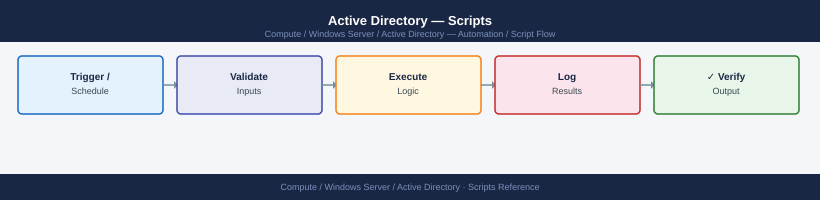

---
tags:
  - operations
  - windows
---
# Active Directory — Scripts

<div class="kb-summary">
PowerShell automation tools for routine Active Directory health checks, auditing, and reporting. Run from a host with the `ActiveDirectory` PowerShell module installed.

*Applies to: Windows Server 2019 / 2022*
</div>


## Before you begin

- **Access:** Read access to the domain for audit and reporting scripts; Domain Admin for GPO replication and account provisioning scripts
- **Timing:** safe to run any time; avoid peak business hours for domain-wide LDAP queries to reduce DC load
- **Dependencies:** ActiveDirectory PowerShell module (`RSAT-AD-PowerShell` feature or domain-joined Windows Server); service account with least-privilege AD rights stored in a secrets vault
- **Logging:** all scripts write timestamped output; redirect to a central log share (`\\server\logs\ad-scripts\`) for audit trail

---

## Audit Script Workflow

```d2
direction: right

trigger: "Scheduled Task\n(weekly / monthly" {shape: rectangle}
importMod: "Import-Module ActiveDirectory" {shape: rectangle}
task: "Audit task" {shape: rectangle}
userQuery: "Get-ADUser — stale / disabled /\nno-expiry / expiring accounts" {shape: rectangle}
privGroups: "Get-ADGroupMember\nDomain Admins / Schema Admins / EA" {shape: rectangle}
compQuery: "Get-ADComputer — enabled,\nnot logged in 90+ days" {shape: rectangle}
replHealth: "Get-ADReplicationFailure -Scope Forest" {shape: rectangle}
gpoBackup: "Backup-GPO -All\ntimestamped folder" {shape: rectangle}
export: "Export-Csv\n(report file" {shape: rectangle}
done: "Notify ops team\n(email / ticketing" {shape: rectangle}

trigger -> importMod
importMod -> task
task -> userQuery
task -> privGroups
task -> compQuery
task -> replHealth
task -> gpoBackup
userQuery -> export
privGroups -> export
compQuery -> export
replHealth -> export
gpoBackup -> done
export -> done
```

---

## Prerequisites

```powershell
# Install RSAT AD tools on Windows 10/11 or Server Core
Add-WindowsCapability -Online -Name "Rsat.ActiveDirectory.DS-LDS.Tools~~~~0.0.1.0"

# Import the module
Import-Module ActiveDirectory

# Verify connectivity
Get-ADDomain
```

---

## User Account Queries

```powershell
# Get full details for a specific user
Get-ADUser -Identity "jsmith" -Properties * |
  Select-Object SamAccountName, DisplayName, Title, Department,
                Enabled, PasswordLastSet, PasswordExpired, LockedOut, LastLogonDate

# Find all disabled accounts in a specific OU
Get-ADUser -Filter {Enabled -eq $false} `
  -SearchBase "OU=Staff,DC=corp,DC=example,DC=com" |
  Select-Object SamAccountName, DisplayName

# Report users with passwords that never expire
Get-ADUser -Filter {PasswordNeverExpires -eq $true -and Enabled -eq $true} |
  Select-Object SamAccountName, DisplayName | Export-Csv "NoExpiry_Users.csv" -NoTypeInformation

# Find accounts expiring within 14 days
$threshold = (Get-Date).AddDays(14)
Get-ADUser -Filter {Enabled -eq $true -and AccountExpirationDate -le $threshold -and AccountExpirationDate -gt "01/01/1900"} |
  Select-Object SamAccountName, AccountExpirationDate | Sort-Object AccountExpirationDate
```

---

## Group Membership Audits

```powershell
# Export members of privileged groups to CSV
$privilegedGroups = @("Domain Admins","Schema Admins","Enterprise Admins","Group Policy Creator Owners")
$report = foreach ($group in $privilegedGroups) {
    Get-ADGroupMember -Identity $group -Recursive | ForEach-Object {
        [PSCustomObject]@{
            Group      = $group
            Name       = $_.Name
            SamAccount = $_.SamAccountName
            ObjectType = $_.objectClass
        }
    }
}
$report | Export-Csv "PrivilegedGroup_Audit.csv" -NoTypeInformation

# List all groups a user belongs to (including nested)
(Get-ADUser "jsmith" -Properties MemberOf).MemberOf |
  Get-ADGroup | Select-Object Name, GroupScope, GroupCategory
```

---

## Stale and Locked Accounts

```powershell
# Stale computer accounts: enabled, not logged in for 90+ days
$cutoff = (Get-Date).AddDays(-90)
Get-ADComputer -Filter {Enabled -eq $true -and LastLogonDate -lt $cutoff} `
  -Properties LastLogonDate |
  Select-Object Name, LastLogonDate, OperatingSystem |
  Export-Csv "Stale_Computers.csv" -NoTypeInformation

# Stale user accounts: enabled, not logged in for 90+ days
Get-ADUser -Filter {Enabled -eq $true -and LastLogonDate -lt $cutoff} `
  -Properties LastLogonDate, Department |
  Select-Object SamAccountName, DisplayName, LastLogonDate, Department |
  Export-Csv "Stale_Users.csv" -NoTypeInformation

# Find all currently locked out accounts
Search-ADAccount -LockedOut |
  Select-Object SamAccountName, DisplayName, LockedOut, LastLogonDate

# Unlock a specific account
Unlock-ADAccount -Identity "jsmith"

# Find account lockout source: query Security event 4740 across all DCs
$lockedUser = "jsmith"
Get-ADDomainController -Filter * | ForEach-Object {
    Get-WinEvent -ComputerName $_.HostName -FilterHashtable @{
        LogName   = "Security"
        Id        = 4740
    } -ErrorAction SilentlyContinue |
    Where-Object { $_.Properties[0].Value -eq $lockedUser } |
    Select-Object TimeCreated,
      @{N="CallerComputer"; E={$_.Properties[1].Value}},
      @{N="DC"; E={$_.MachineName}}
}
```

---

## Expiring Passwords

```powershell
# Report users whose passwords expire within 14 days
$maxPwdAge = (Get-ADDefaultDomainPasswordPolicy).MaxPasswordAge.Days
$warnDays  = 14
$now       = Get-Date

Get-ADUser -Filter {Enabled -eq $true -and PasswordNeverExpires -eq $false} `
  -Properties PasswordLastSet |
  Select-Object SamAccountName, DisplayName, PasswordLastSet,
    @{N="ExpiresOn"; E={ $_.PasswordLastSet.AddDays($maxPwdAge) }} |
  Where-Object { $_.ExpiresOn -gt $now -and $_.ExpiresOn -le $now.AddDays($warnDays) } |
  Sort-Object ExpiresOn
```

---

## Replication Health

```powershell
# Get replication failures across the forest
Get-ADReplicationFailure -Scope Forest |
  Select-Object Server, Partner, FirstFailureTime, FailureCount, FailureType |
  Sort-Object FailureCount -Descending

# Check replication queue length on all DCs
Get-ADDomainController -Filter * | ForEach-Object {
    repadmin /showrepl $_.HostName /errorsonly
}

# Force replication from all partners
repadmin /syncall /AdeP
```

---

## GPO Backup and Reporting

```powershell
# Backup all GPOs to a timestamped folder
$backupPath = "D:\GPO_Backups\$(Get-Date -Format 'yyyyMMdd_HHmmss')"
New-Item -ItemType Directory -Path $backupPath | Out-Null
Backup-GPO -All -Path $backupPath
Write-Host "GPOs backed up to $backupPath"

# Generate HTML report for a specific GPO
Get-GPOReport -Name "PROD-SERVERS-SecBaseline" -ReportType Html -Path "C:\Temp\GPO_Report.html"

# List all GPOs with their link targets
Get-GPO -All | ForEach-Object {
    $links = (Get-GPOReport -Guid $_.Id -ReportType Xml) -match '<SOMPath>(.+)</SOMPath>'
    [PSCustomObject]@{ Name = $_.DisplayName; Links = $Matches[1] }
}
```

---

## Verify

- Confirm the operation completed without errors in the log or management UI
- Verify the expected state change is visible (service running, object created, config applied)
- Document the outcome in the change record

---

## See also

- [Active Directory — Procedures](../procedures/)
- [Active Directory — CLI Reference](../cli-reference/)
- [Active Directory — Health Checks](../health-checks/)
