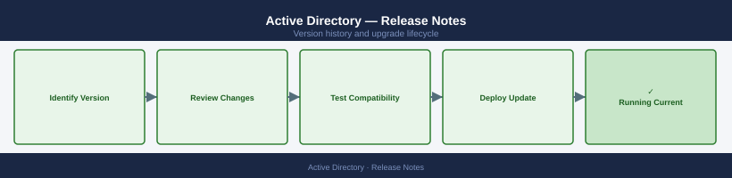

---
tags:
  - windows
---
# Active Directory — Release Notes

*Applies to: Windows Server 2022 · Active Directory*

Version history and release notes for Active Directory.

## Version History

| Version | Released | Summary | Notes |
|---------|----------|---------|-------|
| 2025 FL | 2024-Q4 | AD Forest Level 2025 — DC functional level update | [Release Notes](#) |
| 2022 FL | 2021-Q4 | AD Forest Level 2022 — default policy changes | [Release Notes](#) |
| 2019 FL | 2018-Q4 | AD Forest Level 2019 — AES-256 preferred | [Release Notes](#) |
| 2016 FL | 2016-Q3 | AD Forest Level 2016 — PAM and Just-in-Time access | [Release Notes](#) |
| 2012 R2 | 2013-Q4 | AD Forest Level 2012 R2 — Protected Users group | [Release Notes](#) |

## Key Terminology

**Major Version**
: A release containing significant new features or architectural changes; may require additional planning and testing.

**Patch Release**
: A targeted fix release that addresses bugs or security issues within a major/minor version.

**EOL (End of Life)**
: Date after which the vendor no longer provides updates, security patches, or technical support.

**Upgrade Path**
: The supported sequence of versions a system must traverse to reach a target version (some versions cannot be skipped).

## Upgrade Path

Review the vendor's official upgrade documentation and compatibility matrix before beginning any version change. Validate that all dependent components (OS, drivers, integration plugins) support the target version. Perform upgrades in a staged approach: dev/test environment first, then production. Capture a snapshot or backup immediately prior to the upgrade window. After the upgrade, run post-validation health checks and confirm all services are operating normally.
