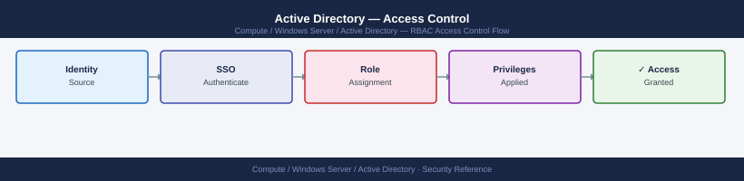

---
tags:
  - security
  - windows
---
# Active Directory — Access Control

<div class="kb-summary">
Access Control reference covering Tiered Administration Model, Core Security Controls, AdminSDHolder Monitoring.

*Applies to: Windows Server 2019 / 2022*
</div>


## Before you begin

- **Access:** Local Administrator or Domain Admin on target hosts
- **Change management:** security changes require CAB approval in most environments
- **Rollback plan:** document current state before any security control change
- **Testing:** validate in a non-production environment first where possible

---

## Tiered Administration Model

Active Directory security is built around the three-tier admin model:

```d2
direction: right

admTier0: "adm0-* accounts" {shape: rectangle}
paw0: "Tier 0 PAW\n(dedicated — no internet/email" {shape: rectangle}
tier0: "Tier 0\nDCs · ADCS · AAD Connect · CyberArk\n(highest sensitivity — forest boundary" {shape: rectangle}
admTier1: "adm1-* accounts" {shape: rectangle}
jump1: "Jump Server / Tier 1 PAW" {shape: rectangle}
tier1: "Tier 1\nApp servers · SQL · ESXi · Storage" {shape: rectangle}
helpdesk: "Helpdesk accounts" {shape: rectangle}
stdWs: "Standard Workstation" {shape: rectangle}
tier2: "Tier 2\nWorkstations · End-user devices" {shape: rectangle}

admTier0 -> paw0
paw0 -> tier0
admTier1 -> jump1
jump1 -> tier1
helpdesk -> stdWs
stdWs -> tier2
```

| Tier | Scope | Examples | Access Restriction |
|---|---|---|---|
| Tier 0 | Identity infrastructure | DCs, ADCS, AAD Connect, CyberArk | Only from Tier 0 PAW |
| Tier 1 | Servers and services | App servers, SQL, ESXi | Only from Tier 1 PAW or jump host |
| Tier 2 | Workstations | End-user PCs | From standard workstation |

Tier model is enforced by GPO logon restrictions (`Deny log on locally`, `Deny access to this computer from the network`) and CyberArk safe membership.

## Core Security Controls

| Control | Implementation |
|---|---|
| Protected Users group | Disables NTLM, DES, RC4, and unconstrained delegation for members |
| AdminSDHolder | ACL template propagated every 60 min to all protected accounts |
| PAW | Dedicated hardened workstations; Tier 0 access only from Tier 0 PAW |
| LDAP signing | `Domain Controller: LDAP server signing requirements` = Require signing |
| LDAP channel binding | `Domain Controller: LDAP server channel binding token requirements` = Always |
| Kerberos AES-256 only | Disable RC4 via `Network security: Configure encryption types allowed for Kerberos` |
| Fine-grained PSO | Stricter password/lockout policies for admin and service accounts |
| Defender for Identity | Sensor on all DCs; detects lateral movement, pass-the-hash, DCSync |

## AdminSDHolder Monitoring

```powershell
# List all accounts protected by AdminSDHolder (adminCount=1)
Get-ADUser -Filter { AdminCount -eq 1 } -Properties AdminCount |
    Select-Object SamAccountName, DistinguishedName, AdminCount

# Check if non-privileged accounts have adminCount=1 (sign of ACL tampering or orphaned admin membership)
Get-ADUser -Filter { AdminCount -eq 1 } |
    Where-Object { (Get-ADUser $_ -Properties MemberOf).MemberOf -eq $null }
```

---

## See also

- [Active Directory — Authentication](../authentication/)
- [Active Directory — Hardening](../hardening/)
- [Active Directory — Encryption](../encryption/)
