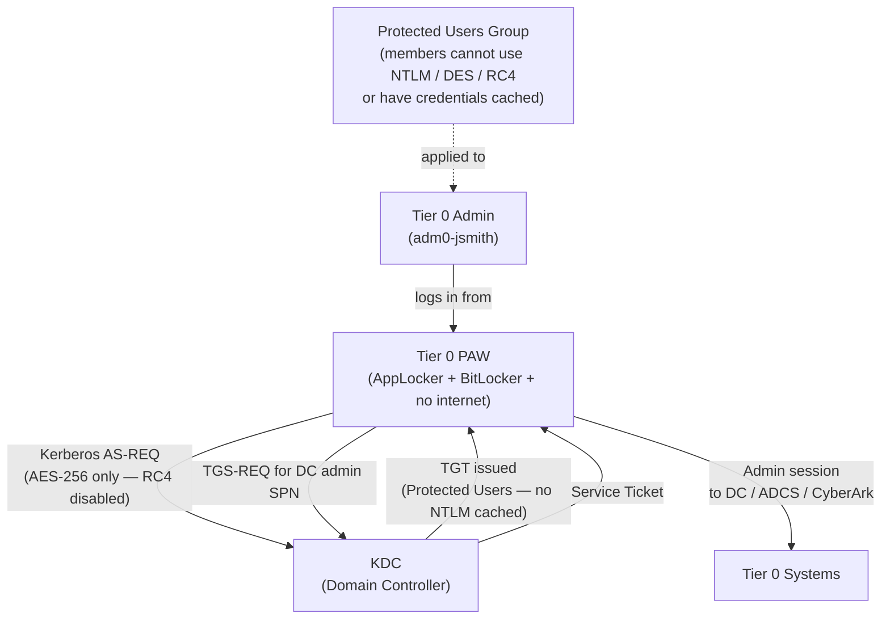

---
tags:
  - security
  - windows
---
# Active Directory — Authentication


<div class="kb-summary">
Authentication reference covering Privileged Access and Kerberos Security Flow, Privileged Access Workstations (PAWs), Protected Users Group, Kerberos Encryption Policy, Related Reference.

*Applies to: Windows Server 2019 / 2022*
</div>


```d2
direction: down

external: External / Untrusted {shape: rectangle}
privileged_access_and_kerberos_secur: "Privileged Access and Kerberos Security Flow" {shape: rectangle}
privileged_access_workstations_paws: "Privileged Access Workstations (PAWs)" {shape: rectangle}
protected_users_group: "Protected Users Group" {shape: rectangle}
kerberos_encryption_policy: "Kerberos Encryption Policy" {shape: rectangle}
related_reference: "Related Reference" {shape: rectangle}
core: "Active Directory Core" {shape: hexagon}

external -> privileged_access_and_kerberos_secur: traffic in
privileged_access_and_kerberos_secur -> privileged_access_workstations_paws
privileged_access_workstations_paws -> protected_users_group
protected_users_group -> kerberos_encryption_policy
kerberos_encryption_policy -> related_reference
related_reference -> core: secured path
```

## Before you begin

- **Access:** Local Administrator or Domain Admin on target hosts
- **Change management:** security changes require CAB approval in most environments
- **Rollback plan:** document current state before any security control change
- **Testing:** validate in a non-production environment first where possible

---

## Privileged Access and Kerberos Security Flow



## Privileged Access Workstations (PAWs)

PAWs are hardened, dedicated hosts:
- No internet browsing, email, or productivity apps
- AppLocker / WDAC policy allows only admin tools
- BitLocker + TPM + Secure Boot enforced
- Joined to separate PAW OU with restricted GPO

```powershell
# Verify PAW OU GPO — confirm internet-facing apps are blocked
Get-GPInheritance -Target "OU=PAW,OU=Tier0,DC=corp,DC=local"

# Check logon restriction policy on DC
Get-GPOReport -Name "Tier0-Logon-Restrictions" -ReportType Html -Path C:\Reports\tier0-gpo.html
```

## Protected Users Group

```powershell
# Add privileged accounts to Protected Users
Add-ADGroupMember -Identity "Protected Users" -Members "admin-tier0-01","admin-tier0-02"

# Verify current membership
Get-ADGroupMember -Identity "Protected Users" | Select-Object SamAccountName, DistinguishedName
```

Protected Users group members cannot:
- Authenticate with NTLM, DES, or RC4
- Use unconstrained delegation
- Have their credentials cached on non-DCs

## Kerberos Encryption Policy

```powershell
# Verify Kerberos encryption GPO is applied to DCs
# GPO setting: Computer → Windows Settings → Security Settings →
# Local Policies → Security Options → "Network security: Configure encryption types allowed for Kerberos"
# Desired: AES128_HMAC_SHA1, AES256_HMAC_SHA1 only (DES and RC4 unchecked)

# Check if RC4 is still in use (legacy clients will fail after disabling)
# Event ID 4769 with "Ticket Encryption Type: 0x17" = RC4 in use
Get-WinEvent -ComputerName dc1 -FilterHashtable @{
    LogName='Security'; Id=4769
} -MaxEvents 500 | Where-Object { $_.Message -match "0x17" } | Select-Object -First 10 TimeCreated, Message
```
---

## Related Reference

- [Standard LDAP Integration](../../ldap-integration/index.md) — field reference, service account standards, TLS requirements, and connectivity testing

---

## See also

- [Active Directory — Access Control](access-control/)
- [Active Directory — Hardening](hardening/)
- [Active Directory — Encryption](encryption/)
