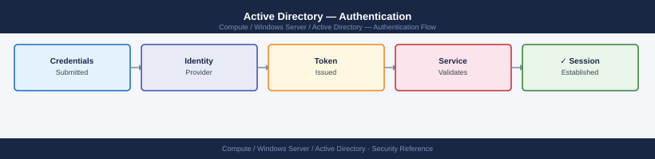

---
tags:
  - security
  - windows
---
# Active Directory — Authentication

<div class="kb-summary">
Authentication reference covering Privileged Access and Kerberos Security Flow, Privileged Access Workstations (PAWs), Protected Users Group, Kerberos Encryption Policy, Related Reference.

*Applies to: Windows Server 2019 / 2022*
</div>


## Before you begin

- **Access:** Local Administrator or Domain Admin on target hosts
- **Change management:** security changes require CAB approval in most environments
- **Rollback plan:** document current state before any security control change
- **Testing:** validate in a non-production environment first where possible

---

## Privileged Access and Kerberos Security Flow

```d2
direction: right

userTier0: "Tier 0 Admin\n(adm0-jsmith" {shape: rectangle}
paw: "Tier 0 PAW\n(AppLocker + BitLocker + no internet" {shape: rectangle}
kdc: "KDC\n(Domain Controller" {shape: rectangle}
tier0Sys: "Tier 0 Systems" {shape: rectangle}

userTier0 -> paw
paw -> kdc
kdc -> paw
paw -> tier0Sys
```

## Privileged Access Workstations (PAWs)

PAWs are hardened, dedicated hosts:
- No internet browsing, email, or productivity apps
- AppLocker / WDAC policy allows only admin tools
- BitLocker + TPM + Secure Boot enforced
- Joined to separate PAW OU with restricted GPO

```powershell
# Verify PAW OU GPO — confirm internet-facing apps are blocked
Get-GPInheritance -Target "OU=PAW,OU=Tier0,DC=corp,DC=local"

# Check logon restriction policy on DC
Get-GPOReport -Name "Tier0-Logon-Restrictions" -ReportType Html -Path C:\Reports\tier0-gpo.html
```

## Protected Users Group

```powershell
# Add privileged accounts to Protected Users
Add-ADGroupMember -Identity "Protected Users" -Members "admin-tier0-01","admin-tier0-02"

# Verify current membership
Get-ADGroupMember -Identity "Protected Users" | Select-Object SamAccountName, DistinguishedName
```

Protected Users group members cannot:
- Authenticate with NTLM, DES, or RC4
- Use unconstrained delegation
- Have their credentials cached on non-DCs

## Kerberos Encryption Policy

```powershell
# Verify Kerberos encryption GPO is applied to DCs
# GPO setting: Computer → Windows Settings → Security Settings →
# Local Policies → Security Options → "Network security: Configure encryption types allowed for Kerberos"
# Desired: AES128_HMAC_SHA1, AES256_HMAC_SHA1 only (DES and RC4 unchecked)

# Check if RC4 is still in use (legacy clients will fail after disabling)
# Event ID 4769 with "Ticket Encryption Type: 0x17" = RC4 in use
Get-WinEvent -ComputerName dc1 -FilterHashtable @{
    LogName='Security'; Id=4769
} -MaxEvents 500 | Where-Object { $_.Message -match "0x17" } | Select-Object -First 10 TimeCreated, Message
```
---

## Related Reference


---

## See also

- [Active Directory — Access Control](../access-control/)
- [Active Directory — Hardening](../hardening/)
- [Active Directory — Encryption](../encryption/)
