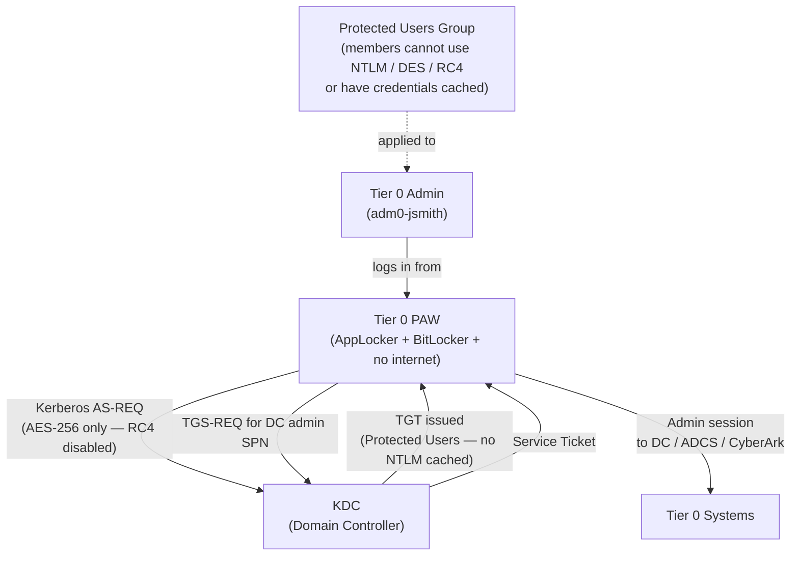

---
tags:
  - security
  - windows
---
# Active Directory — Authentication


<div class="kb-summary">
Authentication reference covering Privileged Access and Kerberos Security Flow, Privileged Access Workstations (PAWs), Protected Users Group, Kerberos Encryption Policy, Related Reference.

*Applies to: Windows Server 2019 / 2022*
</div>
```text
┌───────────────────────── Security Active Directory Security — Authentication ─────────────────────────┐
│                                                                                                       │
│   ┌───────────────────────────────────────────────────────────────────────────────────────────────┐   │
│   │     Active Directory authentication: local accounts, LDAP/AD, RADIUS, and SAML SSO options    │   │
│   │        MFA: time-based OTP or hardware token required for all privileged admin accounts       │   │
│   │         Service accounts: dedicated accounts for automation; API tokens/keys preferred        │   │
│   │       Session: idle timeout enforced; concurrent session limits for admin role accounts       │   │
│   └───────────────────────────────────────────────────────────────────────────────────────────────┘   │
│                                                                                                       │
│    Login → authenticate LDAP/SAML/local → MFA → authorise role → session                              │
│                                                                                                       │
│                  ▼                                ▼                                ▼                  │
│                                                                                                       │
│   ┌─────────────────────────────┐  ┌─────────────────────────────┐  ┌─────────────────────────────┐   │
│   │            Layer            │  │          Component          │  │            Notes            │   │
│   │             Core            │  │       Primary service       │  │        Main function        │   │
│   │          Management         │  │        Control plane        │  │         Admin access        │   │
│   │          Monitoring         │  │         Health/perf         │  │      Alerts/dashboards      │   │
│   │           Security          │  │         Auth/encrypt        │  │        Access control       │   │
│   │         Integration         │  │        APIs/plug-ins        │  │         Third-party         │   │
│   └─────────────────────────────┘  └─────────────────────────────┘  └─────────────────────────────┘   │
│                                                                                                       │
│                          ▼                                                 ▼                          │
│                                                                                                       │
│   ┌───────────────────────────────────────────────────────────────────────────────────────────────┐   │
│   │      Method      │     Use case     │  Config location  │       MFA        │     Priority     │   │
│   │     LDAP/AD      │  Staff accounts  │   Auth settings   │     Required     │     Primary      │   │
│   │     SAML SSO     │    Federated     │    SSO settings   │   IdP-enforced   │    Preferred     │   │
│   │      Local       │   Break-glass    │    Local users    │     Required     │  Emergency only  │   │
│   │    API token     │    Automation    │  Service account  │   N/A (token)    │    Automation    │   │
│   └───────────────────────────────────────────────────────────────────────────────────────────────┘   │
│                                                                                                       │
│    Physical: Security Active Directory Security infrastructure · management network · monitoring      │
│                                                                                                       │
│    Key terms:                                                                                         │
│                                                                                                       │
│    Active Directory   = Security Active Directory Security platform overview and core concepts        │
│    Management         = management console and command-line interface for administration              │
│    Monitoring         = health and performance monitoring dashboards and alerting                     │
│    Automation         = REST API, scripting, and pipeline integration capabilities                    │
│    Security           = access control, authentication, and encryption configuration                  │
│    Backup             = backup and recovery procedures and schedule configuration                     │
│    Upgrade            = software version upgrades and firmware patching procedures                    │
│    Troubleshooting    = diagnostic procedures and common issue resolution steps                       │
│    Escalation         = vendor support escalation path and severity triage process                    │
│    Documentation      = vendor knowledge base and official product documentation                      │
│    Change management  = change ticket requirements for production modifications                       │
│    Audit log          = admin action logging for compliance and security review                       │
│                                                                                                       │
└───────────────────────────────────────────────────────────────────────────────────────────────────────┘
```


## Privileged Access and Kerberos Security Flow



## Privileged Access Workstations (PAWs)

PAWs are hardened, dedicated hosts:
- No internet browsing, email, or productivity apps
- AppLocker / WDAC policy allows only admin tools
- BitLocker + TPM + Secure Boot enforced
- Joined to separate PAW OU with restricted GPO

```powershell
# Verify PAW OU GPO — confirm internet-facing apps are blocked
Get-GPInheritance -Target "OU=PAW,OU=Tier0,DC=corp,DC=local"

# Check logon restriction policy on DC
Get-GPOReport -Name "Tier0-Logon-Restrictions" -ReportType Html -Path C:\Reports\tier0-gpo.html
```

## Protected Users Group

```powershell
# Add privileged accounts to Protected Users
Add-ADGroupMember -Identity "Protected Users" -Members "admin-tier0-01","admin-tier0-02"

# Verify current membership
Get-ADGroupMember -Identity "Protected Users" | Select-Object SamAccountName, DistinguishedName
```

Protected Users group members cannot:
- Authenticate with NTLM, DES, or RC4
- Use unconstrained delegation
- Have their credentials cached on non-DCs

## Kerberos Encryption Policy

```powershell
# Verify Kerberos encryption GPO is applied to DCs
# GPO setting: Computer → Windows Settings → Security Settings →
# Local Policies → Security Options → "Network security: Configure encryption types allowed for Kerberos"
# Desired: AES128_HMAC_SHA1, AES256_HMAC_SHA1 only (DES and RC4 unchecked)

# Check if RC4 is still in use (legacy clients will fail after disabling)
# Event ID 4769 with "Ticket Encryption Type: 0x17" = RC4 in use
Get-WinEvent -ComputerName dc1 -FilterHashtable @{
    LogName='Security'; Id=4769
} -MaxEvents 500 | Where-Object { $_.Message -match "0x17" } | Select-Object -First 10 TimeCreated, Message
```
---

## Related Reference

- [Standard LDAP Integration](../../../ldap-integration/index.md) — field reference, service account standards, TLS requirements, and connectivity testing
