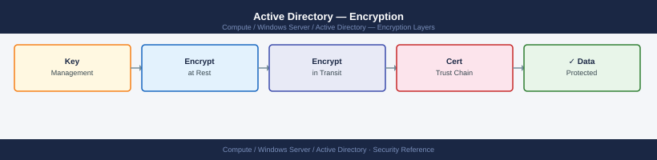

---
tags:
  - security
  - windows
---
# Active Directory — Encryption

<div class="kb-summary">
Encryption reference covering AD Protocol Encryption Overview, Enforcing LDAP Signing and Channel Binding, Kerberos Encryption Policy.

*Applies to: Windows Server 2019 / 2022*
</div>


## Before you begin

- **Access:** Local Administrator or Domain Admin on target hosts
- **Change management:** security changes require CAB approval in most environments
- **Rollback plan:** document current state before any security control change
- **Testing:** validate in a non-production environment first where possible

---

## AD Protocol Encryption Overview

```d2
direction: right

clients: "AD Clients\n(computers / apps" {shape: rectangle}
dc: "Domain Controller\n(LDAP with Signing + Channel Binding" {shape: rectangle}
kdc: "KDC\n(on DC" {shape: rectangle}
sysvol: "SYSVOL / DFSR" {shape: rectangle}
ntds: "NTDS.DIT\n(AD database — AES encrypted at rest" {shape: rectangle}

clients -> dc
clients -> kdc
clients -> sysvol
dc -> ntds
kdc -> ntds
```

## Enforcing LDAP Signing and Channel Binding

```powershell
# Verify current LDAP signing requirement via registry on DC
Get-ItemProperty -Path "HKLM:\System\CurrentControlSet\Services\NTDS\Parameters" |
    Select-Object "LDAPServerIntegrity"
# 2 = Require (desired); 1 = Negotiate; 0 = None

# Verify channel binding token requirements
Get-ItemProperty -Path "HKLM:\System\CurrentControlSet\Services\NTDS\Parameters" |
    Select-Object "LdapEnforceChannelBinding"
# 2 = Always (desired); 1 = When Supported; 0 = Never
```

## Kerberos Encryption Policy

```powershell
# Verify Kerberos encryption GPO is applied to DCs
# GPO setting: Computer → Windows Settings → Security Settings →
# Local Policies → Security Options → "Network security: Configure encryption types allowed for Kerberos"
# Desired: AES128_HMAC_SHA1, AES256_HMAC_SHA1 only (DES and RC4 unchecked)

# Check if RC4 is still in use (legacy clients will fail after disabling)
# Event ID 4769 with "Ticket Encryption Type: 0x17" = RC4 in use
Get-WinEvent -ComputerName dc1 -FilterHashtable @{
    LogName='Security'; Id=4769
} -MaxEvents 500 | Where-Object { $_.Message -match "0x17" } | Select-Object -First 10 TimeCreated, Message
```

---

## See also

- [Active Directory — Hardening](../hardening/)
- [Active Directory — Authentication](../authentication/)
- [Active Directory — Access Control](../access-control/)
