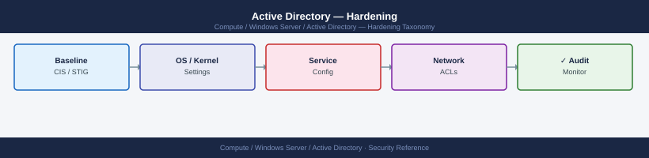
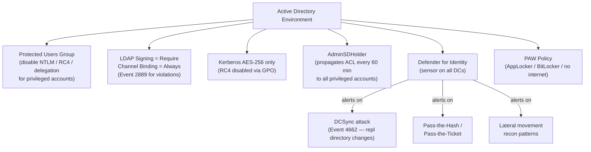

---
tags:
  - security
  - windows
---
# Active Directory — Hardening


<div class="kb-summary">
Hardening reference covering AD Hardening Controls Flow, DCSync Attack Detection, Defender for Identity Deployment, Hardening Checklist.

*Applies to: Windows Server 2019 / 2022*
</div>



```d2
direction: down

external: External / Untrusted {shape: rectangle}
ad_hardening_controls_flow: "AD Hardening Controls Flow" {shape: rectangle}
dcsync_attack_detection: "DCSync Attack Detection" {shape: rectangle}
defender_for_identity_deployment: "Defender for Identity Deployment" {shape: rectangle}
hardening_checklist: "Hardening Checklist" {shape: rectangle}
core: "Active Directory Core" {shape: hexagon}

external -> ad_hardening_controls_flow: traffic in
ad_hardening_controls_flow -> dcsync_attack_detection
dcsync_attack_detection -> defender_for_identity_deployment
defender_for_identity_deployment -> hardening_checklist
hardening_checklist -> core: secured path
```

## Before you begin

- **Access:** Local Administrator or Domain Admin on target hosts
- **Change management:** security changes require CAB approval in most environments
- **Rollback plan:** document current state before any security control change
- **Testing:** validate in a non-production environment first where possible

---

## AD Hardening Controls Flow



## DCSync Attack Detection

```powershell
# Defender for Identity alert: "Directory Services Replication Request"
# Also: Event ID 4662 with access mask 0x100 (Replicating Directory Changes)
Get-WinEvent -ComputerName dc1 -FilterHashtable @{
    LogName='Security'; Id=4662
} -MaxEvents 200 | Where-Object { $_.Message -match "1131f6aa" -or $_.Message -match "1131f6ad" }
# These GUIDs = Replicating Directory Changes (All)
```

## Defender for Identity Deployment

```powershell
# Install MDI sensor on each DC
# Download sensor installer from MDI portal → Sensors → + Sensor
# On DC:
.\Azure ATP Sensor Setup.exe /quiet NetFrameworkCommandLineArguments="/q" AccessKey="<sensor-key>"

# Verify sensor status
# MDI portal → Sensors → confirm all DCs show "Running"
```

## Hardening Checklist

- [ ] Protected Users group populated with all Tier 0 accounts
- [ ] LDAP signing = Require on all DCs
- [ ] LDAP channel binding = Always on all DCs
- [ ] Kerberos RC4 disabled via GPO
- [ ] AdminSDHolder ACL reviewed for unexpected permissions
- [ ] Defender for Identity sensor on all DCs, alerting active
- [ ] Privileged accounts have no email, no SPN, no internet
- [ ] PAW policy applied and enforced
- [ ] Fine-grained password policy applied to admin groups (min 20-char passphrase)
- [ ] AD Recycle Bin enabled (forest functional level 2008 R2+)
- [ ] Audit policy: Account logon, Directory Service Access, Account Management all enabled

---

## See also

- [Active Directory — Authentication](authentication/)
- [Active Directory — Access Control](access-control/)
- [Active Directory — Encryption](encryption/)
