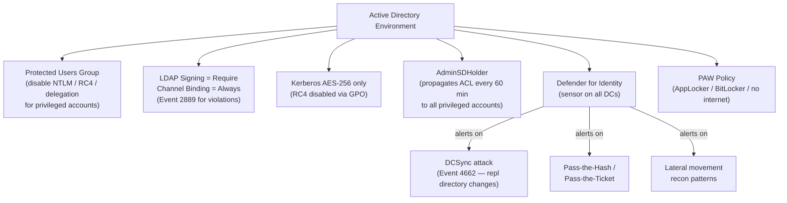

---
tags:
  - security
  - windows
---
# Active Directory — Hardening


<div class="kb-summary">
Hardening reference covering AD Hardening Controls Flow, DCSync Attack Detection, Defender for Identity Deployment, Hardening Checklist.
</div>
```text
┌─────────────────────── Security Active Directory Security — Security Hardening ───────────────────────┐
│                                                                                                       │
│   ┌───────────────────────────────────────────────────────────────────────────────────────────────┐   │
│   │   Active Directory hardening: disable unused protocols, enforce encryption, restrict access   │   │
│   │         Network: dedicated storage VLAN; restrict management access to jump hosts only        │   │
│   │        Auth: disable default accounts; enforce password complexity and rotation policy        │   │
│   │         Audit: forward syslog to SIEM; alert on privilege escalation and failed logins        │   │
│   └───────────────────────────────────────────────────────────────────────────────────────────────┘   │
│                                                                                                       │
│    Baseline config → disable unused → enforce MFA → enable logging → audit                            │
│                                                                                                       │
│                  ▼                                ▼                                ▼                  │
│                                                                                                       │
│   ┌─────────────────────────────┐  ┌─────────────────────────────┐  ┌─────────────────────────────┐   │
│   │            Layer            │  │          Component          │  │            Notes            │   │
│   │             Core            │  │       Primary service       │  │        Main function        │   │
│   │          Management         │  │        Control plane        │  │         Admin access        │   │
│   │          Monitoring         │  │         Health/perf         │  │      Alerts/dashboards      │   │
│   │           Security          │  │         Auth/encrypt        │  │        Access control       │   │
│   │         Integration         │  │        APIs/plug-ins        │  │         Third-party         │   │
│   └─────────────────────────────┘  └─────────────────────────────┘  └─────────────────────────────┘   │
│                                                                                                       │
│                          ▼                                                 ▼                          │
│                                                                                                       │
│   ┌───────────────────────────────────────────────────────────────────────────────────────────────┐   │
│   │       Area       │     Control      │      Standard     │      Verify      │    Frequency     │   │
│   │     Accounts     │ Disable defaults │  No default creds │   Login audit    │      Deploy      │   │
│   │    Protocols     │  Disable unused  │   TLS 1.2+ only   │    Port scan     │     Monthly      │   │
│   │       MFA        │ Enforce all admi │   TOTP/hardware   │    Auth logs     │    Continuous    │   │
│   │     Logging      │ SIEM forwarding  │  All admin events │   SIEM alerts    │      Daily       │   │
│   └───────────────────────────────────────────────────────────────────────────────────────────────┘   │
│                                                                                                       │
│    Physical: Security Active Directory Security infrastructure · management network · monitoring      │
│                                                                                                       │
│    Key terms:                                                                                         │
│                                                                                                       │
│    Active Directory   = Security Active Directory Security platform overview and core concepts        │
│    Management         = management console and command-line interface for administration              │
│    Monitoring         = health and performance monitoring dashboards and alerting                     │
│    Automation         = REST API, scripting, and pipeline integration capabilities                    │
│    Security           = access control, authentication, and encryption configuration                  │
│    Backup             = backup and recovery procedures and schedule configuration                     │
│    Upgrade            = software version upgrades and firmware patching procedures                    │
│    Troubleshooting    = diagnostic procedures and common issue resolution steps                       │
│    Escalation         = vendor support escalation path and severity triage process                    │
│    Documentation      = vendor knowledge base and official product documentation                      │
│    Change management  = change ticket requirements for production modifications                       │
│    Audit log          = admin action logging for compliance and security review                       │
│                                                                                                       │
└───────────────────────────────────────────────────────────────────────────────────────────────────────┘
```


## AD Hardening Controls Flow



## DCSync Attack Detection

```powershell
# Defender for Identity alert: "Directory Services Replication Request"
# Also: Event ID 4662 with access mask 0x100 (Replicating Directory Changes)
Get-WinEvent -ComputerName dc1 -FilterHashtable @{
    LogName='Security'; Id=4662
} -MaxEvents 200 | Where-Object { $_.Message -match "1131f6aa" -or $_.Message -match "1131f6ad" }
# These GUIDs = Replicating Directory Changes (All)
```

## Defender for Identity Deployment

```powershell
# Install MDI sensor on each DC
# Download sensor installer from MDI portal → Sensors → + Sensor
# On DC:
.\Azure ATP Sensor Setup.exe /quiet NetFrameworkCommandLineArguments="/q" AccessKey="<sensor-key>"

# Verify sensor status
# MDI portal → Sensors → confirm all DCs show "Running"
```

## Hardening Checklist

- [ ] Protected Users group populated with all Tier 0 accounts
- [ ] LDAP signing = Require on all DCs
- [ ] LDAP channel binding = Always on all DCs
- [ ] Kerberos RC4 disabled via GPO
- [ ] AdminSDHolder ACL reviewed for unexpected permissions
- [ ] Defender for Identity sensor on all DCs, alerting active
- [ ] Privileged accounts have no email, no SPN, no internet
- [ ] PAW policy applied and enforced
- [ ] Fine-grained password policy applied to admin groups (min 20-char passphrase)
- [ ] AD Recycle Bin enabled (forest functional level 2008 R2+)
- [ ] Audit policy: Account logon, Directory Service Access, Account Management all enabled
