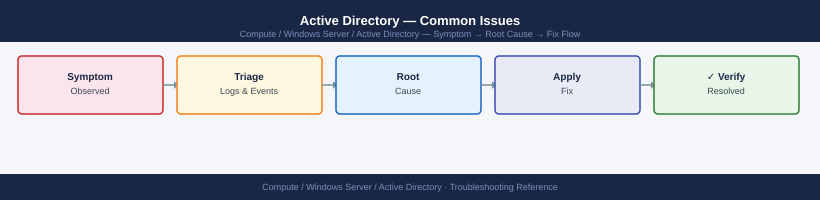
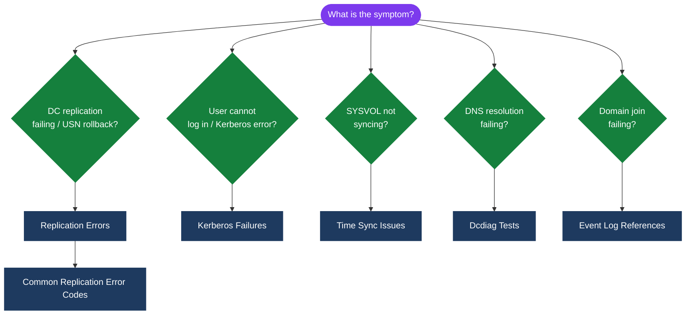
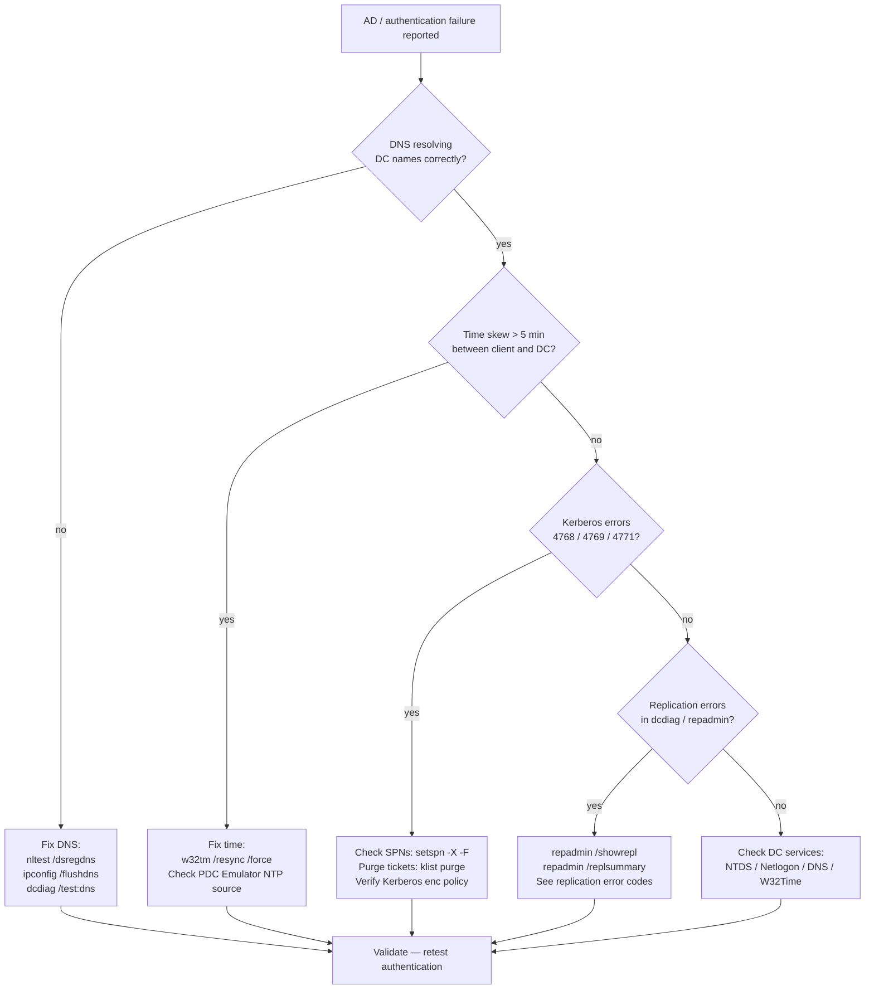

---
tags:
  - troubleshooting
  - windows
search:
  boost: 2
---
# Active Directory — Common Issues


<div class="kb-summary">
AD failures typically trace back to replication, DNS, time sync, or Kerberos. This page covers the most common failure categories with diagnostic commands.

*Applies to: Windows Server 2019 / 2022*
</div>



```d2
direction: down

symptom: Identify Symptom {shape: diamond}
diagnostic_flow: "Diagnostic Flow" {shape: rectangle}
ad_failure_triage_flowchart: "AD Failure Triage Flowchart" {shape: rectangle}
replication_errors: "Replication Errors" {shape: rectangle}
common_replication_error_codes: "Common Replication Error Codes" {shape: rectangle}
dcdiag_tests: "Dcdiag Tests" {shape: rectangle}
kerberos_failures: "Kerberos Failures" {shape: rectangle}
resolution: Resolve or Escalate {shape: oval}

symptom -> diagnostic_flow: investigate
symptom -> ad_failure_triage_flowchart: investigate
symptom -> replication_errors: investigate
symptom -> common_replication_error_codes: investigate
symptom -> dcdiag_tests: investigate
symptom -> kerberos_failures: investigate
diagnostic_flow -> resolution
ad_failure_triage_flowchart -> resolution
replication_errors -> resolution
common_replication_error_codes -> resolution
dcdiag_tests -> resolution
kerberos_failures -> resolution
```

## Diagnostic Flow



---

## Before you begin

- **Access:** Local Administrator or Domain Admin on target hosts
- **Gather first:** recent error message text, event timestamps, and affected object names
- **Scope:** confirm whether the issue affects a single object, host, cluster, or site
- **Escalation:** open a vendor support ticket before running any destructive step
- **Logging:** document each command and output — required if escalation is needed

---

## AD Failure Triage Flowchart




## Replication Errors

AD replication failures cause inconsistent directory state across DCs. Start with `repadmin` to identify the scope.

```cmd
# Show replication status for all partners
repadmin /showrepl

# Show replication summary (good overview)
repadmin /replsummary

# Force replication from a specific source DC
repadmin /replicate dc02.corp.example.com dc01.corp.example.com "DC=corp,DC=example,DC=com"

# Force full sync from all partners
repadmin /syncall /AdeP

# Show replication errors only
repadmin /showrepl * /csv > C:\repl-errors.csv
```

## Common Replication Error Codes

| Error Code | Meaning | Common Fix |
|---|---|---|
| 8453 | Replication access denied | Check AD permissions on NC head |
| 1722 | RPC server unavailable | Check firewall, DNS, DC connectivity |
| 8606 | Insufficient attributes | USN rollback — restore or demote DC |
| 8614 | Replication quarantine | DC offline too long — check tombstone lifetime |
| -2146893022 | Target principal name incorrect | Time skew or SPN issue |

## Dcdiag Tests

```cmd
# Full dcdiag run
dcdiag /test:all /v /f:C:\dcdiag-output.txt

# DNS-specific test
dcdiag /test:dns /v

# Connectivity test only
dcdiag /test:connectivity

# Run against a remote DC
dcdiag /s:dc02.corp.example.com /test:replications
```

## Kerberos Failures

Most Kerberos errors stem from time skew (>5 min), DNS, or SPN issues.

```cmd
# Check Kerberos tickets on a client
klist

# Purge Kerberos ticket cache
klist purge

# Check time difference between client and DC
w32tm /stripchart /computer:dc01.corp.example.com /samples:5

# List SPNs for a service account
setspn -L svc-webapp

# Find duplicate SPNs (common cause of Kerberos failures)
setspn -X -F
```

## Time Sync Issues

```cmd
# Check current sync status
w32tm /query /status

# Force resync
w32tm /resync /force

# Check time source hierarchy
w32tm /query /peers

# Configure a workstation to use the domain hierarchy
w32tm /config /syncfromflags:domhier /update
net stop w32tm && net start w32tm
```

## Event Log References

```powershell
# Check Directory Service log for replication errors
Get-WinEvent -LogName "Directory Service" |
    Where-Object {$_.Level -le 3} | Select-Object -First 20 TimeCreated, Id, Message

# Check System log for Netlogon errors
Get-WinEvent -LogName System -ProviderName Netlogon |
    Select-Object -First 20 TimeCreated, Id, Message

# Check for Kerberos errors in Security log
Get-WinEvent -LogName Security |
    Where-Object {$_.Id -in @(4768,4769,4771)} |
    Select-Object -First 20 TimeCreated, Id, Message
```

---

## Verify resolution

- Confirm the original symptom no longer occurs
- Check logs for any residual errors related to the issue
- Monitor for 10–15 minutes to confirm the fix is stable

---

## See also

- [Active Directory — Diagnostics](../diagnostics/)
- [Active Directory — Escalation](../escalation/)
- [Active Directory — Health Checks](../../operations/health-checks/)
