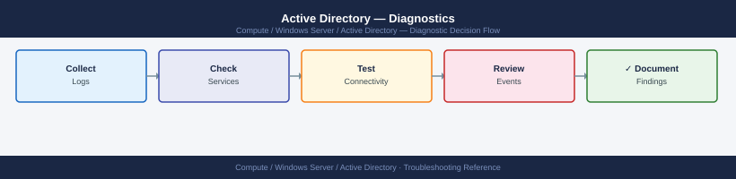
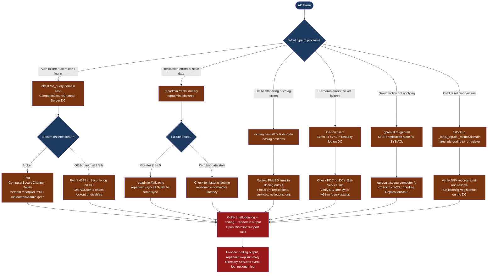

---
tags:
  - troubleshooting
  - windows
  - active-directory
search:
  boost: 1.5
---
# Active Directory — Diagnostics

<div class="kb-summary">
Active Directory diagnostic commands: run dcdiag tests on domain controllers, check replication health with repadmin, find FSMO role holders, test secure channels, review Directory Services and Security event logs, and collect netlogon debug logs for Microsoft support.

*Applies to: Windows Server 2019 / 2022 AD DS*
</div>





```d2
direction: down

symptom: Identify Symptom {shape: diamond}
step_1_run_dcdiag_on_the_affected_dc: "Step 1 — Run dcdiag on the affected DC" {shape: rectangle}
step_2_check_replication_health: "Step 2 — Check replication health" {shape: rectangle}
step_3_find_fsmo_role_holders_and_ve: "Step 3 — Find FSMO role holders and verify DNS SRV records" {shape: rectangle}
step_4_test_secure_channel_and_kerbe: "Step 4 — Test secure channel and Kerberos" {shape: rectangle}
step_5_review_directory_services_and: "Step 5 — Review Directory Services and Security event logs" {shape: rectangle}
step_6_check_group_policy_and_sysvol: "Step 6 — Check Group Policy and SYSVOL replication" {shape: rectangle}
resolution: Resolve or Escalate {shape: oval}

symptom -> step_1_run_dcdiag_on_the_affected_dc: investigate
symptom -> step_2_check_replication_health: investigate
symptom -> step_3_find_fsmo_role_holders_and_ve: investigate
symptom -> step_4_test_secure_channel_and_kerbe: investigate
symptom -> step_5_review_directory_services_and: investigate
symptom -> step_6_check_group_policy_and_sysvol: investigate
step_1_run_dcdiag_on_the_affected_dc -> resolution
step_2_check_replication_health -> resolution
step_3_find_fsmo_role_holders_and_ve -> resolution
step_4_test_secure_channel_and_kerbe -> resolution
step_5_review_directory_services_and -> resolution
step_6_check_group_policy_and_sysvol -> resolution
```

## Before you begin

- **Access:** Domain Admin credentials (or delegated AD Diagnostic rights); RDP or console access to a domain controller; Remote Server Administration Tools (RSAT) installed on your workstation
- **Gather first:** the specific symptom (login failure, GPO not applying, replication error event ID), the affected DC name and site name, and approximate time the issue started
- **Scope:** confirm whether the issue affects one DC, one site, or the entire domain

---

## Step 1 — Run dcdiag on the affected DC

```cmd
:: Run ALL dcdiag tests — always start here
dcdiag /test:all /v /s:<dc-fqdn> /f:C:\Logs\dcdiag.log
:: Review output: look for "FAILED" lines

:: Quick focused run: most common failure sources
dcdiag /test:connectivity /test:dns /test:replications /test:services /test:netlogons /v

:: DNS-specific test suite
dcdiag /test:DNS /DnsBasic /DnsForwarders /DnsDelegation /DnsRecordRegistration /v

:: Run against a remote DC from your workstation (requires RSAT)
dcdiag /s:<remote-dc-fqdn> /test:all /v
```

Common dcdiag failures:

| Test | FAILED means |
|---|---|
| Connectivity | DC unreachable on port 389/88/135 |
| Replications | AD replication errors between DC pairs |
| Services | NTDS, KDC, or netlogon service not running |
| Netlogons | Netlogon service not authenticating machines |
| DNS | SRV records missing or DC cannot register DNS |
| FSMOCheck | FSMO role holder unreachable |

---

## Step 2 — Check replication health

```cmd
:: Quick replication health overview
repadmin /replsummary
:: Columns: Source DC, Largest Delta, Fails, Total

:: Detailed per-partner replication status
repadmin /showrepl
:: Look for: FAILED lines with error codes

:: Force sync of all naming contexts from all partners
repadmin /syncall /AdeP
:: Flags: A=all partitions, d=DN format, e=enterprise, P=push

:: Show failed replication operations stuck in cache
repadmin /failcache
```

Common replication error codes:

| Error | Meaning |
|---|---|
| 8453 | Replication access denied — check SPN / dcdiag /test:CheckSDRefDom |
| 1256 | Remote DC unreachable — check network and firewall port 135/389 |
| 8606 | Lingering objects — use repadmin /removelingeringobjects |
| 8614 | DC offline longer than tombstone lifetime — demote and re-promote |

---

## Step 3 — Find FSMO role holders and verify DNS SRV records

```powershell
# FSMO role holder inventory
netdom query fsmo
# Expected: all 5 roles assigned to reachable DCs

# List all DCs with site, IP, and role info
Get-ADDomainController -Filter * |
  Select Name, IPv4Address, Site, IsGlobalCatalog, OperationMasterRoles |
  Format-Table -AutoSize

# DNS DC locator SRV records — clients use these to find DCs
nslookup -type=SRV _ldap._tcp.dc._msdcs.<domain>
nslookup -type=SRV _kerberos._tcp.dc._msdcs.<domain>
# Expected: one or more DC IPs returned

# Re-register DC DNS records if missing (run on the DC itself)
nltest /dsregdns
ipconfig /registerdns

# Site-specific DC locator SRV records
nslookup -type=SRV _ldap._tcp.<site-name>._sites.dc._msdcs.<domain>
```

---

## Step 4 — Test secure channel and Kerberos

```powershell
# Test secure channel from a member server
nltest /sc_query:<domain>
# Expected: Status = 0 0x0 NERR_Success

# Test and optionally repair secure channel
Test-ComputerSecureChannel -Server <dc-fqdn>
Test-ComputerSecureChannel -Repair -Credential (Get-Credential)

# Reset machine account password via netdom (alternative repair)
netdom resetpwd /s:<dc-hostname> /ud:<domain>\<admin-user> /pd:*

# List cached Kerberos tickets
klist
# Expired tickets cause auth failures — purge and re-auth
klist purge

# Verify all required DC ports are reachable
Test-NetConnection -ComputerName <dc-fqdn> -Port 389    # LDAP
Test-NetConnection -ComputerName <dc-fqdn> -Port 636    # LDAPS
Test-NetConnection -ComputerName <dc-fqdn> -Port 3268   # Global Catalog
Test-NetConnection -ComputerName <dc-fqdn> -Port 88     # Kerberos
Test-NetConnection -ComputerName <dc-fqdn> -Port 135    # RPC endpoint mapper
```

---

## Step 5 — Review Directory Services and Security event logs

```powershell
# Directory Services log — primary AD error source
Get-EventLog -LogName "Directory Services" -Newest 100 |
  Where-Object {$_.EntryType -match "Error|Warning"} |
  Select TimeGenerated, EventID, Source, Message |
  Format-List

# Key replication event IDs
Get-EventLog -LogName "Directory Services" -Newest 200 |
  Where-Object {$_.EventID -in @(1311,1388,1864,2042,1722,1925)} |
  Select TimeGenerated, EventID, Message

# Auth failures in Security log
Get-EventLog -LogName Security -Newest 100 |
  Where-Object {$_.EventID -in @(4625,4771,4769,4768)} |
  Select TimeGenerated, EventID, Message
```

Key event IDs:

| Event ID | Source | Meaning |
|---|---|---|
| 1311 | Directory Services | Replication configuration error |
| 1388 / 1988 | Directory Services | Lingering object conflict |
| 1864 | Directory Services | No replication in 24 hours |
| 2042 | Directory Services | DC offline past tombstone lifetime |
| 4625 | Security | NTLM logon failure |
| 4771 | Security | Kerberos pre-auth failure |

---

## Step 6 — Check Group Policy and SYSVOL replication

```cmd
:: GPO result for current user/computer
gpresult /h C:\Logs\gpresult.html /f
:: Open HTML report: see Applied and Denied GPOs with failure reason

:: SYSVOL replication health (DFS-R)
dfsrdiag ReplicationState

:: Check DFS-R service
Get-Service -Name DFSR

:: Confirm SYSVOL share exists on this DC
net share | findstr SYSVOL

:: Force GPO refresh
gpupdate /force
```

---

## Step 7 — Collect support data for Microsoft case

```cmd
:: Enable verbose netlogon debug logging on the affected DC
nltest /dbflag:0x2080FFFF
:: Reproduce the issue, then collect: C:\Windows\debug\netlogon.log

:: Disable logging after capture
nltest /dbflag:0x0

:: Export Directory Services event log
wevtutil epl "Directory Services" C:\Logs\DirectoryServices.evtx
wevtutil epl Security C:\Logs\Security.evtx

:: Full dcdiag to file
dcdiag /test:all /v /s:<dc-fqdn> /f:C:\Logs\dcdiag-full.log

:: Replication state
repadmin /replsummary > C:\Logs\replsummary.txt
repadmin /showrepl >> C:\Logs\replication.txt
repadmin /failcache >> C:\Logs\replication.txt

:: System and network state
systeminfo > C:\Logs\systeminfo.txt
ipconfig /all > C:\Logs\ipconfig.txt
netstat -an > C:\Logs\netstat.txt
```

---

## Log locations

| Source | Path / Command | What to look for |
|---|---|---|
| DC health | `dcdiag /test:all /v` | FAILED test entries |
| Replication | `repadmin /replsummary` | Failure count and largest delta |
| Netlogon | `C:\Windows\debug\netlogon.log` | Secure channel, auth, password errors |
| Directory Services | Event Viewer → Windows Logs → Directory Services | Event IDs 1311, 1388, 1864, 2042 |
| Security | Event Viewer → Windows Logs → Security | Event IDs 4625, 4771, 4769 |
| SYSVOL | `dfsrdiag ReplicationState` | DFS-R sync errors and backlog count |

---

## See also

- [Active Directory — Common Issues](common-issues/)
- [Active Directory — Escalation](escalation/)

## Verify resolution

- `dcdiag /test:all /v /s:<dc-fqdn>` returns no FAILED tests
- `repadmin /replsummary` shows 0 failures and delta < 15 minutes for all DC pairs
- `nltest /sc_query:<domain>` returns `Status = 0 0x0 NERR_Success`
- `klist purge` then re-authenticate the affected user — login succeeds
- `Get-EventLog -LogName "Directory Services" -Newest 20` shows no new Error events
