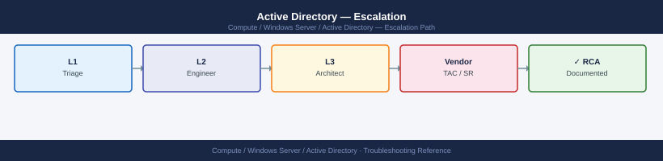
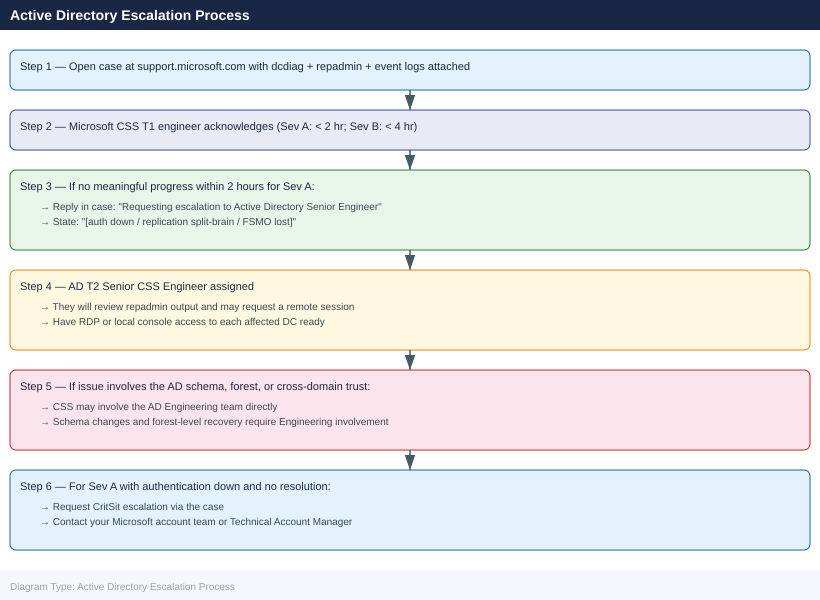

---
tags:
  - troubleshooting
  - windows
search:
  boost: 1.5
---
# Active Directory — Escalation

<div class="kb-summary">
How to escalate Active Directory issues to Microsoft support: what data to collect, how to run dcdiag and repadmin, step-by-step case creation on support.microsoft.com, and the escalation path when progress stalls.

*Applies to: Windows Server 2019 / 2022 Active Directory Domain Services*
</div>



---

## Before you begin

- **Access required:** Domain Admin or Enterprise Admin credentials; Local Administrator on each affected DC; Microsoft support account at support.microsoft.com with a Microsoft Unified or Premier Support contract
- **Do NOT seize FSMO roles** without Microsoft CSS direction — seizing an FSMO role that is still reachable creates a USN conflict that can cascade into a forest-wide replication failure
- **Do NOT run metadata cleanup** (`ntdsutil` metadata cleanup) without CSS guidance — removing a DC's metadata while the DC is still partially reachable creates orphaned objects that cause replication failures
- **Do NOT restart all DCs simultaneously** — losing all DCs at once removes all authentication capability and may interrupt any in-progress replication that could be key diagnostic data

---

## Pre-Escalation Self-Check

Run these on every affected DC before opening the case.

| Check | Command | Expected result |
|---|---|---|
| DC services | `dcdiag /test:services` | All services PASS |
| Replication health | `repadmin /replsummary` | No failures listed |
| FSMO holders | `netdom query fsmo` | All 5 roles assigned to live DCs |
| Sysvol replication | `dcdiag /test:sysvolcheck` | PASS |
| Kerberos / secure channel | `nltest /sc_verify:<domain>` | Successful secure channel |
| DNS resolution | `nslookup <domain> <dc-ip>` | Returns DC IPs |
| Time sync | `w32tm /query /status` | Offset < 5 minutes vs. PDC Emulator |
| AD replication lag | `repadmin /showrepl * /errorsonly` | No errors listed |

---

## Step-by-Step Data Collection

### 1. Run dcdiag on all affected DCs

```powershell
# Run on EACH affected DC — the /v flag gives full verbose output
dcdiag /v /f:C:\temp\dcdiag-$(hostname).txt

# Additional specific tests
dcdiag /test:Replications /v
dcdiag /test:DFSREvent /v
dcdiag /test:SysVolCheck /v

# From any DC: test all DCs in the domain
dcdiag /a /v /f:C:\temp\dcdiag-allDCs.txt
```

### 2. Capture replication status

```powershell
# Full replication status — all DCs, all NCs
repadmin /showrepl * /csv > C:\temp\replication-$(Get-Date -Format 'yyyyMMddHHmm').csv

# Failed replications only
repadmin /replsummary

# Replication errors across the forest
repadmin /showrepl * /errorsonly

# Replication partners and last replication time
repadmin /showrepl

# FSMO role holders
netdom query fsmo
```

### 3. Export Security and System Event logs

```powershell
# Export Windows Security event log (last 72 hours)
wevtutil epl Security C:\temp\Security-$(hostname)-$(Get-Date -Format 'yyyyMMdd').evtx

# Export System event log
wevtutil epl System C:\temp\System-$(hostname)-$(Get-Date -Format 'yyyyMMdd').evtx

# Export Directory Service event log (AD-specific events)
wevtutil epl "Directory Service" C:\temp\DS-$(hostname)-$(Get-Date -Format 'yyyyMMdd').evtx

# Repeat on EACH affected DC
```

### 4. Collect the Netlogon log

```powershell
# Netlogon log is in %SystemRoot%\debug\netlogon.log
# Enable if not already active
nltest /dbflag:0x2080ffff

# Copy the log
Copy-Item "$env:SystemRoot\debug\netlogon.log" C:\temp\netlogon-$(hostname).log
Copy-Item "$env:SystemRoot\debug\netlogon.bak" C:\temp\netlogon-backup-$(hostname).log
```

### 5. Collect AD domain and forest info

```powershell
# Domain and forest functional levels
Get-ADDomain | Select-Object DNSRoot, DomainMode, PDCEmulator
Get-ADForest | Select-Object Name, ForestMode, SchemaMaster

# All DCs in the domain
Get-ADDomainController -Filter * | Select-Object Name, IPv4Address, IsGlobalCatalog, OperationMasterRoles

# Sites and subnets
Get-ADReplicationSite -Filter * | Select-Object Name, Description
Get-ADReplicationSubnet -Filter * | Select-Object Name, Site

# Network config on this DC
ipconfig /all
```

### 6. Write the timeline

```text
Domain: corp.local
Forest functional level: Windows Server 2016
DCs: dc01.corp.local, dc02.corp.local, dc03.corp.local (3 DCs, 2 sites)
FSMO holders: PDC Emulator and RID Master on dc01; Schema and Domain Naming on dc01
Issue first observed: 2026-06-14 09:00 UTC
Last confirmed authentication: 2026-06-14 08:30 UTC
Changes in 24h before the issue:
  - 08:00: dc01 rebooted for Windows Update
  - 08:30: Users in Site B (dc03) report Kerberos errors (KDC_ERR_C_PRINCIPAL_UNKNOWN)
  - 09:00: dc03 replication to dc01 shows error 8453 (replication access denied)
Steps already taken:
  - repadmin /replsummary: dc03 shows 2 failures, dc01 shows 0
  - dcdiag on dc03: Replications test FAIL (error 8453)
  - netlogon.log on dc03: "NO_CLIENT_SITE" messages + KDC errors
  - Did NOT seize FSMO roles or run metadata cleanup
Blast radius: Users in Site B cannot authenticate; dc03 out of sync with dc01
```

---

## How to Open the Case on support.microsoft.com

1. Go to **support.microsoft.com** and sign in with your Microsoft account associated with your support contract.

2. Click **Create a support request** (or navigate via the Microsoft 365 Admin Center → Support → New service request).

3. Under **Product**, select **Windows Server** → **Active Directory Domain Services**.

4. Under **Severity**, select:
   - **Severity A — Critical**: Authentication is completely down for a significant portion of users; DC replication has split-brain or USN rollback; FSMO roles are lost; no workaround; business operations halted
   - **Severity B — High**: Replication failing between specific DCs; some authentication failures; DC joined the domain but not fully functional; workaround exists but incomplete
   - **Severity C — Moderate**: Single DC health issue; specific AD operation failing; workaround available; no significant user impact
   - **Severity D — Low**: How-to question, pre-migration planning, documentation request

5. In the **Summary** field: symptom + scope. Example: `Active Directory — dc03 replication to dc01 failing error 8453, Site B users cannot authenticate via Kerberos`.

6. In the **Description** field, paste:
   - Domain and forest functional levels from Step 5
   - FSMO role holders from Step 5
   - The repadmin error from Step 2
   - The timeline from Step 6

7. Under **Attachments**, upload:
   - dcdiag output from all affected DCs (Step 1)
   - The replication CSV from Step 2
   - Event logs (Security, System, Directory Service) from affected DCs (Step 3)
   - Netlogon logs from affected DCs (Step 4)

8. Click **Submit**. You receive a case number immediately.

9. **Severity A only:** call Microsoft CSS after submission. The call-back phone number and direct phone support line are listed in your Microsoft Unified Support or Premier Support contract portal. State "Severity A — Active Directory authentication down, replication split-brain, case number XXXXXXXX" when connected.

---

## Escalation Path



---

## What NOT to Do

| Do NOT do this | Why | What to do instead |
|---|---|---|
| Seize FSMO roles without CSS guidance | Seizing a role that is still held by a live DC creates a USN conflict; two DCs with the same role cause forest-wide replication corruption | Verify the FSMO holder is truly unreachable; only seize after CSS confirms the holder cannot be recovered |
| Run `ntdsutil` metadata cleanup without CSS | Removing DC metadata while the DC is partially reachable creates orphaned AD objects and disrupts replication | Let CSS confirm the DC is permanently removed and cannot come back before any metadata cleanup |
| Tombstone-reactivate a DC (restore from backup past tombstone lifetime) | Reactivating a DC with objects that are beyond the tombstone lifetime causes a replication storm | Restore from a backup taken within the tombstone lifetime (180 days); or decommission and rebuild |
| Restart all DCs simultaneously | Removes all authentication and replication; may interrupt an in-progress replication that is diagnostic data | Restart one DC at a time; always leave at least one DC per site fully running |
| Apply Group Policy changes during a replication failure | GP changes replicate via AD and SYSVOL; applying changes to a broken replication may cause inconsistent policy across DCs | Freeze all GP changes until replication is restored and CSS advises it is safe to proceed |
| Run `dcpromo /forceremoval` on a live DC without CSS direction | Force-removes the DC from the domain without proper cleanup; leaves orphaned metadata and broken replication links | Only use force removal if CSS has confirmed the DC cannot be properly demoted |

---

## Useful Commands for Case Updates

```powershell
# Paste these into every case update

# Replication summary (errors)
repadmin /replsummary

# Replication failures only
repadmin /showrepl * /errorsonly

# FSMO role holders (confirm all 5 are reachable)
netdom query fsmo

# DC services status
dcdiag /test:services

# Time sync status (Kerberos requires < 5 min skew)
w32tm /query /status

# Secure channel to domain
nltest /sc_verify:<domain-fqdn>

# Sysvol replication status
dfsrdiag ReplicationState /member:* 2>&1
```

---

## Support SLA Reference

| Severity | Definition | Initial Response SLA |
|---|---|---|
| Sev A — Critical | Auth down; replication split-brain; FSMO lost; no workaround | < 2 hours callback (Unified/Premier) |
| Sev B — High | Replication failing; partial auth issues; DC not fully functional | < 4 hours (business hours) |
| Sev C — Moderate | Single DC issue; specific AD operation failing; workaround available | < 8 hours (business hours) |
| Sev D — Low | How-to, planning, documentation, non-urgent question | Next business day |

---

## See also

- [Active Directory — Diagnostics](diagnostics/)
- [Active Directory — Common Issues](common-issues/)

---

## Verify resolution

- Run `repadmin /replsummary` and confirm no failures listed for any DC
- Run `dcdiag /v` on each previously affected DC and confirm all tests PASS
- Run `netdom query fsmo` and confirm all 5 FSMO roles are assigned to live, reachable DCs
- Verify user authentication: have a user in the affected site log in and confirm Kerberos ticket is issued (run `klist` — confirm TGT present, no error)
- Check `netlogon.log` on previously affected DCs: no new KDC errors or auth failures in the last 10 minutes
- Run `w32tm /query /status` on all DCs and confirm time offset is within 5 minutes of the PDC Emulator
- Monitor for 30 minutes to confirm replication stays healthy across all DCs
