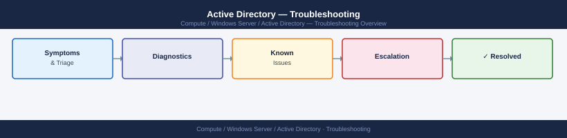

---
tags:
  - troubleshooting
  - windows
search:
  boost: 1.5
description: "Diagnosing AD replication failures, Kerberos errors, trust issues, SYSVOL sync problems, and LDAP query failures."
---
# Active Directory — Troubleshooting

Diagnosing AD replication failures, Kerberos errors, trust issues, SYSVOL sync problems, and LDAP query failures.

*Applies to: Windows Server 2019 / 2022*

<a class="kb-card" href="common-issues/">
  <strong>Common Issues</strong>
  Replication errors, Kerberos failures, time sync, and event log references.
</a>

<a class="kb-card" href="diagnostics/">
  <strong>Diagnostics</strong>
  Diagnostic commands, LDAP diagnostics, and DNS dependency checks.
</a>

<a class="kb-card" href="escalation/">
  <strong>Escalation</strong>
  Microsoft support procedures and data collection for vendor cases.
</a>

