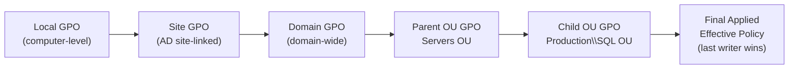
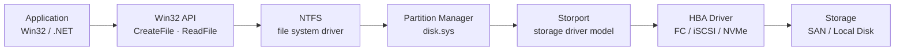

# Windows Server — Standards


<div class="kb-summary">
Sizing guidelines, design standards, and best practices.
</div>

## Group Policy Processing Order


┌────────────────────────────────── Windows Server — Design Standards ──────────────────────────────────┐
│                                                                                                       │
│  Design standards: naming conventions, OU structure, GPO hierarchy, and server hardening baseline.    │
│                                                                                                       │
│   ┌──────────────────────────────────────────────┐  ┌─────────────────────────────────────────────┐   │
│   │              Naming Conventions              │  │               AD OU Structure               │   │
│   │            Server: SITE-ROLE-NNN             │  │         Domain → Servers → Role OUs         │   │
│   │           Domain: corp.example.com           │  │       Tier: T0 DC / T1 server / T2 WS       │   │
│   │         GPO: ROLE-SETTING-POL format         │  │        Admin Groups: per tier + role        │   │
│   │        Service accounts: svc-appname         │  │          LAPS: local admin pwd mgmt         │   │
│   └──────────────────────────────────────────────┘  └─────────────────────────────────────────────┘   │
│                                                                                                       │
│    Tiered admin model prevents lateral movement; LAPS eliminates shared local passwords               │
│                                                                                                       │
│                          ▼                                                 ▼                          │
│                                                                                                       │
│   ┌──────────────────────────────────────────────┐  ┌─────────────────────────────────────────────┐   │
│   │                  GPO Design                  │  │               Server Baseline               │   │
│   │       Default Domain Policy: password        │  │        Server Core preferred over GUI       │   │
│   │        Workstation / Server baselines        │  │         SMB signing: required on all        │   │
│   │        Role-specific: IIS / SQL / DC         │  │       Audit: logon, object, privilege       │   │
│   │       Link order: lower = higher prio        │  │          Windows Defender: AV + EDR         │   │
│   └──────────────────────────────────────────────┘  └─────────────────────────────────────────────┘   │
│                                                                                                       │
│  Physical Infrastructure (the hardware everything above runs on):                                     │
│  Physical or virtual server · Domain Controllers · AD replication · PKI                               │
│                                                                                                       │
│  Key terms:                                                                                           │
│                                                                                                       │
│  Tiered admin = Tier 0 (DCs), Tier 1 (servers), Tier 2 (workstations); no cross-tier                  │
│  LAPS         = Local Administrator Password Solution; unique pwd per machine                         │
│  OU           = Organisational Unit; container for GPO linking and delegation                         │
│  GPO link order= lowest link order number = highest priority in OU                                    │
│  SMB signing  = cryptographic signing of SMB packets; prevents relay attacks                          │
│  Server Core  = no GUI; managed via PowerShell/WAC; reduced attack surface                            │
│  svc- prefix  = service account naming prefix; helps identify in audit logs                           │
│  Default Domain Policy= must only contain password and account lockout settings                       │
│  EDR          = Endpoint Detection and Response; Microsoft Defender for Endpoint                      │
│  Privilege audit= logs use of user rights assignments; required for compliance                        │
│  Object audit  = logs file/folder access; apply selectively to avoid log flood                        │
│  Logon audit   = logs interactive, network, and Kerberos logons                                       │
│                                                                                                       │
└───────────────────────────────────────────────────────────────────────────────────────────────────────┘
```powershell

WinRM listener configuration:

```powershell
# View WinRM listeners
winrm enumerate winrm/config/listener

# Configure HTTPS listener (requires certificate)
New-WSManInstance -ResourceURI winrm/config/Listener `
  -SelectorSet @{Address="*"; Transport="HTTPS"} `
  -ValueSet @{Hostname="<fqdn>"; CertificateThumbprint="<thumbprint>"}
```

## WinRM Configuration Baseline

| Setting | Required Value |
|---------|---------------|
| Service startup type | Automatic |
| HTTP listener | Enabled (or HTTPS only in high-security environments) |
| MaxEnvelopeSizekb | 500 minimum |
| MaxTimeoutms | 60000 minimum |
| Authentication | Negotiate (Kerberos preferred) |
| TrustedHosts | Set to domain FQDN or specific hosts |

## Server Build Baseline Checklist

- [ ] Hostname set per naming convention
- [ ] Joined to correct AD domain and OU
- [ ] Drive layout per conventions above
- [ ] WinRM/PowerShell remoting enabled
- [ ] Windows Update configured (WSUS or Windows Update for Business)
- [ ] Windows Defender enabled and updated
- [ ] NTP configured (domain-joined servers sync from DC hierarchy)
- [ ] Local Administrator account renamed or disabled; LAPS deployed
- [ ] Remote Desktop enabled; restricted to jump servers via firewall/GPO
- [ ] Monitoring agent installed (Zabbix/Nagios/Datadog)
- [ ] Backup agent installed and job configured
- [ ] Event log sizes configured (System: 64 MB, Application: 64 MB, Security: 256 MB)
- [ ] Page file: system-managed or fixed on dedicated volume
- [ ] Server documented in CMDB

## Windows Storage Stack



## Group Policy Baseline

All servers must receive the following GPO categories at minimum:

| GPO | Scope |
|-----|-------|
| Security Baseline | All servers |
| Audit Policy | All servers |
| WinRM / PS Remoting | All servers |
| Windows Update | All servers (or managed via WSUS) |
| Defender ATP settings | All servers |
| Role-specific settings | Applied at role-level OUs |

---


## Hostname Convention and Domain Join

Windows hostnames follow the same schema as all servers: `{site}{role}{env}{num}`. Maximum length is 15 characters (NetBIOS limit). Choose abbreviations accordingly.

| Component | Max chars | Example |
|---|---|---|
| Site code | 3 | `dc1` |
| Role code | 4 | `wsql` |
| Env code | 3 | `prd` |
| Number | 2 | `01` |

Full example: `dc1wsqlprd01` (12 chars — within limit).

Domain join must be completed before any application installation. All Windows servers join `corp.example.com`. The join is performed using the `svc-domainjoin` service account, which has rights scoped to a specific OU. After join, move the computer object to the correct OU immediately.

```powershell
# Verify domain membership
(Get-WmiObject -Class Win32_ComputerSystem).Domain
nltest /dsgetdc:corp.example.com
```

## NTP Configuration

Windows domain members automatically use the domain hierarchy for time. The PDC emulator synchronises to the internal NTP infrastructure. Do not configure external NTP sources on domain members.

Verify time sync:

```powershell
w32tm /query /status
w32tm /query /source
```

Expected output: source is the domain PDC or a DC. If `Local CMOS Clock` appears, the domain time sync is broken — re-run `w32tm /resync /force`.

| Check | Expected |
|---|---|
| Source | Domain controller or internal NTP server |
| Stratum | 4 or better |
| Last sync offset | Under 1 second |
| Next sync time | Within 8 hours |

## Windows Update and Patch Policy

Windows Update is managed via WSUS or Windows Update for Business, not via direct internet access. Servers must be pointed at the internal WSUS server within 1 hour of domain join.

```powershell
# Confirm WSUS server is configured
(Get-ItemProperty "HKLM:\SOFTWARE\Policies\Microsoft\Windows\WindowsUpdate").WUServer

# Force update detection
wuauclt /detectnow
UsoClient StartScan
```

Patching schedule:

| Environment | Patch window | Reboot handling |
|---|---|---|
| Production | Second Tuesday of month + 7 days | Scheduled maintenance window |
| Staging | Second Tuesday of month | Automatic reboot |
| Dev | Weekly | Automatic reboot |

Security-only patches with CVSS 9.0+ are applied out-of-band within 72 hours, regardless of environment.

## Local Administrator and Accounts

The built-in `Administrator` account must be renamed and a strong random password set via LAPS (Local Administrator Password Solution). LAPS must be deployed and reporting to AD before build sign-off.

```powershell
# Verify LAPS is installed and reporting
Get-AdmPwdPassword -ComputerName dc1wsqlprd01

# Check LAPS client is installed
Get-WmiObject -Namespace root\cimv2 -Class Win32_Product | Where-Object { $_.Name -like "*LAPS*" }
```

Additional local accounts:
- No shared local accounts permitted
- All service accounts created in AD, not locally
- Local `Guest` account: must be disabled
- Local `Administrator` account: renamed to `lcladmin`, managed by LAPS

## Audit Policy

Windows audit policy is configured via Group Policy. The following categories must be enabled:

| Audit Category | Success | Failure |
|---|---|---|
| Account Logon | Enabled | Enabled |
| Account Management | Enabled | Enabled |
| Logon/Logoff | Enabled | Enabled |
| Object Access (file system) | Enabled | Enabled |
| Policy Change | Enabled | Enabled |
| Privilege Use | Enabled | Enabled |
| System | Enabled | Enabled |
| Process Creation | Enabled | — |

Security event log size must be set to a minimum of 1 GB. Logs are forwarded to the SIEM via Windows Event Forwarding (WEF) or the Elastic/Splunk agent.

```powershell
# Confirm audit policy
auditpol /get /category:*

# Check event log size
Get-EventLog -LogName Security | Select-Object -ExpandProperty MaximumKilobytes
```

## Build Completion Checklist

- [ ] Hostname set and matches naming convention (max 15 chars)
- [ ] DNS forward and reverse resolve correctly
- [ ] Domain joined to `corp.example.com`, computer object in correct OU
- [ ] NTP source confirmed as domain controller; offset under 1 second
- [ ] WSUS pointing to internal server; update scan completed
- [ ] LAPS deployed and reporting password to AD
- [ ] Built-in Administrator renamed; Guest disabled
- [ ] Audit policy applied and confirmed via `auditpol`
- [ ] Security event log size set to 1 GB minimum
- [ ] WEF or SIEM agent deployed and events visible in SIEM
- [ ] Server visible in monitoring platform within 15 minutes of build
