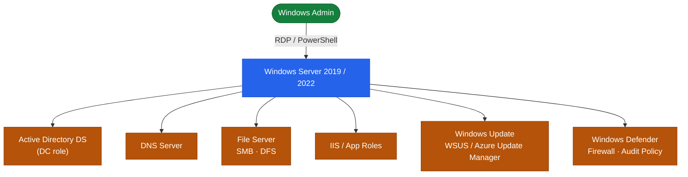

---
tags:
  - architecture
  - windows
---
# Windows Server — How It Works

How It Works reference covering Overview, Editions and Installation Types, Role Topology.

*Applies to: Windows Server 2019 / 2022*

## Overview

Windows Server delivers infrastructure services through **Roles** (major functions) and **Features** (supporting components) installed on top of the base OS. The current supported versions are 2019, 2022, and 2025, available in Standard and Datacenter editions. All server administration uses PowerShell, WinRM remoting, or RSAT tools. Server Core (no GUI) is the recommended installation type for security and performance.

## Editions and Installation Types

| Version | Edition | Notes |
|---|---|---|
| Windows Server 2019/2022/2025 | Standard | Up to 2 Hyper-V VMs per licence |
| Windows Server 2019/2022/2025 | Datacenter | Unlimited Hyper-V VMs; Storage Spaces Direct, SDN |
| All | Server Core | No GUI; PowerShell remoting / RSAT; smaller attack surface |
| All | Desktop Experience | Full GUI; larger footprint; required for some legacy tools |

## Role Topology

---

## See also

- [Windows Server — Design Standards](../design-standards/)
- [Windows Server — Integrations](../integrations/)
- [Windows Server — Deploy](../../deploy/)
