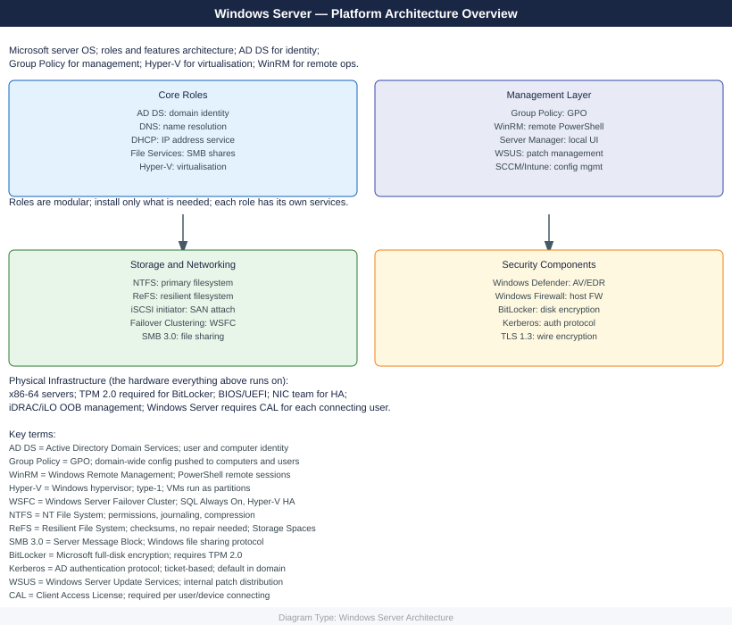
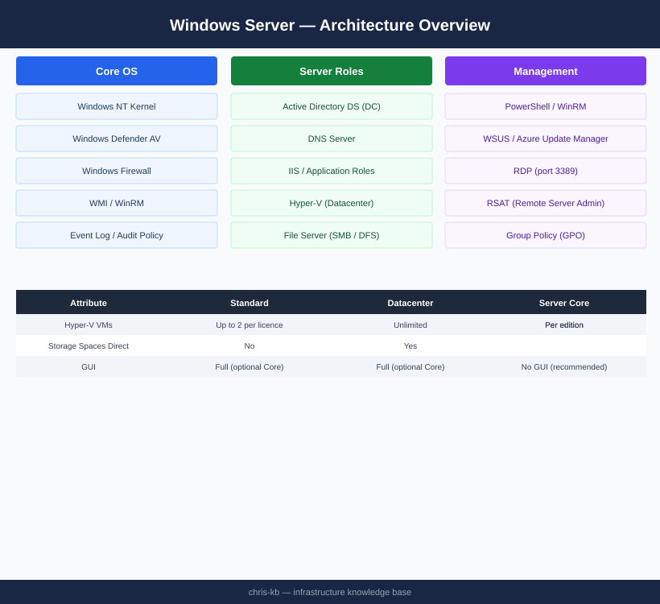

---
tags:
  - architecture
  - windows
---
# Windows Server — Architecture

<div class="kb-summary">
Windows Server 2019/2022/2025 infrastructure — Active Directory DS, DNS, SMB file services, Hyper-V, WSUS, and PowerShell-based management. Available in Standard and Datacenter editions with Server Core (recommended) or Desktop Experience installation.

*Applies to: Windows Server 2019 / 2022*
</div>




<div class="kb-grid kb-grid-3">
  <a class="kb-card" href="how-it-works/">
    <div class="kb-card-icon">⚙️</div>
    <div class="kb-card-title">How It Works</div>
    <div class="kb-card-desc">Edition and installation types, key server roles, critical services, common ports, event log channels, and PowerShell reference.</div>
  </a>
  <a class="kb-card" href="integrations/">
    <div class="kb-card-icon">🔗</div>
    <div class="kb-card-title">Integrations</div>
    <div class="kb-card-desc">Active Directory, Group Policy, SAN/SMB storage connectivity, Hyper-V, and monitoring via WMI/WinRM.</div>
  </a>
  <a class="kb-card" href="design-standards/">
    <div class="kb-card-icon">📐</div>
    <div class="kb-card-title">Design Standards</div>
    <div class="kb-card-desc">Edition selection criteria, Server Core baseline, patch management policy, and firewall rule standards.</div>
  </a>
</div>

```d2
direction: right

center: "Windows Server" {shape: hexagon}
editions: "Editions" {shape: rectangle}
topology: "Topology" {shape: rectangle}

center -> editions
center -> topology
```

## Editions

| Version | Edition | Key Differentiator |
|---|---|---|
| Windows Server 2019/2022/2025 | Standard | Up to 2 Hyper-V VMs per licence |
| Windows Server 2019/2022/2025 | Datacenter | Unlimited Hyper-V VMs; Storage Spaces Direct, SDN |
| All | Server Core | No GUI; smaller attack surface; recommended for production |
| All | Desktop Experience | Full GUI; required for some legacy management tools |

## Topology

