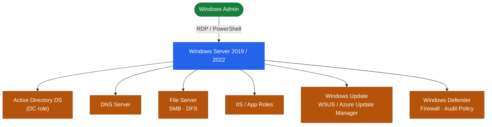

# Windows Server — Overview

Architecture overview, design principles, and topology.

## Overview

Windows Server is Microsoft's server operating system, available in Standard and Datacenter editions. Current supported versions are 2016, 2019, 2022, and 2025. The installation type choice — Server Core (headless) or Desktop Experience (full GUI) — is made at install time and cannot be changed post-install.

## Edition and Installation Types

| Version | Edition | Notes |
|---------|---------|-------|
| Windows Server 2019/2022/2025 | Standard | Up to 2 Hyper-V VMs per licence |
| Windows Server 2019/2022/2025 | Datacenter | Unlimited Hyper-V VMs, extra features (Storage Spaces Direct, SDN) |
| All | Server Core | No GUI; managed via PowerShell remoting or RSAT; smaller attack surface |
| All | Desktop Experience | Full GUI; larger footprint; required for some legacy management tools |

## Roles and Features Model

Windows Server functionality is delivered through **Roles** (major services) and **Features** (supporting components), installed via Server Manager or PowerShell:

```powershell
# List installed roles and features
Get-WindowsFeature | Where-Object Installed -eq $true

# Install a role example
Install-WindowsFeature -Name AD-Domain-Services -IncludeManagementTools
```

## Topology



---

## In this section

<div class="kb-grid kb-grid-3">
<a class="kb-card" href="components/"><strong>Components</strong><span>Core components, services, and technical specifications.</span></a>
<a class="kb-card" href="integrations/"><strong>Integrations</strong><span>Integration with other platforms and external systems.</span></a>
<a class="kb-card" href="standards/"><strong>Standards</strong><span>Sizing guidelines, design standards, and best practices.</span></a>
</div>
