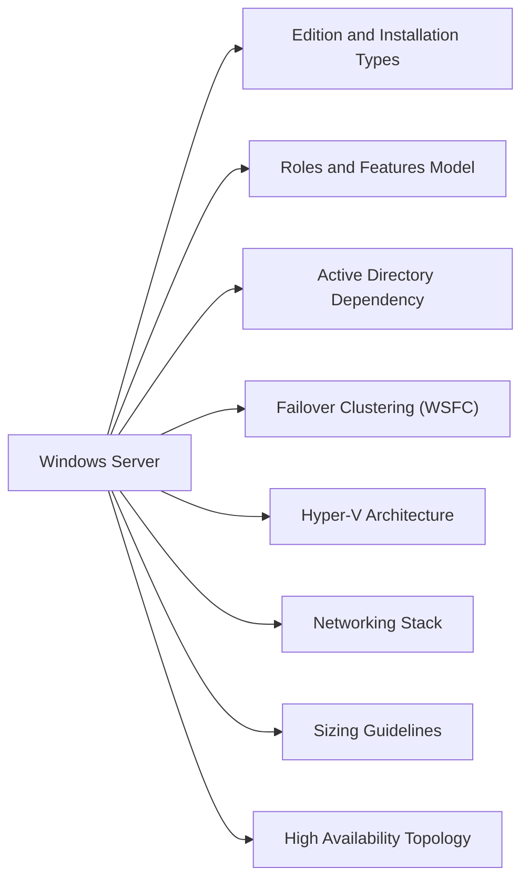

# Windows Server — Architecture



## Overview

Windows Server is Microsoft's server operating system, available in Standard and Datacenter editions. Current supported versions are 2016, 2019, 2022, and 2025. The installation type choice — Server Core (headless) or Desktop Experience (full GUI) — is made at install time and cannot be changed post-install.

## Edition and Installation Types

| Version | Edition | Notes |
|---------|---------|-------|
| Windows Server 2019/2022/2025 | Standard | Up to 2 Hyper-V VMs per licence |
| Windows Server 2019/2022/2025 | Datacenter | Unlimited Hyper-V VMs, extra features (Storage Spaces Direct, SDN) |
| All | Server Core | No GUI; managed via PowerShell remoting or RSAT; smaller attack surface |
| All | Desktop Experience | Full GUI; larger footprint; required for some legacy management tools |

## Roles and Features Model

Windows Server functionality is delivered through **Roles** (major services) and **Features** (supporting components), installed via Server Manager or PowerShell:

```powershell
# List installed roles and features
Get-WindowsFeature | Where-Object Installed -eq $true

# Install a role example
Install-WindowsFeature -Name AD-Domain-Services -IncludeManagementTools
```

Common roles:

- **AD DS** — Active Directory Domain Services; core identity and authentication
- **DNS Server** — Name resolution, required for AD DS
- **DHCP Server** — IP address assignment
- **File and Storage Services** — SMB shares, DFS, iSCSI
- **IIS** — Web server
- **Hyper-V** — Hypervisor (Datacenter/Standard)
- **Failover Clustering** — Windows Server Failover Cluster (WSFC) for HA

## Active Directory Dependency

Nearly all Windows Server deployments require AD DS for:

- Authentication (Kerberos/NTLM)
- Group Policy (GPO) application
- DNS SRV record registration
- Certificate Services (AD CS)
- Computer and user account management

Domain controllers (DCs) should be deployed in pairs per site for redundancy.

## Failover Clustering (WSFC)

WSFC provides HA for roles including SQL Server, file servers, Hyper-V, and custom applications:

- Requires shared storage (iSCSI, FC SAN, SMB 3.0) or Storage Replica
- Quorum model: Node Majority, Node and Disk Majority, Cloud Witness
- Cluster Shared Volumes (CSV) used for Hyper-V live migration
- Validate cluster before production with `Test-Cluster`

## Hyper-V Architecture

Hyper-V uses a Type 1 (bare-metal) hypervisor. Key concepts:

- **Parent partition** — runs the management OS with direct hardware access
- **Child partitions** — VMs with virtualised hardware
- **Virtual Switch** — external (bridged), internal, or private
- **Live Migration** — zero-downtime VM movement between Hyper-V hosts (requires WSFC or Hyper-V Replica for standalone)

## Networking Stack

| Component | Purpose |
|-----------|---------|
| TCP/IP stack | IPv4/IPv6, configurable via `netsh` or `Set-NetIPAddress` |
| WinRM | Windows Remote Management; enables PowerShell remoting and WMI over HTTP/HTTPS |
| RPC | Remote Procedure Call; used by AD, GPO, DCOM |
| Windows Firewall | Host-based firewall; managed via GPO or `Set-NetFirewallRule` |
| DNS Client | Resolves names; configured via DHCP or static NIC settings |

## Sizing Guidelines

| Workload | Minimum RAM | Recommended vCPU |
|----------|-------------|-----------------|
| Domain Controller | 4 GB | 2 |
| File Server | 8 GB | 2–4 |
| SQL Server (small) | 16 GB | 4 |
| Hyper-V Host | 32 GB+ | 8+ |
| General application | 8 GB | 2–4 |

## High Availability Topology

```
        ┌─────────────────────────────────┐
        │         Active Directory        │
        │    DC1 (Primary)  DC2 (Secondary)│
        └─────────────┬───────────────────┘
                      │ Kerberos / LDAP
        ┌─────────────▼───────────────────┐
        │         Application Tier        │
        │   WEB-PROD-01   WEB-PROD-02     │
        │         (NLB or IIS ARR)        │
        └─────────────┬───────────────────┘
                      │
        ┌─────────────▼───────────────────┐
        │          Data Tier              │
        │   SQL-PROD-01  SQL-PROD-02      │
        │     (Always On AG or WSFC FCI)  │
        └─────────────────────────────────┘
```

## Related Sections

- [Standards](../standards/) — hostname and OU conventions
- [Operations](../operations/) — daily health checks
- [Troubleshooting](../troubleshooting/) — common failure scenarios
