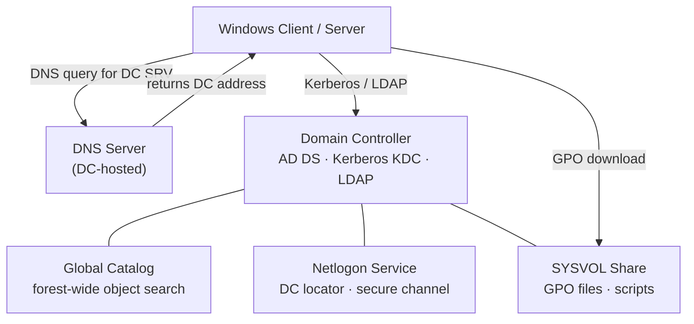
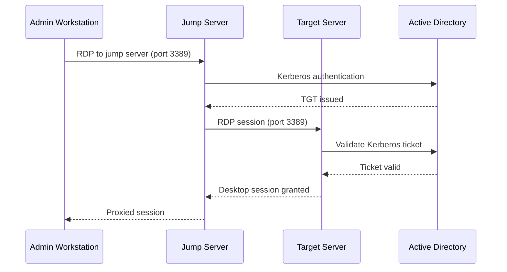

# Windows Server — Integrations


<div class="kb-summary">
Integration with other platforms and external systems.
</div>

## AD / DNS Dependency Diagram


```
┌──────────────────────────────────── Windows Server — Integrations ────────────────────────────────────┐
│                                                                                                       │
│  Windows Server integrations: Azure AD, VMware, monitoring tools, and enterprise apps.                │
│                                                                                                       │
│   ┌──────────────────────────────────────────────┐  ┌─────────────────────────────────────────────┐   │
│   │            Identity Integrations             │  │                Virtualisation               │   │
│   │        Azure AD Connect: hybrid sync         │  │         Hyper-V: built-in hypervisor        │   │
│   │         AD FS: SAML/OAuth federation         │  │          VMware Tools: guest agent          │   │
│   │          LDAPS: secure LDAP queries          │  │           System Center VMM: mgmt           │   │
│   │         Certificate Services (AD CS)         │  │           Azure Arc: cloud-managed          │   │
│   └──────────────────────────────────────────────┘  └─────────────────────────────────────────────┘   │
│                                                                                                       │
│    AD integrates with cloud via Connect/ADFS; Arc extends cloud management on-prem                    │
│                                                                                                       │
│                          ▼                                                 ▼                          │
│                                                                                                       │
│   ┌──────────────────────────────────────────────┐  ┌─────────────────────────────────────────────┐   │
│   │                  Monitoring                  │  │              Storage and Backup             │   │
│   │        Windows Events: WinRM forward         │  │            Windows Server Backup            │   │
│   │          Azure Monitor Agent (AMA)           │  │           DFS Replication: shares           │   │
│   │         SCOM: enterprise monitoring          │  │          SAN: iSCSI / FC initiator          │   │
│   │          Splunk UF: log forwarding           │  │        Storage Spaces: software RAID        │   │
│   └──────────────────────────────────────────────┘  └─────────────────────────────────────────────┘   │
│                                                                                                       │
│  Physical Infrastructure (the hardware everything above runs on):                                     │
│  Physical or virtual server · NIC · SAN/NAS · Azure connectivity                                      │
│                                                                                                       │
│  Key terms:                                                                                           │
│                                                                                                       │
│  Azure AD Connect= synchronises on-prem AD users/groups to Azure AD (Entra)                           │
│  AD FS         = Active Directory Federation Services; SAML/OAuth IdP                                 │
│  AD CS         = Certificate Services; internal PKI for cert issuance                                 │
│  Azure Arc     = extends Azure management plane to on-prem Windows servers                            │
│  AMA           = Azure Monitor Agent; replaces Log Analytics agent                                    │
│  SCOM          = System Center Operations Manager; enterprise monitoring                              │
│  WinRM         = Windows Remote Management; used for PS remoting + event forward                      │
│  LDAPS         = LDAP over TLS; requires DC certificate; port 636                                     │
│  Storage Spaces= Windows software-defined storage; RAID-like redundancy                               │
│  VMM           = Virtual Machine Manager; Hyper-V cluster management                                  │
│  DFS-R         = DFS Replication; multi-master file replication between servers                       │
│  iSCSI initiator= Windows built-in iSCSI client for SAN block access                                  │
│                                                                                                       │
└───────────────────────────────────────────────────────────────────────────────────────────────────────┘
```

Maintenance windows control reboot scheduling:
- Development: patching on Tuesdays, auto-reboot allowed
- Staging: patching on Thursdays, auto-reboot after midnight
- Production: patching on scheduled maintenance windows, manual reboot approval required

## Monitoring Agent Deployment

```powershell
# Aria Operations Windows guest agent — deploy via Ansible or SCCM
# Verify agent is running
Get-Service "VMware Aria Operations Agent" | Select-Object Status

# SCOM agent — verify management group registration
Get-SCOMAgent -ComputerName $env:COMPUTERNAME | Select-Object Name, HealthState, ManagementGroup
```

## Backup Agent Deployment

**Veeam Agent for Windows**:
```powershell
# Install via VBR console: Protection Groups → Add Server
# Or verify existing agent
Get-Service VeeamAgentSvc | Select-Object Status
```

**NetBackup Client**:
```powershell
# Verify NBU client is installed and connected to master
Get-Service "NetBackup Client Service" | Select-Object Status
& "C:\Program Files\Veritas\NetBackup\bin\bpclntcmd.exe" -self   # Show NBU version
```

## RDP / WinRM Session Flow



## iSCSI / MPIO Configuration

```powershell
# iSCSI Initiator — add target portal and connect
$iqn = "iqn.1992-04.com.emc:storage.powermax01"
New-IscsiTargetPortal -TargetPortalAddress "10.10.10.100" -TargetPortalPortNumber 3260
Connect-IscsiTarget -NodeAddress $iqn -IsMultipathEnabled $true

# Verify MPIO paths
Get-MSDSMSupportedHW
mpclaim -s -d   # List all MPIO devices and paths

# Verify DSM is installed (Dell MPIO DSM)
Get-WindowsFeature Multipath-IO | Select-Object InstallState
```

## DNS Registration

Verify correct DNS registration after domain join:

```powershell
# Force DNS re-registration
ipconfig /registerdns

# Verify A and PTR records
Resolve-DnsName -Name $env:COMPUTERNAME -Server dc1.example.local
Resolve-DnsName -Type PTR -Name "10.10.10.50" -Server dc1.example.local
```

## FC HBA Configuration

After OS installation:
```powershell
# Get HBA WWPNs (for fabric zoning request)
Get-WmiObject -Namespace "root\WMI" -Class "MSFC_FCAdapterHBAAttributes" |
    Select-Object NodeWWN, PortWWN

# Verify zoning is in place before enabling FC storage access
# (confirm with storage team that initiator WWPNs are zoned to required target ports)
```
