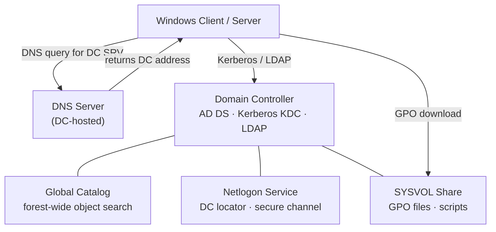
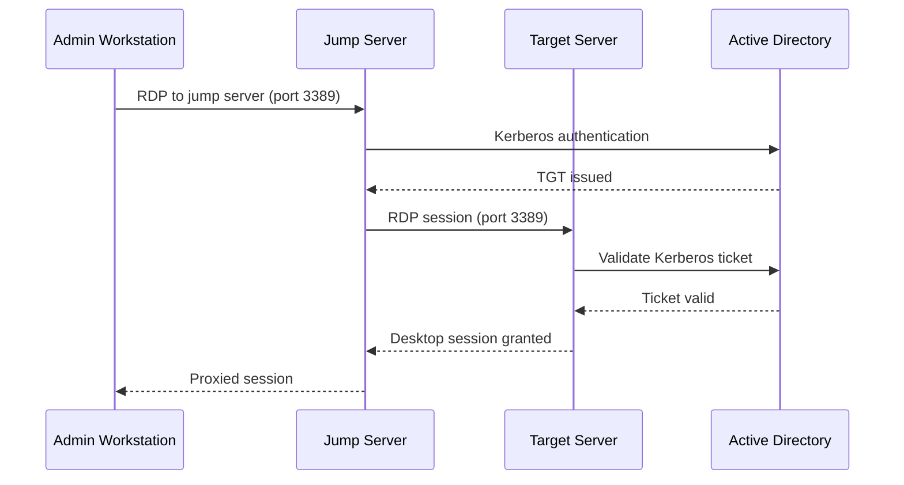

# Windows Server — Integrations

Integration with other platforms and external systems.

## AD / DNS Dependency Diagram



## Active Directory Domain Join

All Windows Server systems are domain-joined during provisioning:

```powershell
# Domain join with OU placement
Add-Computer -DomainName "corp.local" `
    -OUPath "OU=Servers,OU=Infrastructure,DC=corp,DC=local" `
    -Credential (Get-Credential) `
    -Restart

# Verify domain membership
(Get-WmiObject Win32_ComputerSystem).Domain
nltest /dsgetdc:corp.local
```

GPOs are applied at the OU level by server role — infrastructure, database, application tiers each have a dedicated OU with role-specific policy.

## WSUS / SCCM Patch Management

```powershell
# Verify WSUS client is configured
Get-ItemProperty -Path "HKLM:\SOFTWARE\Policies\Microsoft\Windows\WindowsUpdate" |
    Select-Object WUServer, WUStatusServer

# Force WSUS detection (triggers check-in with WSUS server)
wuauclt /detectnow
# Or on newer Windows:
UsoClient StartScan

# Check pending updates
$UpdateSession = New-Object -ComObject Microsoft.Update.Session
$UpdateSearcher = $UpdateSession.CreateUpdateSearcher()
$Updates = $UpdateSearcher.Search("IsInstalled=0")
$Updates.Updates | Select-Object Title, MsrcSeverity
```

Maintenance windows control reboot scheduling:
- Development: patching on Tuesdays, auto-reboot allowed
- Staging: patching on Thursdays, auto-reboot after midnight
- Production: patching on scheduled maintenance windows, manual reboot approval required

## Monitoring Agent Deployment

```powershell
# Aria Operations Windows guest agent — deploy via Ansible or SCCM
# Verify agent is running
Get-Service "VMware Aria Operations Agent" | Select-Object Status

# SCOM agent — verify management group registration
Get-SCOMAgent -ComputerName $env:COMPUTERNAME | Select-Object Name, HealthState, ManagementGroup
```

## Backup Agent Deployment

**Veeam Agent for Windows**:
```powershell
# Install via VBR console: Protection Groups → Add Server
# Or verify existing agent
Get-Service VeeamAgentSvc | Select-Object Status
```

**NetBackup Client**:
```powershell
# Verify NBU client is installed and connected to master
Get-Service "NetBackup Client Service" | Select-Object Status
& "C:\Program Files\Veritas\NetBackup\bin\bpclntcmd.exe" -self   # Show NBU version
```

## RDP / WinRM Session Flow



## iSCSI / MPIO Configuration

```powershell
# iSCSI Initiator — add target portal and connect
$iqn = "iqn.1992-04.com.emc:storage.powermax01"
New-IscsiTargetPortal -TargetPortalAddress "10.10.10.100" -TargetPortalPortNumber 3260
Connect-IscsiTarget -NodeAddress $iqn -IsMultipathEnabled $true

# Verify MPIO paths
Get-MSDSMSupportedHW
mpclaim -s -d   # List all MPIO devices and paths

# Verify DSM is installed (Dell MPIO DSM)
Get-WindowsFeature Multipath-IO | Select-Object InstallState
```

## DNS Registration

Verify correct DNS registration after domain join:

```powershell
# Force DNS re-registration
ipconfig /registerdns

# Verify A and PTR records
Resolve-DnsName -Name $env:COMPUTERNAME -Server dc1.corp.local
Resolve-DnsName -Type PTR -Name "10.10.10.50" -Server dc1.corp.local
```

## FC HBA Configuration

After OS installation:
```powershell
# Get HBA WWPNs (for fabric zoning request)
Get-WmiObject -Namespace "root\WMI" -Class "MSFC_FCAdapterHBAAttributes" |
    Select-Object NodeWWN, PortWWN

# Verify zoning is in place before enabling FC storage access
# (confirm with storage team that initiator WWPNs are zoned to required target ports)
```
