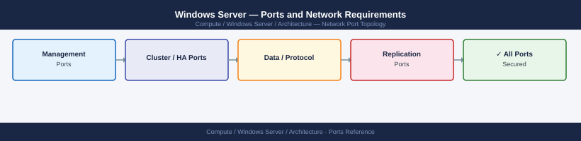

---
tags:
  - windows-server
  - compute
  - networking
  - firewall
  - ports
---
# Windows Server — Ports and Network Requirements

<div class="kb-summary">
Firewall port reference for Windows Server in a managed enterprise environment. Covers remote management (RDP, WinRM, DCOM), monitoring, Windows Update, and backup agent access.

*Applies to: Windows Server 2019 / 2022*
</div>



## Before you begin

- RDP (3389) must only be reachable from jump hosts — never expose directly to the internet
- WinRM (5985/5986) is the preferred remote management channel for Ansible and PowerShell remoting — use 5986 (HTTPS) in production
- DCOM/RPC (135 + dynamic ports) is needed for Windows admin tools (Server Manager, remote event logs, registry) — restrict where possible
- Restrict all management ports to the management source IP range at the Windows Firewall level

---

## Inbound — Remote Management

| Port | Protocol | Source | Purpose |
|---|---|---|---|
| 3389 | TCP | Jump hosts, admin workstations | RDP — Remote Desktop Protocol (graphical management) |
| 5985 | TCP | Ansible control node, PowerShell remoting source | WinRM HTTP (non-production only) |
| 5986 | TCP | Ansible control node, PowerShell remoting source | WinRM HTTPS (production — encrypted PS remoting) |
| 22 | TCP | Jump hosts (if OpenSSH installed) | SSH — optional; enabled via Windows optional feature |
| 445 | TCP | Management systems, domain controllers | SMB — Group Policy, SYSVOL, admin file shares (ADMIN$) |
| 135 | TCP | Management workstations | DCOM/RPC endpoint mapper (Windows admin tools) |
| 49152–65535 | TCP | Management workstations | Dynamic RPC (Server Manager, remote registry, WMI) |

---

## Inbound — Monitoring Agents

| Port | Protocol | Source | Purpose |
|---|---|---|---|
| 9182 | TCP | Prometheus scraper | windows_exporter — OS metrics (WMI-based) |
| 10050 | TCP | Zabbix Server / Proxy | Zabbix agent passive mode |

---

## Outbound — Monitoring and Event Reporting

| Port | Protocol | Destination | Purpose |
|---|---|---|---|
| 10051 | TCP | Zabbix Server / Proxy | Zabbix agent active mode |
| 514 | UDP/TCP | Syslog server | Windows Event Log forwarding |

---

## Outbound — Domain, Time, and Updates

| Port | Protocol | Destination | Purpose |
|---|---|---|---|
| 123 | UDP | NTP / Domain Controller | W32tm time synchronisation |
| 53 | TCP/UDP | DNS server | Name resolution |
| 389/636 | TCP | Active Directory DCs | LDAP/LDAPS — domain authentication |
| 88 | TCP/UDP | Active Directory DCs | Kerberos |
| 445 | TCP | Domain Controllers | Group Policy, SYSVOL, NETLOGON |
| 443 | TCP | WSUS server or windowsupdate.microsoft.com | Windows Update |
| 8530/8531 | TCP | WSUS server (self-hosted) | WSUS HTTP/HTTPS update delivery |

---

## Outbound — Backup Agent

| Port | Protocol | Destination | Purpose |
|---|---|---|---|
| 8400 | TCP | Commvault CommServe / Media Agent | Commvault backup agent |
| 1556 | TCP | NetBackup Primary Server | NetBackup client connection |
| 9392 | TCP | Veeam VBR Server | Veeam agent-based backup |

---

## Firewall Zone Summary

| From | To | Ports | Notes |
|---|---|---|---|
| Jump hosts | Windows Server | 3389 | RDP — restrict to jump host IPs only |
| Ansible / PS remoting | Windows Server | 5986 | WinRM HTTPS — encrypted PS sessions |
| Management tools | Windows Server | 135, 49152-65535 | DCOM/RPC — restrict range where possible |
| Prometheus | Windows Server | 9182 | windows_exporter scrape |
| Windows Server | NTP | 123 UDP | Time sync |
| Windows Server | WSUS / WU | 443, 8530 | Patch delivery |
| Windows Server | AD / DNS | 389, 636, 88, 445 | Domain membership |

---

## Verify

```powershell
# From jump host — test RDP port
Test-NetConnection -ComputerName <windows-server> -Port 3389

# From Ansible / PS remoting host — test WinRM
Test-NetConnection -ComputerName <windows-server> -Port 5986

# From Prometheus server — test windows_exporter
Invoke-WebRequest http://<windows-server>:9182/metrics | Select-Object -First 5

# From Windows Server — test NTP sync
w32tm /query /status

# From Windows Server — test AD connectivity
nltest /dsgetdc:corp.local

# From Windows Server — test WSUS
wuauclt /detectnow
Get-WindowsUpdateLog | Select-String "AU detected" | Select-Object -Last 5
```

---

## See also

- [Windows Server — Architecture](how-it-works/)
- [Windows Server — Operations](../operations/)
- [Active Directory — Ports](../active-directory/architecture/ports.md)
- [SQL Server — Ports](../sql-server/architecture/ports.md)
- [Ansible — Ports](../../../automation/ansible/architecture/ports.md)
