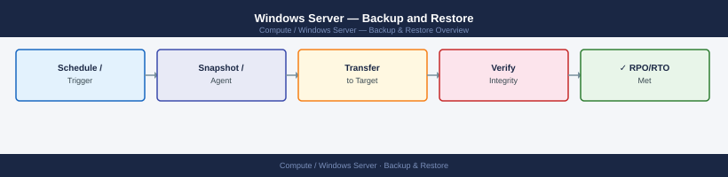
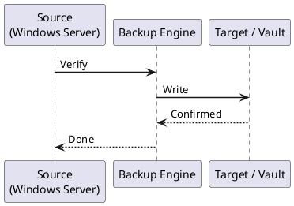

---
tags:
  - operations
  - windows
---
# Windows Server — Backup and Restore



```powershell
# Silent installation of Veeam Agent for Windows
Start-Process -Wait -FilePath "VeeamAgentWindows.exe" -ArgumentList "/silent /accepteula"

# Verify service is running
Get-Service -Name "Veeam Agent for Microsoft Windows"
```

```powershell
# Install Windows Server Backup feature
Install-WindowsFeature Windows-Server-Backup -IncludeManagementTools

# Verify
Get-Command -Module WindowsServerBackup
```
```powershell
# Create a backup policy for the C: volume to a network location
$policy = New-WBPolicy

# Add the C: volume
$volume = Get-WBVolume -VolumePath "C:"
Add-WBVolume -Policy $policy -Volume $volume

# Add system state (recommended for domain controllers)
Add-WBSystemState -Policy $policy

# Add BMR (Bare Metal Recovery) support — includes system reserved partition
Add-WBBareMetalRecovery -Policy $policy

# Set network backup target
$netTarget = New-WBBackupTarget -NetworkPath "\\backupserver\WSB-SERVER01" `
  -Credential (Get-Credential)
Add-WBBackupTarget -Policy $policy -Target $netTarget

# Set daily schedule at 02:00 and 14:00
Set-WBSchedule -Policy $policy -Schedule 02:00, 14:00

# Apply the policy
Set-WBPolicy -Policy $policy -AllowDeleteOldBackups

# Verify policy
Get-WBPolicy
```
```powershell
# Start a backup immediately using the existing policy
Start-WBBackup -Policy (Get-WBPolicy)

# Check backup status
Get-WBJob | Select-Object JobType, StartTime, EndTime, HResult, ErrorDescription
```
```powershell
# List all backup jobs
Get-WBJob -Previous 20 | Select-Object StartTime, EndTime, HResult, ErrorDescription

# Verify last successful backup
$lastBackup = Get-WBSummary
$lastBackup | Select-Object LastSuccessfulBackupTime, LastBackupResultHR, NumberOfVersions
```
```powershell
# Veeam: Mount a restore point to a drive letter for manual file copy
# (Available via VBR console for agent backups managed by VBR)
Mount-VBRBackup -BackupName "SERVER01-Daily" -RestorePoint (
    Get-VBRRestorePoint -BackupName "SERVER01-Daily" | Select-Object -Last 1)
```
```powershell
# Create Veeam Recovery Media (run before disaster)
# From Veeam Agent control panel: Recovery Media > Create Recovery Media
# Output: ISO file or directly to USB

# Or via VBR server:
New-VBRLinuxIsoMediaFile -OutputPath "C:\Media\VeeamRecovery.iso"
```
```powershell
# Alternatively, use wbadmin for BMR from the command line (WinRE environment)
wbadmin get versions -backuptarget:\\backupserver\WSB-SERVER01
wbadmin start sysrecovery -version:<version-identifier> -backuptarget:\\backupserver\WSB-SERVER01 -recreateDisks
```
```powershell
# List restore points
Get-WBBackupSet -BackupTarget (New-WBBackupTarget -NetworkPath "\\backupserver\WSB-SERVER01" -Credential (Get-Credential))

# Start a file recovery
Start-WBFileRecovery -BackupSet <backupset-object> -SourcePath "C:\Data\file.txt" -TargetPath "C:\Restored\"
```
```cmd
REM Boot into Directory Services Restore Mode (DSRM) — F8 at boot
REM Perform authoritative or non-authoritative restore

REM Non-authoritative restore (use when replicating from another DC)
wbadmin start systemstaterecovery -version:<version-identifier>

REM Authoritative restore (use to restore deleted AD objects)
REM After wbadmin restore, run ntdsutil before DC restarts replication:
ntdsutil "activate instance ntds" "authoritative restore" "restore subtree OU=Users,DC=corp,DC=local" quit quit
```
```powershell
# Veeam — verify a specific restore point (runs checksum validation)
# In VBR console: Jobs > right-click job > Verify

# Windows Server Backup — verify last backup
$summary = Get-WBSummary
if ($summary.LastBackupResultHR -ne 0) {
    Write-Warning "Last WSB backup failed with HR: $($summary.LastBackupResultHR)"
}

# Test file-level restore monthly
# 1. Mount a restore point or image
# 2. Copy a test file to a staging location
# 3. Verify the file matches the source (compare hash)
$sourceHash = Get-FileHash "C:\Data\critical-file.db" -Algorithm SHA256
$restoredHash = Get-FileHash "C:\Restored\critical-file.db" -Algorithm SHA256
if ($sourceHash.Hash -eq $restoredHash.Hash) {
    Write-Host "Restore validation PASSED" -ForegroundColor Green
} else {
    Write-Warning "Hash mismatch — investigate restore"
}
```
```powershell
# Check Veeam Agent service
Get-Service -Name "Veeam Agent for Microsoft Windows" | Select-Object Status, StartType

# Check Veeam Agent event log
Get-WinEvent -ProviderName "Veeam Agent" -MaxEvents 20 |
  Select-Object TimeCreated, LevelDisplayName, Message

# Alert on WSB failures (add to monitoring task)
$summary = Get-WBSummary
if ($summary.LastBackupResultHR -ne 0 -or
    $summary.LastSuccessfulBackupTime -lt (Get-Date).AddHours(-25)) {
    Send-MailMessage -To "alerts@corp.local" -From "monitor@corp.local" `
      -Subject "Backup Alert: SERVER01" `
      -Body "Last successful backup: $($summary.LastSuccessfulBackupTime)" `
      -SmtpServer "smtp.example.local"
}
```



## Before you begin

- **Access:** Local Administrator or Domain Admin on target hosts
- **Timing:** safe to run during business hours unless a step is marked ⚠ (causes interruption)
- **Dependencies:** no active upgrades or migrations on the same infrastructure
- **Logging:** capture command output — paste into the change record on completion

---

---

## Verify

- Confirm the operation completed without errors in the log or management UI
- Verify the expected state change is visible (service running, object created, config applied)
- Document the outcome in the change record

---

## See also

- [Windows Server — Procedures](../procedures/)
- [Windows Server — Health Checks](../health-checks/)
- [Windows Server — Common Issues](../../troubleshooting/common-issues/)
