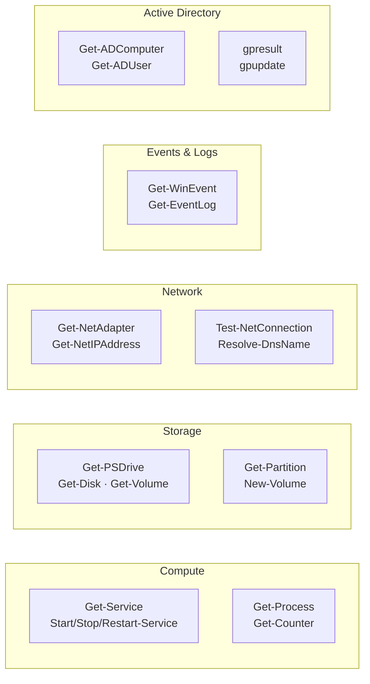

# Windows Server — CLI Reference

Commands, syntax, and quick reference.

All commands are PowerShell unless noted as `cmd`.

## PowerShell Command Categories


┌─────────────────────────────────── Windows Server — CLI Reference ────────────────────────────────────┐
│                                                                                                       │
│  Essential Windows Server CLI: PowerShell, cmd.exe, and server management commands.                   │
│                                                                                                       │
│   ┌──────────────────────────────────────────────┐  ┌─────────────────────────────────────────────┐   │
│   │            PowerShell Essentials             │  │               Network Commands              │   │
│   │            Get-Command / Get-Help            │  │           ipconfig /all, /flushdns          │   │
│   │        Get-Member: object properties         │  │          ping / tracert / nslookup          │   │
│   │         Select-Object / Where-Object         │  │             netstat -ano / netsh            │   │
│   │          Format-Table / Export-CSV           │  │           Test-NetConnection port           │   │
│   └──────────────────────────────────────────────┘  └─────────────────────────────────────────────┘   │
│                                                                                                       │
│    PowerShell is primary CLI; cmd.exe for legacy/batch; PS remoting via WinRM                         │
│                                                                                                       │
│                          ▼                                                 ▼                          │
│                                                                                                       │
│   ┌──────────────────────────────────────────────┐  ┌─────────────────────────────────────────────┐   │
│   │              Disk and Services               │  │                 AD Commands                 │   │
│   │           diskpart / diskmgmt.msc            │  │          gpresult /r /h report.html         │   │
│   │           sc query / sc start/stop           │  │               gpupdate /force               │   │
│   │           sfc /scannow: file check           │  │           nltest /sc_query:domain           │   │
│   │          chkdsk /f /r: disk repair           │  │            repadmin /replsummary            │   │
│   └──────────────────────────────────────────────┘  └─────────────────────────────────────────────┘   │
│                                                                                                       │
│  Physical Infrastructure (the hardware everything above runs on):                                     │
│  Physical or virtual server · terminal (local/RDP/WinRM) · Domain Controllers                         │
│                                                                                                       │
│  Key terms:                                                                                           │
│                                                                                                       │
│  Get-Help -Online= opens online docs for cmdlet; -Examples shows usage                                │
│  Where-Object = filters pipeline objects by condition; alias: where or ?                              │
│  Test-NetConnection= tests TCP port reachability; -ComputerName -Port                                 │
│  netstat -ano = shows all connections with PID; -a all, -n numeric, -o pid                            │
│  netsh        = network configuration tool; interface, firewall, wlan contexts                        │
│  diskpart     = interactive disk partitioning; use select disk/volume                                 │
│  sc query     = query service status; sc config changes service config                                │
│  sfc /scannow = System File Checker; verifies and repairs protected system files                      │
│  chkdsk /f /r = fix file system errors and recover data from bad sectors                              │
│  gpresult /h  = generates HTML GP report; shows applied policies                                      │
│  nltest       = network logon test; /sc_query verifies secure channel to DC                           │
│  repadmin     = AD replication diagnostics; /replsummary shows health                                 │
│                                                                                                       │
└───────────────────────────────────────────────────────────────────────────────────────────────────────┘
```

## Event Logs

```powershell
# Query event log (classic)
Get-EventLog -LogName System -EntryType Error -Newest 50
Get-EventLog -LogName Application -EntryType Error,Warning -After (Get-Date).AddHours(-24)
Get-EventLog -LogName Security -InstanceId 4624,4625 -Newest 100

# Query using Get-WinEvent (more flexible)
Get-WinEvent -LogName System -MaxEvents 50
Get-WinEvent -FilterHashtable @{LogName='System'; Level=2; StartTime=(Get-Date).AddHours(-24)}

# Export event log
Get-EventLog -LogName System | Export-Csv C:\Temp\SystemEvents.csv -NoTypeInformation

# Clear event log (requires admin)
Clear-EventLog -LogName Application
```

## Disk and Storage

```powershell
# Physical disks
Get-Disk | Select-Object Number, FriendlyName, Size, PartitionStyle, OperationalStatus

# Partitions
Get-Partition | Select-Object DiskNumber, PartitionNumber, DriveLetter, Size, Type

# Volumes
Get-Volume | Select-Object DriveLetter, FileSystemLabel, FileSystem, Size, SizeRemaining, HealthStatus

# Drive space (quick)
Get-PSDrive -PSProvider FileSystem

# Initialise and format a new disk
Initialize-Disk -Number <n> -PartitionStyle GPT
New-Partition -DiskNumber <n> -UseMaximumSize -DriveLetter D
Format-Volume -DriveLetter D -FileSystem NTFS -NewFileSystemLabel "Data" -Confirm:$false

# Extend a volume
Resize-Partition -DriveLetter D -Size (Get-PartitionSupportedSize -DriveLetter D).SizeMax
```

## Networking

```powershell
# IP configuration
Get-NetIPAddress | Select-Object InterfaceAlias, AddressFamily, IPAddress, PrefixLength
ipconfig /all                # cmd

# Network adapters
Get-NetAdapter | Select-Object Name, InterfaceDescription, Status, LinkSpeed, MacAddress

# Routes
Get-NetRoute | Where-Object DestinationPrefix -eq '0.0.0.0/0'
route print                  # cmd

# DNS configuration
Get-DnsClientServerAddress
nslookup <hostname>          # cmd
Resolve-DnsName <hostname>

# Test connectivity
Test-NetConnection -ComputerName <target>
Test-NetConnection -ComputerName <target> -Port 443
Test-NetConnection -ComputerName <target> -TraceRoute

# Active connections
netstat -ano                 # cmd
Get-NetTCPConnection | Where-Object State -eq Established

# Flush DNS cache
Clear-DnsClientCache
ipconfig /flushdns           # cmd
```

## Active Directory and Domain

```powershell
# Check domain join status
dsregcmd /status             # cmd (shows AAD/AD join state)

# Computer account info
Get-ADComputer -Identity <hostname> -Properties *

# Current user info
whoami /all                  # cmd
[System.Security.Principal.WindowsIdentity]::GetCurrent()

# Group Policy results
gpresult /r                  # cmd (text output)
gpresult /h C:\Temp\gp.html  # cmd (HTML report)
gpupdate /force              # cmd (force GP refresh)

# Kerberos tickets
klist                        # cmd
klist purge                  # cmd (clear ticket cache)
```

## Process Management

```powershell
# List processes
Get-Process | Sort-Object CPU -Descending | Select-Object -First 20
Get-Process | Sort-Object WorkingSet -Descending | Select-Object -First 20 Name, Id, WorkingSet, CPU

# Kill a process
Stop-Process -Name <name> -Force
Stop-Process -Id <pid> -Force

# Find process by port
Get-NetTCPConnection -LocalPort 80 | Select-Object -ExpandProperty OwningProcess | Get-Process
```

## Performance Counters

```powershell
# Snapshot CPU
Get-Counter '\Processor(_Total)\% Processor Time'

# Snapshot memory
Get-Counter '\Memory\Available MBytes'

# Disk I/O
Get-Counter '\PhysicalDisk(_Total)\Disk Reads/sec'
Get-Counter '\PhysicalDisk(_Total)\Disk Writes/sec'

# Multi-counter snapshot
Get-Counter @(
  '\Processor(_Total)\% Processor Time',
  '\Memory\Available MBytes',
  '\PhysicalDisk(_Total)\% Disk Time'
) -SampleInterval 5 -MaxSamples 6
```

## User and Security

```powershell
# Local users
Get-LocalUser
Get-LocalGroupMember -Group Administrators

# Active sessions
query session                # cmd
logoff <sessionid>           # cmd (disconnect RDP session)

# Audit policy
auditpol /get /category:*   # cmd

# Firewall
Get-NetFirewallRule | Where-Object Enabled -eq True | Select-Object DisplayName, Direction, Action, Profile
New-NetFirewallRule -DisplayName "Block SMBv1" -Direction Inbound -Protocol TCP -LocalPort 445 -Action Block
```

## Hotfix and Updates

```powershell
# Installed hotfixes
Get-HotFix | Sort-Object InstalledOn -Descending | Select-Object -First 20 HotFixID, InstalledOn, Description

# Windows Update service
Get-Service wuauserv
Start-Service wuauserv

# Force update check (cmd)
wuauclt /detectnow           # cmd
UsoClient StartScan          # cmd (Windows 10/Server 2016+)
```
