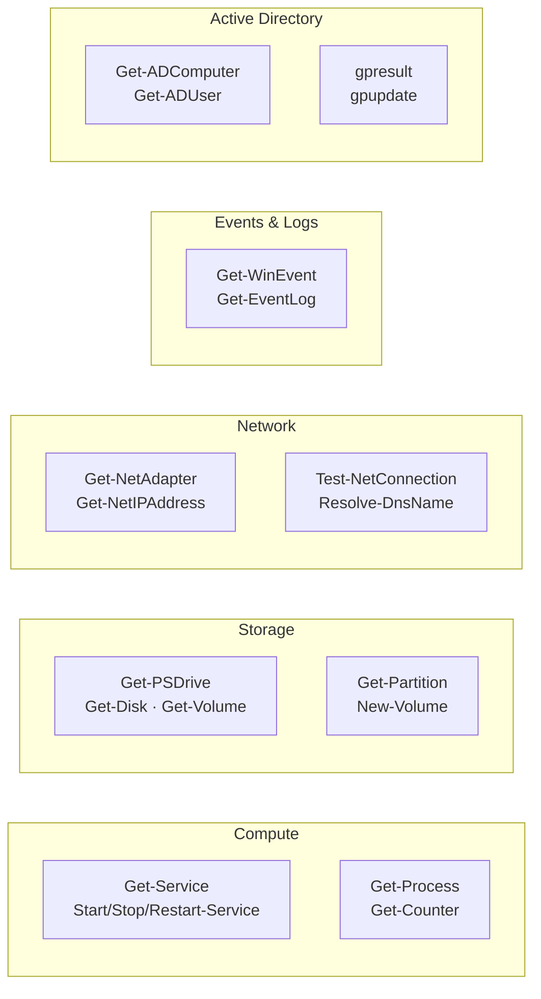

---
tags:
  - operations
  - windows
---
# Windows Server — CLI Reference

<div class="kb-summary">
Commands, syntax, and quick reference. All commands are PowerShell unless noted as `cmd`.

*Applies to: Windows Server 2019 / 2022*
</div>

Commands, syntax, and quick reference.

All commands are PowerShell unless noted as `cmd`.

## Before you begin

- **Access:** Local Administrator or Domain Admin on target hosts
- **Timing:** safe to run during business hours unless a step is marked ⚠ (causes interruption)
- **Dependencies:** no active upgrades or migrations on the same infrastructure
- **Logging:** capture command output — paste into the change record on completion

---

## PowerShell Command Categories



## Disk and Storage

```powershell
# Physical disks
Get-Disk | Select-Object Number, FriendlyName, Size, PartitionStyle, OperationalStatus

# Partitions
Get-Partition | Select-Object DiskNumber, PartitionNumber, DriveLetter, Size, Type

# Volumes
Get-Volume | Select-Object DriveLetter, FileSystemLabel, FileSystem, Size, SizeRemaining, HealthStatus

# Drive space (quick)
Get-PSDrive -PSProvider FileSystem

# Initialise and format a new disk
Initialize-Disk -Number <n> -PartitionStyle GPT
New-Partition -DiskNumber <n> -UseMaximumSize -DriveLetter D
Format-Volume -DriveLetter D -FileSystem NTFS -NewFileSystemLabel "Data" -Confirm:$false

# Extend a volume
Resize-Partition -DriveLetter D -Size (Get-PartitionSupportedSize -DriveLetter D).SizeMax
```

## Networking

```powershell
# IP configuration
Get-NetIPAddress | Select-Object InterfaceAlias, AddressFamily, IPAddress, PrefixLength
ipconfig /all                # cmd

# Network adapters
Get-NetAdapter | Select-Object Name, InterfaceDescription, Status, LinkSpeed, MacAddress

# Routes
Get-NetRoute | Where-Object DestinationPrefix -eq '0.0.0.0/0'
route print                  # cmd

# DNS configuration
Get-DnsClientServerAddress
nslookup <hostname>          # cmd
Resolve-DnsName <hostname>

# Test connectivity
Test-NetConnection -ComputerName <target>
Test-NetConnection -ComputerName <target> -Port 443
Test-NetConnection -ComputerName <target> -TraceRoute

# Active connections
netstat -ano                 # cmd
Get-NetTCPConnection | Where-Object State -eq Established

# Flush DNS cache
Clear-DnsClientCache
ipconfig /flushdns           # cmd
```

## Active Directory and Domain

```powershell
# Check domain join status
dsregcmd /status             # cmd (shows AAD/AD join state)

# Computer account info
Get-ADComputer -Identity <hostname> -Properties *

# Current user info
whoami /all                  # cmd
[System.Security.Principal.WindowsIdentity]::GetCurrent()

# Group Policy results
gpresult /r                  # cmd (text output)
gpresult /h C:\Temp\gp.html  # cmd (HTML report)
gpupdate /force              # cmd (force GP refresh)

# Kerberos tickets
klist                        # cmd
klist purge                  # cmd (clear ticket cache)
```

## Process Management

```powershell
# List processes
Get-Process | Sort-Object CPU -Descending | Select-Object -First 20
Get-Process | Sort-Object WorkingSet -Descending | Select-Object -First 20 Name, Id, WorkingSet, CPU

# Kill a process
Stop-Process -Name <name> -Force
Stop-Process -Id <pid> -Force

# Find process by port
Get-NetTCPConnection -LocalPort 80 | Select-Object -ExpandProperty OwningProcess | Get-Process
```

## Performance Counters

```powershell
# Snapshot CPU
Get-Counter '\Processor(_Total)\% Processor Time'

# Snapshot memory
Get-Counter '\Memory\Available MBytes'

# Disk I/O
Get-Counter '\PhysicalDisk(_Total)\Disk Reads/sec'
Get-Counter '\PhysicalDisk(_Total)\Disk Writes/sec'

# Multi-counter snapshot
Get-Counter @(
  '\Processor(_Total)\% Processor Time',
  '\Memory\Available MBytes',
  '\PhysicalDisk(_Total)\% Disk Time'
) -SampleInterval 5 -MaxSamples 6
```

## User and Security

```powershell
# Local users
Get-LocalUser
Get-LocalGroupMember -Group Administrators

# Active sessions
query session                # cmd
logoff <sessionid>           # cmd (disconnect RDP session)

# Audit policy
auditpol /get /category:*   # cmd

# Firewall
Get-NetFirewallRule | Where-Object Enabled -eq True | Select-Object DisplayName, Direction, Action, Profile
New-NetFirewallRule -DisplayName "Block SMBv1" -Direction Inbound -Protocol TCP -LocalPort 445 -Action Block
```

## Hotfix and Updates

```powershell
# Installed hotfixes
Get-HotFix | Sort-Object InstalledOn -Descending | Select-Object -First 20 HotFixID, InstalledOn, Description

# Windows Update service
Get-Service wuauserv
Start-Service wuauserv

# Force update check (cmd)
wuauclt /detectnow           # cmd
UsoClient StartScan          # cmd (Windows 10/Server 2016+)
```

---

## Verify

- Confirm the operation completed without errors in the log or management UI
- Verify the expected state change is visible (service running, object created, config applied)
- Document the outcome in the change record

---

## See also

- [Windows Server — Procedures](../procedures/)
- [Windows Server — Scripts](../scripts/)
- [Windows Server — Health Checks](../health-checks/)
