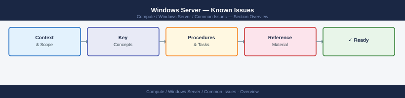
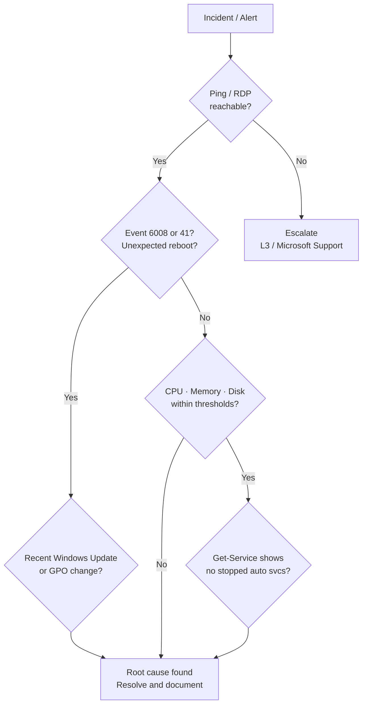

---
tags:
  - operations
  - windows
---
# Windows Server — Known Issues


<div class="kb-summary">
Quick reference for common problems and resolutions. Structured approach to diagnosing common Windows Server issues.

*Applies to: Windows Server 2019 / 2022*
</div>



Quick reference for common problems and resolutions.

Structured approach to diagnosing common Windows Server issues.

```d2
direction: down

symptom: Identify Symptom {shape: diamond}
triage_order: "Triage Order" {shape: rectangle}
high_memory: "High Memory" {shape: rectangle}
disk_full_or_high_latency: "Disk Full or High Latency" {shape: rectangle}
network_connectivity_issues: "Network Connectivity Issues" {shape: rectangle}
service_not_starting: "Service Not Starting" {shape: rectangle}
rdp_remote_access_issues: "RDP / Remote Access Issues" {shape: rectangle}
resolution: Resolve or Escalate {shape: oval}

symptom -> triage_order: investigate
symptom -> high_memory: investigate
symptom -> disk_full_or_high_latency: investigate
symptom -> network_connectivity_issues: investigate
symptom -> service_not_starting: investigate
symptom -> rdp_remote_access_issues: investigate
triage_order -> resolution
high_memory -> resolution
disk_full_or_high_latency -> resolution
network_connectivity_issues -> resolution
service_not_starting -> resolution
rdp_remote_access_issues -> resolution
```

## Before you begin

- **Access:** Local Administrator or Domain Admin on target hosts
- **Timing:** safe to run during business hours unless a step is marked ⚠ (causes interruption)
- **Dependencies:** no active upgrades or migrations on the same infrastructure
- **Logging:** capture command output — paste into the change record on completion

---

## Triage Order

1. **Is the host reachable?** — ping, RDP, WinRM, iDRAC/iLO console
2. **Has the server rebooted unexpectedly?** — Event ID 6008, 41 in System log
3. **What changed recently?** — Windows Update history, software installs, GPO changes
4. **What is the resource state?** — CPU, memory, disk, network
5. **Which service or application is affected?** — Event logs, Get-Service




## High Memory

```powershell
# Memory summary
$os = Get-CimInstance Win32_OperatingSystem
"Free: $([math]::Round($os.FreePhysicalMemory/1MB,1)) GB of $([math]::Round($os.TotalVisibleMemorySize/1MB,1)) GB"

# Top memory consumers
Get-Process | Sort-Object WorkingSet -Descending | Select-Object -First 10 Name, Id,
    @{N="WS_MB"; E={ [math]::Round($_.WorkingSet/1MB,1) }},
    @{N="Priv_MB"; E={ [math]::Round($_.PrivateMemorySize64/1MB,1) }}

# Memory pressure — paging activity
Get-Counter '\Memory\Pages/sec', '\Memory\Available MBytes' -SampleInterval 5 -MaxSamples 5

# Non-paged pool exhaustion event
Get-WinEvent -FilterHashtable @{ LogName='System'; Id=2019 } -MaxEvents 3 -ErrorAction SilentlyContinue
```

## Disk Full or High Latency

```powershell
# Which volume is full?
Get-PSDrive -PSProvider FileSystem | Select-Object Name,
    @{N="FreeGB";  E={ [math]::Round($_.Free/1GB,1) }},
    @{N="TotalGB"; E={ [math]::Round(($_.Used+$_.Free)/1GB,1) }},
    @{N="UsedPct"; E={ [math]::Round($_.Used/($_.Used+$_.Free)*100,1) }}

# Largest directories on C:\
Get-ChildItem C:\ -Directory | ForEach-Object {
    [PSCustomObject]@{
        Name    = $_.Name
        SizeGB  = [math]::Round((Get-ChildItem $_.FullName -Recurse -ErrorAction SilentlyContinue |
            Measure-Object Length -Sum).Sum / 1GB, 2)
    }
} | Sort-Object SizeGB -Descending

# Disk latency — Avg sec/Transfer > 20ms = problem
Get-Counter '\PhysicalDisk(*)\Avg. Disk sec/Transfer' -SampleInterval 2 -MaxSamples 5

# Large files — Windows Update cache
Get-ChildItem "C:\Windows\SoftwareDistribution\Download" -Recurse -ErrorAction SilentlyContinue |
    Measure-Object Length -Sum | Select-Object @{N="SizeGB"; E={ [math]::Round($_.Sum/1GB,2) }}
# Clean: Stop-Service wuauserv; Remove-Item ... ; Start-Service wuauserv
```

## Network Connectivity Issues

```powershell
# Is the adapter up?
Get-NetAdapter | Select-Object Name, Status, LinkSpeed

# IP and routing
Get-NetIPAddress -AddressFamily IPv4 | Select-Object InterfaceAlias, IPAddress, PrefixLength
Get-NetRoute -AddressFamily IPv4 | Sort-Object RouteMetric | Select-Object -First 10

# Test DNS
Resolve-DnsName corp.local
Test-NetConnection -ComputerName 10.0.0.1 -Port 443

# Firewall — check if port is blocked
Get-NetFirewallRule -Direction Inbound -Enabled True -Action Block |
    Select-Object DisplayName, Profile, LocalPort | Format-Table -AutoSize

# Check Windows Firewall profile state
Get-NetFirewallProfile | Select-Object Name, Enabled, DefaultInboundAction
```

## Service Not Starting

```powershell
# Get the error
Get-Service -Name <ServiceName> | Select-Object *
Get-WinEvent -FilterHashtable @{ LogName='System'; Id=7000,7001,7009,7011,7034 } -MaxEvents 20 |
    Where-Object { $_.Message -match "<ServiceName>" } |
    Select-Object TimeCreated, Id, Message | Format-List

# Check service account permissions
Get-CimInstance Win32_Service -Filter "Name='<ServiceName>'" | Select-Object Name, StartName, State

# Check if binary exists
$svc = Get-CimInstance Win32_Service -Filter "Name='<ServiceName>'"
Test-Path ($svc.PathName -split '"')[1]
```

## RDP / Remote Access Issues

```powershell
# Is RDP listening?
Get-NetTCPConnection -LocalPort 3389 | Select-Object State, OwningProcess

# Is firewall allowing RDP?
Get-NetFirewallRule -DisplayName "*Remote Desktop*" | Select-Object DisplayName, Enabled, Direction, Action

# Is TermService running?
Get-Service TermService | Select-Object Status, StartType

# Check RDP login failures
Get-WinEvent -FilterHashtable @{ LogName='Security'; Id=4625 } -MaxEvents 20 |
    Select-Object TimeCreated, Message | Format-List

# Check NLA and certificate
Get-ItemProperty "HKLM:\SYSTEM\CurrentControlSet\Control\Terminal Server\WinStations\RDP-Tcp" |
    Select-Object SecurityLayer, UserAuthentication, fDenyTSConnections
# fDenyTSConnections=0 means RDP enabled
```

---

## Verify

- Confirm the operation completed without errors in the log or management UI
- Verify the expected state change is visible (service running, object created, config applied)
- Document the outcome in the change record

## See also

- [Windows Server — Procedures](../procedures/)
- [Windows Server — Health Checks](../health-checks/)
- [Windows Server — CLI Reference](../cli-reference/)
- [Windows Server — Scripts](../scripts/)
- [Windows Server — Backup and Restore](../backup-restore/)
- [Windows Server — Install and Upgrade](../install-upgrade/)
- [Windows Server — Common Issues](../../troubleshooting/common-issues/)
