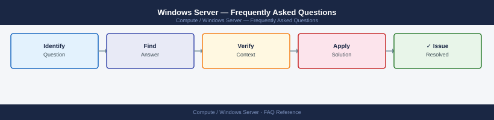

---
tags:
  - windows-server
  - faq
  - operations
description: "Common questions about Windows Server operations, configuration, and troubleshooting. For step-by-step procedures, see the Operations section."
---
# Windows Server — Frequently Asked Questions

*Applies to: Windows Server 2019 / 2022*

Common questions about Windows Server operations, configuration, and troubleshooting. For step-by-step procedures, see the <a href="index.md">Operations</a> section.

## General

**Q: How do I check the Windows Server version and edition?**
A: Run `winver` for GUI, or `(Get-ComputerInfo).WindowsProductName` in PowerShell. For patch level: `(Get-HotFix | Sort InstalledOn)[-1]` shows the most recent update.

**Q: How do I check the current Windows Server version?**
A: `(Get-ComputerInfo).WindowsProductName`

## Configuration

**Q: What is the default Windows Update configuration and when should it change?**
A: Default allows automatic updates. For servers, configure WSUS or SCCM/Intune to control update timing. Set maintenance windows to prevent unplanned reboots. Disable automatic restarts for servers in production.

**Q: How do I enable Windows Defender Credential Guard?**
A: Enable via GPO: Computer Configuration → Administrative Templates → System → Device Guard → Turn On Virtualization Based Security. Requires UEFI, Secure Boot, and Hyper-V. Check with `msinfo32` → Virtualization-based security.

## Operations

**Q: How do I apply patches across a Windows Server fleet without downtime?**
A: Use SCCM/WSUS deployment rings. Patch dev → test → prod with 1-week gaps. For clustered workloads, use Cluster-Aware Updating (CAU). Always test patches in a lower environment first.

**Q: What is the correct procedure to add a new data disk to Windows Server?**
A: Attach disk, then in Disk Management: right-click → Online → Initialize → New Simple Volume. For scripting: `Get-Disk | Where PartitionStyle -eq 'RAW' | Initialize-Disk -PartitionStyle GPT | New-Partition -AssignDriveLetter -UseMaximumSize | Format-Volume`.

## Troubleshooting

**Q: System log shows Event ID 4226 'TCP/IP reached the security limit'. What does it mean?**
A: Half-open TCP connection limit reached (historical limit on older Windows). On modern Windows Server 2016+, this limit is removed. On older systems, check for port exhaustion or SYN flood conditions.

**Q: Windows Server performance degraded — where do I start?**
A: Open Resource Monitor (`resmon`) or Performance Monitor (`perfmon`). Check CPU, memory, disk, and network. Use `Get-Process | Sort CPU -Descending | Select -First 10` for top CPU consumers. Review event logs for errors.

## Backup and Recovery

**Q: How often should I back up Windows Server?**
A: Daily via Windows Server Backup, Veeam, or Commvault. Include System State for DCs. Test restore monthly. For application servers, follow the application's own backup requirements in addition to OS-level backup.

**Q: Can I restore a single registry key without a full server restore?**
A: Yes — export the registry key before changes: `reg export HKLM\SOFTWARE\MyApp backup.reg`. Restore with `reg import backup.reg`. For full registry restore, boot to WinRE and use System Restore or restore from backup.

## See Also

- [Windows Server Operations](index.md)
- [Windows Server Troubleshooting](../troubleshooting/index.md)
