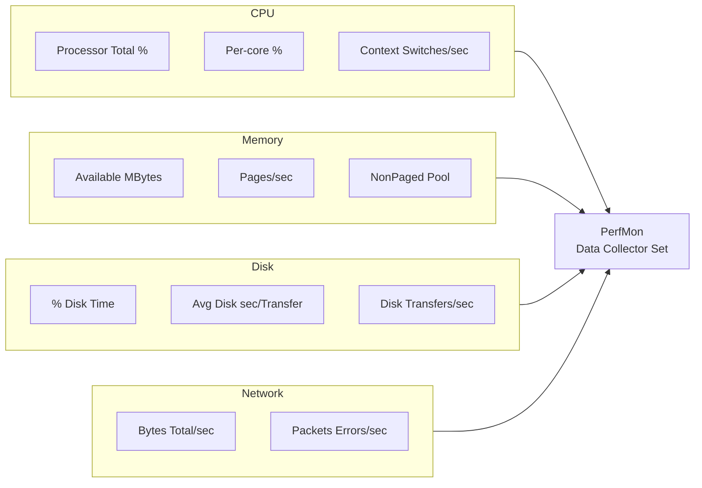

---
tags:
  - operations
  - windows
---
# Windows Server — Health Checks


<div class="kb-summary">
Routine checks, service validation, and status verification.

*Applies to: Windows Server 2019 / 2022*
</div>

## Before you begin

- **Access:** Local Administrator or Domain Admin on target hosts
- **Timing:** safe to run during business hours unless a step is marked ⚠ (causes interruption)
- **Dependencies:** no active upgrades or migrations on the same infrastructure
- **Logging:** capture command output — paste into the change record on completion

---

## Run This Routine

Run these PowerShell commands in sequence at the start of any health check session or before making changes to a Windows Server.

```powershell
# 1. OS version
Get-ComputerInfo | Select-Object WindowsProductName, OsVersion

# 2. Uptime
(Get-Date) - (gcim Win32_OperatingSystem).LastBootUpTime

# 3. Disk space
Get-PSDrive -PSProvider FileSystem | Select-Object Name,
    @{n='FreeGB';  e={[math]::Round($_.Free/1GB, 1)}},
    @{n='UsedGB';  e={[math]::Round($_.Used/1GB, 1)}}

# 4. Failed auto-start services
Get-Service | Where-Object { $_.StartType -eq 'Automatic' -and $_.Status -ne 'Running' }

# 5. Event log errors — last 24 hours
Get-EventLog -LogName System -EntryType Error -After (Get-Date).AddHours(-24) | Select-Object -First 20

# 6. CPU and memory snapshot
Get-Counter '\Processor(_Total)\% Processor Time', '\Memory\Available MBytes'

# 7. Network adapter status
Get-NetAdapter | Select-Object Name, Status, LinkSpeed

# 8. Pending reboot check
Test-Path 'HKLM:\SYSTEM\CurrentControlSet\Control\Session Manager\PendingFileRenameOperations'

# 9. Windows Firewall status
Get-NetFirewallProfile | Select-Object Name, Enabled

# 10. Last Windows Updates installed
Get-HotFix | Sort-Object InstalledOn -Descending | Select-Object -First 5
```
```text
┌─────────────────────────────────── Windows Server — Health Checks ────────────────────────────────────┐
│                                                                                                       │
│  Regular health checks: disk, AD replication, services, and event log review.                         │
│                                                                                                       │
│   ┌──────────────────────────────────────────────┐  ┌─────────────────────────────────────────────┐   │
│   │                System Health                 │  │                  AD Health                  │   │
│   │          Disk: > 20 % free required          │  │            repadmin /replsummary            │   │
│   │            CPU: < 80 % sustained             │  │               dcdiag /test:all              │   │
│   │          Memory: paging < 100 MB/s           │  │         netlogon: running on all DCs        │   │
│   │        Event log: filter 1xxx errors         │  │       SYSVOL: replicated + accessible       │   │
│   └──────────────────────────────────────────────┘  └─────────────────────────────────────────────┘   │
│                                                                                                       │
│    System + AD checks should run daily; cluster and security checks weekly                            │
│                                                                                                       │
│                          ▼                                                 ▼                          │
│                                                                                                       │
│   ┌──────────────────────────────────────────────┐  ┌─────────────────────────────────────────────┐   │
│   │            Cluster Health (WSFC)             │  │               Security Posture              │   │
│   │           Get-ClusterNode: all up            │  │         Missing patches: age < 30 d         │   │
│   │            Cluster log: no errors            │  │         Defender: signatures current        │   │
│   │          Quorum: witness reachable           │  │         Local admins: minimum count         │   │
│   │           CSV: available + healthy           │  │              Audit log: no gaps             │   │
│   └──────────────────────────────────────────────┘  └─────────────────────────────────────────────┘   │
│                                                                                                       │
│  Physical Infrastructure (the hardware everything above runs on):                                     │
│  Physical or virtual server · Domain Controllers · cluster shared storage · SIEM                      │
│                                                                                                       │
│  Key terms:                                                                                           │
│                                                                                                       │
│  repadmin      = AD replication admin tool; /replsummary shows lag and errors                         │
│  dcdiag        = DC diagnostic tool; runs test battery against all DCs                                │
│  netlogon      = Windows service; required for domain auth and GPO application                        │
│  SYSVOL        = shared folder on all DCs; must be replicated and accessible                          │
│  Get-ClusterNode= PowerShell command; shows all cluster nodes and their state                         │
│  Quorum        = cluster voting mechanism; requires majority to stay online                           │
│  Witness       = quorum tie-breaker; disk witness or cloud witness                                    │
│  CSV           = Cluster Shared Volume; shared storage for Hyper-V VMs                                │
│  Paging        = excessive page file activity indicates RAM shortage                                  │
│  Event 1xxx    = common error range in Windows event logs; filter by level                            │
│  Audit log gap = gap in security event log sequence; may indicate tampering                           │
│  LAPS          = auto-rotated local admin password; check rotation age                                │
│                                                                                                       │
└───────────────────────────────────────────────────────────────────────────────────────────────────────┘
```

### Disk Space

```powershell
# All drives with free space
Get-PSDrive -PSProvider FileSystem |
  Select-Object Name,
    @{N="Used(GB)"; E={[math]::Round($_.Used/1GB,2)}},
    @{N="Free(GB)"; E={[math]::Round($_.Free/1GB,2)}},
    @{N="Total(GB)"; E={[math]::Round(($_.Used+$_.Free)/1GB,2)}},
    @{N="Free%"; E={[math]::Round($_.Free/($_.Used+$_.Free)*100,1)}} |
  Where-Object {$_."Total(GB)" -gt 0}
```

Alert threshold: warn at < 20% free, critical at < 10% free.

### CPU and Memory

```powershell
# CPU utilisation (5-second average)
Get-Counter '\Processor(_Total)\% Processor Time' -SampleInterval 5 -MaxSamples 3 |
  Select-Object -ExpandProperty CounterSamples |
  Select-Object CookedValue

# Memory usage
$os = Get-CimInstance Win32_OperatingSystem
[PSCustomObject]@{
  TotalGB   = [math]::Round($os.TotalVisibleMemorySize/1MB, 2)
  FreeGB    = [math]::Round($os.FreePhysicalMemory/1MB, 2)
  UsedPct   = [math]::Round(($os.TotalVisibleMemorySize - $os.FreePhysicalMemory) / $os.TotalVisibleMemorySize * 100, 1)
}

# Top 10 processes by CPU
Get-Process | Sort-Object CPU -Descending | Select-Object -First 10 Name, CPU, WorkingSet, Id
```

### Windows Defender Status

```powershell
# Defender status
Get-MpComputerStatus | Select-Object `
  AMServiceEnabled, AntispywareEnabled, AntivirusEnabled,
  RealTimeProtectionEnabled, AntivirusSignatureLastUpdated,
  QuickScanStartTime, FullScanStartTime

# Check for threats
Get-MpThreatDetection | Select-Object ThreatID, ProcessName, ActionSuccess, InitialDetectionTime
```

### Scheduled Tasks

```powershell
# Tasks that failed in last 24 hours
Get-ScheduledTask | Where-Object State -ne Disabled |
  ForEach-Object {
    $info = $_ | Get-ScheduledTaskInfo
    [PSCustomObject]@{
      TaskName   = $_.TaskName
      TaskPath   = $_.TaskPath
      LastResult = $info.LastTaskResult
      LastRun    = $info.LastRunTime
    }
  } |
  Where-Object LastResult -ne 0 |
  Sort-Object LastRun -Descending
```

## System Overview

```powershell
# Uptime
(Get-Date) - (gcim Win32_OperatingSystem).LastBootUpTime

# OS version, build, and hostname
Get-ComputerInfo | Select-Object CsName, OsName, OsVersion, OsBuildNumber, WindowsVersion

# Last 5 system events (errors/warnings)
Get-WinEvent -LogName System -MaxEvents 100 |
    Where-Object { $_.LevelDisplayName -in "Error","Warning" } |
    Select-Object -First 5 TimeCreated, LevelDisplayName, Message
```

## CPU and Memory

```powershell
# CPU usage (10-second sample)
$cpu = Get-Counter '\Processor(_Total)\% Processor Time' -SampleInterval 2 -MaxSamples 5
$cpu.CounterSamples.CookedValue | Measure-Object -Average | Select-Object Average

# Memory
$os = Get-CimInstance Win32_OperatingSystem
[PSCustomObject]@{
    TotalGB     = [math]::Round($os.TotalVisibleMemorySize/1MB, 1)
    FreeGB      = [math]::Round($os.FreePhysicalMemory/1MB, 1)
    UsedPct     = [math]::Round(($os.TotalVisibleMemorySize - $os.FreePhysicalMemory) / $os.TotalVisibleMemorySize * 100, 1)
}

# Top CPU-consuming processes
Get-Process | Sort-Object CPU -Descending | Select-Object -First 10 Name, Id, CPU, WorkingSet
```

## Disk

```powershell
# Disk free space — flag below 20%
Get-PSDrive -PSProvider FileSystem | Select-Object Name,
    @{N="FreeGB";   E={ [math]::Round($_.Free/1GB, 1) }},
    @{N="TotalGB";  E={ [math]::Round(($_.Used + $_.Free)/1GB, 1) }},
    @{N="UsedPct";  E={ [math]::Round($_.Used/($_.Used + $_.Free)*100, 1) }} |
    Where-Object { $_.UsedPct -gt 80 }

# Disk performance counters
Get-Counter '\PhysicalDisk(*)\Avg. Disk sec/Transfer' -SampleInterval 2 -MaxSamples 3 |
    ForEach-Object { $_.CounterSamples | Select-Object Path, CookedValue }
```

## Services

```powershell
# Services in a stopped state that should be running (auto start)
Get-Service | Where-Object { $_.StartType -eq "Automatic" -and $_.Status -ne "Running" } |
    Select-Object Name, DisplayName, Status

# Check a specific service
Get-Service -Name <ServiceName> | Select-Object Name, Status, StartType
```

## Event Log Quick Review

```powershell
# System errors in last 24 hours
Get-WinEvent -FilterHashtable @{ LogName='System'; Level=2; StartTime=(Get-Date).AddHours(-24) } |
    Select-Object TimeCreated, Id, Message | Select-Object -First 10

# Application errors in last 24 hours
Get-WinEvent -FilterHashtable @{ LogName='Application'; Level=2; StartTime=(Get-Date).AddHours(-24) } |
    Select-Object TimeCreated, Id, Message | Select-Object -First 10
```

## Network

```powershell
# Interface status
Get-NetAdapter | Select-Object Name, Status, LinkSpeed, MacAddress

# IP addresses
Get-NetIPAddress | Where-Object { $_.AddressFamily -eq "IPv4" } |
    Select-Object InterfaceAlias, IPAddress, PrefixLength

# Active TCP connections
Get-NetTCPConnection -State Established |
    Select-Object LocalAddress, LocalPort, RemoteAddress, RemotePort, OwningProcess |
    Sort-Object RemoteAddress | Select-Object -First 20

# Test DNS resolution
Resolve-DnsName corp.local
```

## Pending Reboots

```powershell
# Check for pending reboot from Windows Update or software installs
$rebootPending = $false
if (Get-ItemProperty "HKLM:\SOFTWARE\Microsoft\Windows\CurrentVersion\WindowsUpdate\Auto Update\RebootRequired" -EA SilentlyContinue) { $rebootPending = $true }
if (Get-ItemProperty "HKLM:\SYSTEM\CurrentControlSet\Control\Session Manager" -Name PendingFileRenameOperations -EA SilentlyContinue) { $rebootPending = $true }
"Reboot Pending: $rebootPending"
```

## Performance Counter Hierarchy



## Health Check Summary

| Check | Command | Healthy |
|---|---|---|
| Uptime reasonable | `(Get-Date) - LastBootUpTime` | No unexpected recent reboot |
| CPU usage | `Get-Counter` | < 80% sustained |
| Memory available | `Get-CimInstance Win32_OperatingSystem` | > 20% free |
| No disk > 80% | `Get-PSDrive` | All < 80% used |
| No stopped auto services | `Get-Service` | 0 stopped auto-start |
| No System errors (24h) | `Get-WinEvent` | 0 critical errors |
| Network adapters up | `Get-NetAdapter` | All status = Up |
| Pending reboot | Registry check | $false |

## Event Logs

| Log | Path | Content |
|---|---|---|
| System | `System` | OS events, driver failures, service stops, hardware |
| Application | `Application` | App errors, .NET exceptions, SQL, IIS |
| Security | `Security` | Authentication, account management, privilege use |
| Setup | `Setup` | Windows Update, component installs |
| Windows PowerShell | `Windows PowerShell` | PS script execution |
| Sysmon | `Microsoft-Windows-Sysmon/Operational` | Process creation, network, file events (if deployed) |

### Get-WinEvent — Common Queries

```powershell
# Errors in System log — last 24 hours
Get-WinEvent -FilterHashtable @{
    LogName   = 'System'
    Level     = 2
    StartTime = (Get-Date).AddHours(-24)
} | Select-Object TimeCreated, Id, Message | Format-List

# Application errors — last 6 hours
Get-WinEvent -FilterHashtable @{
    LogName   = 'Application'
    Level     = 2
    StartTime = (Get-Date).AddHours(-6)
} | Select-Object -First 20 TimeCreated, Id, Message

# Security log — failed logons (Event ID 4625)
Get-WinEvent -FilterHashtable @{
    LogName   = 'Security'
    Id        = 4625
    StartTime = (Get-Date).AddHours(-24)
} | Select-Object TimeCreated, Message | Select-Object -First 20
```

### Key Security Event IDs

| Event ID | Description |
|---|---|
| 4624 | Successful logon |
| 4625 | Failed logon |
| 4634 | Logoff |
| 4688 | Process creation |
| 4720 | User account created |
| 4740 | Account locked out |
| 7036 | Service started or stopped |
| 41 | Kernel power — unexpected reboot |
| 6008 | Unexpected shutdown |

### Log Size and Retention

```powershell
# Check current log sizes and limits
Get-WinEvent -ListLog System, Application, Security |
    Select-Object LogName, MaximumSizeInBytes,
        @{N="CurrentSizeMB"; E={ [math]::Round($_.FileSize/1MB,1) }},
        LogMode

# Set max size (e.g., Security log to 1 GB)
wevtutil sl Security /ms:1073741824
```

## Performance

### Quick Performance Snapshot

```powershell
# CPU usage (5-sample average)
$cpu = Get-Counter '\Processor(_Total)\% Processor Time' -SampleInterval 2 -MaxSamples 5
[math]::Round(($cpu.CounterSamples.CookedValue | Measure-Object -Average).Average, 1)

# Memory
$os = Get-CimInstance Win32_OperatingSystem
[PSCustomObject]@{
    TotalGB   = [math]::Round($os.TotalVisibleMemorySize/1MB, 1)
    FreeGB    = [math]::Round($os.FreePhysicalMemory/1MB, 1)
    UsedPct   = [math]::Round(($os.TotalVisibleMemorySize - $os.FreePhysicalMemory)/$os.TotalVisibleMemorySize*100, 1)
}

# Top processes by CPU
Get-Process | Sort-Object CPU -Descending | Select-Object -First 10 Name, Id,
    @{N="CPU%"; E={ [math]::Round($_.CPU, 1) }}, WorkingSet

# Top processes by memory
Get-Process | Sort-Object WorkingSet -Descending | Select-Object -First 10 Name, Id,
    @{N="MemMB"; E={ [math]::Round($_.WorkingSet/1MB, 1) }}
```

### Performance Thresholds

| Counter | Warning | Critical |
|---|---|---|
| CPU % Processor Time | > 70% sustained | > 90% sustained |
| Memory Available MB | < 20% of total | < 10% of total |
| Pages/sec | > 100/sec | > 1,000/sec |
| Disk Avg. sec/Transfer | > 15 ms | > 25 ms |
| Disk % Disk Time | > 80% | > 95% |
| Network % Bandwidth | > 70% | > 90% |

### Performance Counters

```powershell
# CPU — sustained above 85% = problem
Get-Counter '\Processor(_Total)\% Processor Time' -SampleInterval 5 -MaxSamples 12 |
    ForEach-Object { $_.CounterSamples | Select-Object Path, CookedValue }

# Memory — pages/sec above 1000 sustained = memory pressure
Get-Counter '\Memory\Pages/sec', '\Memory\Available MBytes' -SampleInterval 5 -MaxSamples 6

# Disk — latency above 20ms = problem
Get-Counter '\PhysicalDisk(*)\Avg. Disk sec/Transfer' -SampleInterval 2 -MaxSamples 5

# Network — throughput and errors
Get-Counter '\Network Interface(*)\Bytes Total/sec', '\Network Interface(*)\Packets Received Errors'
```

### Data Collector Sets (PerfMon)

```powershell
# Create a data collector set from command line
logman create counter "PerfBaseline" ^
    -c "\Processor(_Total)\% Processor Time" ^
       "\Memory\Available MBytes" ^
       "\PhysicalDisk(*)\Avg. Disk sec/Transfer" ^
       "\Network Interface(*)\Bytes Total/sec" ^
    -si 00:00:05 ^
    -f bincirc ^
    -max 500 ^
    -o C:\PerfLogs\baseline

logman start PerfBaseline
logman stop PerfBaseline
```

---

## CPU and Memory

Commands to assess processor utilisation and memory availability, and identify resource-intensive processes.

```powershell
# CPU utilisation — 5-sample average
$cpu = Get-Counter '\Processor(_Total)\% Processor Time' -SampleInterval 2 -MaxSamples 5
[math]::Round(($cpu.CounterSamples.CookedValue | Measure-Object -Average).Average, 1)

# Per-core CPU utilisation
Get-Counter '\Processor(*)\% Processor Time' -SampleInterval 2 -MaxSamples 3 |
    ForEach-Object { $_.CounterSamples | Select-Object InstanceName, CookedValue }

# Memory summary
$os = Get-CimInstance Win32_OperatingSystem
[PSCustomObject]@{
    TotalGB  = [math]::Round($os.TotalVisibleMemorySize / 1MB, 1)
    FreeGB   = [math]::Round($os.FreePhysicalMemory / 1MB, 1)
    UsedPct  = [math]::Round(($os.TotalVisibleMemorySize - $os.FreePhysicalMemory) / $os.TotalVisibleMemorySize * 100, 1)
}

# Top 10 processes by CPU
Get-Process | Sort-Object CPU -Descending | Select-Object -First 10 Name, Id, CPU, WorkingSet

# Top 10 processes by memory
Get-Process | Sort-Object WorkingSet -Descending | Select-Object -First 10 Name, Id,
    @{N="MemMB"; E={[math]::Round($_.WorkingSet / 1MB, 1)}}
```

What to look for:
- CPU above 80% sustained indicates saturation — identify the top process and assess whether it is expected.
- `Available MBytes` below 10% of total RAM indicates memory pressure; the system may be paging.
- A single process consuming excessive CPU or memory and growing over time may indicate a memory leak or runaway thread.
- Pages/sec counter above 100 sustained indicates the system is actively paging to disk.

---

## Disk Health

Commands to check free space, disk I/O latency, and identify large consumers.

```powershell
# Disk free space — flag volumes below 20% free
Get-PSDrive -PSProvider FileSystem | Select-Object Name,
    @{N="FreeGB";  E={[math]::Round($_.Free/1GB, 1)}},
    @{N="TotalGB"; E={[math]::Round(($_.Used + $_.Free)/1GB, 1)}},
    @{N="UsedPct"; E={[math]::Round($_.Used / ($_.Used + $_.Free) * 100, 1)}} |
    Where-Object { $_.TotalGB -gt 0 }

# Disk I/O latency — above 20ms average is a concern
Get-Counter '\PhysicalDisk(*)\Avg. Disk sec/Transfer' -SampleInterval 2 -MaxSamples 5 |
    ForEach-Object { $_.CounterSamples | Select-Object Path, CookedValue }

# Disk queue length — above 2 indicates saturation
Get-Counter '\PhysicalDisk(*)\Current Disk Queue Length' -SampleInterval 2 -MaxSamples 3 |
    ForEach-Object { $_.CounterSamples | Select-Object Path, CookedValue }

# Large directories consuming space
Get-ChildItem C:\Windows\Logs -Recurse -ErrorAction SilentlyContinue |
    Measure-Object -Property Length -Sum |
    Select-Object @{N="SizeMB"; E={[math]::Round($_.Sum/1MB, 1)}}
```

What to look for:
- Any volume below 10% free is critical — application writes will fail when space reaches 0.
- `C:\Windows\Temp` and `C:\Windows\Logs` are common large-growth directories.
- `Avg. Disk sec/Transfer` above 0.020 (20ms) indicates I/O latency issues.
- `Current Disk Queue Length` above 2 on a physical disk indicates the disk cannot keep up with I/O demand.

---

## Event Log Review

Commands to surface errors and warnings from the Windows event logs, focusing on the System and Application logs.

```powershell
# System errors — last 24 hours
Get-WinEvent -FilterHashtable @{
    LogName   = 'System'
    Level     = 2
    StartTime = (Get-Date).AddHours(-24)
} | Select-Object TimeCreated, Id, Message | Select-Object -First 20 | Format-List

# Application errors — last 24 hours
Get-WinEvent -FilterHashtable @{
    LogName   = 'Application'
    Level     = 2
    StartTime = (Get-Date).AddHours(-24)
} | Select-Object TimeCreated, Id, Message | Select-Object -First 20 | Format-List

# Critical events — last 48 hours (Level 1 = Critical)
Get-WinEvent -FilterHashtable @{
    LogName   = 'System'
    Level     = 1
    StartTime = (Get-Date).AddHours(-48)
} | Select-Object TimeCreated, Id, ProviderName, Message

# Unexpected reboots (Event ID 41 = Kernel Power, 6008 = unexpected shutdown)
Get-WinEvent -FilterHashtable @{ LogName='System'; Id=@(41, 6008) } -MaxEvents 5 |
    Select-Object TimeCreated, Id, Message

# Service failures (Event ID 7034 = unexpected termination, 7036 = state change)
Get-WinEvent -FilterHashtable @{ LogName='System'; Id=@(7034, 7036) } -MaxEvents 20 |
    Select-Object TimeCreated, Id, Message
```

What to look for:
- Event ID 41 (Kernel Power) or 6008 (unexpected shutdown) indicates the server rebooted without a clean shutdown — investigate hardware or power issues.
- Repeated Event ID 7034 for the same service indicates a crashing service that needs investigation.
- High volumes of errors from a single source (Provider) in a short time window may indicate a failing component.
- Event ID 1000 (Application Error) with the same faulting module repeatedly indicates an application crash loop.

---

## Service Health

Commands to identify stopped auto-start services and investigate service failures.

```powershell
# Auto-start services that are not running — should return 0 results on a healthy server
Get-Service | Where-Object { $_.StartType -eq 'Automatic' -and $_.Status -ne 'Running' } |
    Select-Object Name, DisplayName, Status, StartType

# Check a specific service
Get-Service -Name <ServiceName> | Select-Object Name, Status, StartType, DependentServices

# Service start/stop events in the last 24 hours (Event ID 7036)
Get-WinEvent -FilterHashtable @{
    LogName   = 'System'
    Id        = 7036
    StartTime = (Get-Date).AddHours(-24)
} | Select-Object TimeCreated, Message | Format-List

# Services not running as LocalSystem (custom service accounts — verify they are expected)
Get-CimInstance Win32_Service |
    Where-Object { $_.StartName -notin @('LocalSystem', 'NT AUTHORITY\NetworkService', 'NT AUTHORITY\LocalService') } |
    Select-Object Name, StartName, State, StartMode

# Remote service check — useful for cluster nodes
$servers = @('srv01', 'srv02')
$servers | ForEach-Object {
    Get-Service -Name <ServiceName> -ComputerName $_ -ErrorAction SilentlyContinue |
        Select-Object MachineName, Name, Status
}
```

What to look for:
- Any automatic-start service that is stopped and was not manually stopped requires investigation.
- Services running under custom accounts that are locked or expired will fail to start.
- Dependent services will stop if a service they depend on stops — always check `ServicesDependedOn`.

---

## Network Health

Commands to verify adapter status, IP configuration, connectivity, and detect unexpected connections.

```powershell
# Adapter status — all should show Status = Up
Get-NetAdapter | Select-Object Name, Status, LinkSpeed, MacAddress

# IP configuration
Get-NetIPAddress | Where-Object AddressFamily -eq 'IPv4' |
    Select-Object InterfaceAlias, IPAddress, PrefixLength

# Default gateway and routing
Get-NetRoute -DestinationPrefix '0.0.0.0/0' | Select-Object InterfaceAlias, NextHop, RouteMetric

# DNS server configuration
Get-DnsClientServerAddress | Where-Object AddressFamily -eq 2 |
    Select-Object InterfaceAlias, ServerAddresses

# Active TCP connections — look for unexpected remote addresses
Get-NetTCPConnection -State Established |
    Select-Object LocalAddress, LocalPort, RemoteAddress, RemotePort, OwningProcess |
    Sort-Object RemoteAddress | Select-Object -First 30

# Test DNS resolution
Resolve-DnsName corp.local -ErrorAction SilentlyContinue

# Network error counters
Get-NetAdapterStatistics | Select-Object Name, ReceivedPacketErrors, OutboundPacketErrors
```

What to look for:
- Any adapter showing `Status = Disconnected` or `Status = Not Present` that should be active requires investigation.
- `ReceivedPacketErrors` or `OutboundPacketErrors` above 0 and growing indicate NIC or switch issues.
- Established connections to unexpected remote addresses or ports may indicate unauthorized access.
- DNS resolution failure for the domain name will cause Kerberos and Group Policy failures.

---

## Windows Update Status

Commands to review installed updates, check for pending patches, and verify the system is current.

```powershell
# Last 10 installed hotfixes (most recent first)
Get-HotFix | Sort-Object InstalledOn -Descending | Select-Object -First 10 HotFixID, Description, InstalledOn

# Current OS build — compare against Microsoft's known-good build
(Get-ItemProperty "HKLM:\SOFTWARE\Microsoft\Windows NT\CurrentVersion").CurrentBuild
(Get-ItemProperty "HKLM:\SOFTWARE\Microsoft\Windows NT\CurrentVersion").UBR

# Pending reboot from Windows Update
Test-Path 'HKLM:\SOFTWARE\Microsoft\Windows\CurrentVersion\WindowsUpdate\Auto Update\RebootRequired'

# Pending reboot from file rename operations
$pfro = Get-ItemProperty 'HKLM:\SYSTEM\CurrentControlSet\Control\Session Manager' `
    -Name PendingFileRenameOperations -ErrorAction SilentlyContinue
if ($pfro) { "Pending file rename operations: YES" } else { "No pending file rename operations" }

# List available updates without installing (uses COM object)
$Session  = New-Object -ComObject Microsoft.Update.Session
$Searcher = $Session.CreateUpdateSearcher()
$Results  = $Searcher.Search("IsInstalled=0")
$Results.Updates | Select-Object Title, MsrcSeverity | Format-Table -AutoSize

# Days since last update was installed
$lastUpdate = (Get-HotFix | Sort-Object InstalledOn -Descending | Select-Object -First 1).InstalledOn
[math]::Round(((Get-Date) - $lastUpdate).TotalDays, 0)
```

What to look for:
- If the last installed update is more than 30 days old, the server may be missing critical security patches.
- Any pending reboot (`Test-Path` returns `True`) should be scheduled for the next maintenance window.
- Available updates with `MsrcSeverity` of `Critical` should be prioritised and applied within the defined SLA.
- Validate that the current build number matches the expected patched build from Microsoft's release notes.

---

## Verify

- Confirm the operation completed without errors in the log or management UI
- Verify the expected state change is visible (service running, object created, config applied)
- Document the outcome in the change record
