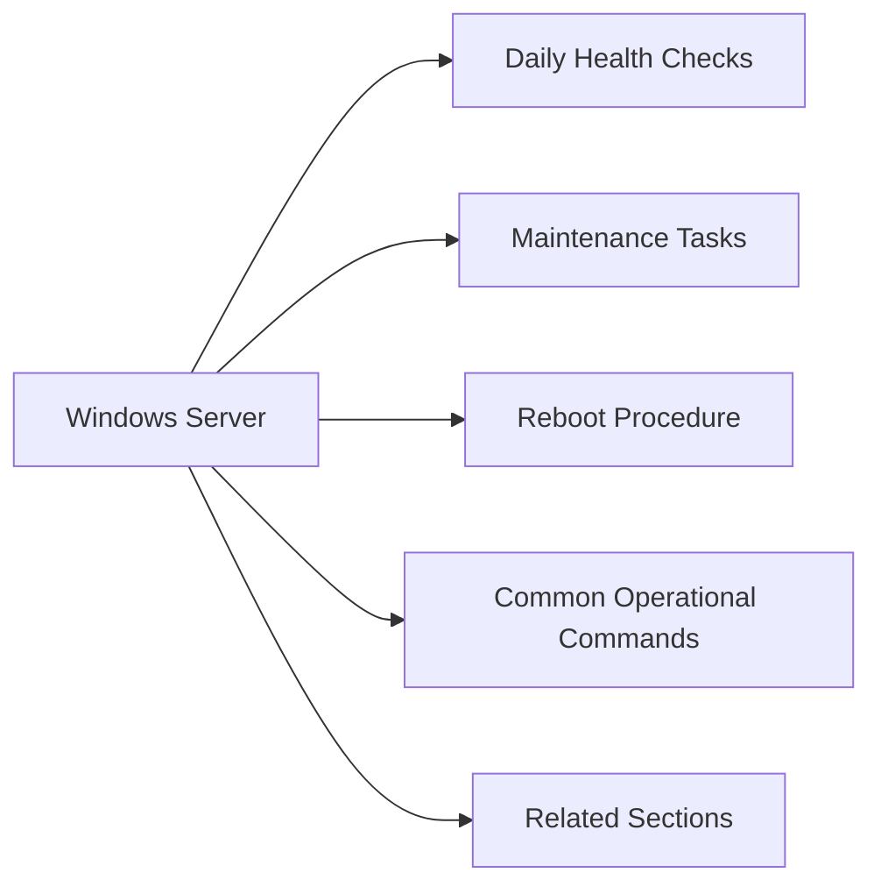

# Windows Server — Operations



## Daily Health Checks

Run the following checks at the start of each operational shift or as part of an automated morning report.

### Event Viewer — Critical Errors

```powershell
# System log errors in last 24 hours
Get-EventLog -LogName System -EntryType Error,Warning `
  -After (Get-Date).AddHours(-24) |
  Select-Object TimeGenerated, EntryType, Source, EventID, Message |
  Sort-Object TimeGenerated -Descending

# Application log errors
Get-EventLog -LogName Application -EntryType Error `
  -After (Get-Date).AddHours(-24) |
  Select-Object TimeGenerated, Source, EventID, Message |
  Sort-Object TimeGenerated -Descending
```

### Windows Services Status

```powershell
# Services that should be running but are not
Get-Service | Where-Object {
  $_.StartType -eq 'Automatic' -and $_.Status -ne 'Running'
} | Select-Object Name, DisplayName, Status, StartType

# Check a specific service
Get-Service -Name wuauserv | Select-Object Name, Status, StartType
```

### Disk Space

```powershell
# All drives with free space
Get-PSDrive -PSProvider FileSystem |
  Select-Object Name,
    @{N="Used(GB)"; E={[math]::Round($_.Used/1GB,2)}},
    @{N="Free(GB)"; E={[math]::Round($_.Free/1GB,2)}},
    @{N="Total(GB)"; E={[math]::Round(($_.Used+$_.Free)/1GB,2)}},
    @{N="Free%"; E={[math]::Round($_.Free/($_.Used+$_.Free)*100,1)}} |
  Where-Object {$_."Total(GB)" -gt 0}
```

Alert threshold: warn at < 20% free, critical at < 10% free.

### CPU and Memory

```powershell
# CPU utilisation (5-second average)
Get-Counter '\Processor(_Total)\% Processor Time' -SampleInterval 5 -MaxSamples 3 |
  Select-Object -ExpandProperty CounterSamples |
  Select-Object CookedValue

# Memory usage
$os = Get-CimInstance Win32_OperatingSystem
[PSCustomObject]@{
  TotalGB   = [math]::Round($os.TotalVisibleMemorySize/1MB, 2)
  FreeGB    = [math]::Round($os.FreePhysicalMemory/1MB, 2)
  UsedPct   = [math]::Round(($os.TotalVisibleMemorySize - $os.FreePhysicalMemory) / $os.TotalVisibleMemorySize * 100, 1)
}

# Top 10 processes by CPU
Get-Process | Sort-Object CPU -Descending | Select-Object -First 10 Name, CPU, WorkingSet, Id
```

### Windows Defender Status

```powershell
# Defender status
Get-MpComputerStatus | Select-Object `
  AMServiceEnabled, AntispywareEnabled, AntivirusEnabled,
  RealTimeProtectionEnabled, AntivirusSignatureLastUpdated,
  QuickScanStartTime, FullScanStartTime

# Check for threats
Get-MpThreatDetection | Select-Object ThreatID, ProcessName, ActionSuccess, InitialDetectionTime
```

### Scheduled Tasks

```powershell
# Tasks that failed in last 24 hours
Get-ScheduledTask | Where-Object State -ne Disabled |
  ForEach-Object {
    $info = $_ | Get-ScheduledTaskInfo
    [PSCustomObject]@{
      TaskName   = $_.TaskName
      TaskPath   = $_.TaskPath
      LastResult = $info.LastTaskResult
      LastRun    = $info.LastRunTime
    }
  } |
  Where-Object LastResult -ne 0 |
  Sort-Object LastRun -Descending
```

## Maintenance Tasks

### Weekly

- Review Windows Update compliance for all servers
- Check backup job success in Veeam or Windows Server Backup
- Review Defender threat detection log
- Verify DC replication health: `repadmin /replsummary`
- Check certificate expiry for IIS and LDAPS: `Get-ChildItem Cert:\LocalMachine\My`

### Monthly

- Apply Patch Tuesday updates per patching cadence (see [Lifecycle](../lifecycle/))
- Review local administrator accounts: `Get-LocalGroupMember -Group Administrators`
- Rotate LAPS passwords if manual override has been set
- Review scheduled task inventory for orphaned tasks
- Check system uptime and schedule reboots if > 30 days without patching

### Quarterly

- Review and test backup restores
- Verify cluster health (if WSFC): `Test-Cluster`
- Audit services set to Automatic that are stopped
- Review GPO application: `gpresult /h c:\temp\gpresult.html`
- Review Event Log custom views for recurring errors

## Reboot Procedure

1. Notify application owners and update change record
2. Verify no active user sessions: `query session`
3. Check cluster ownership if clustered: `Get-ClusterGroup`
4. Initiate graceful shutdown of application services
5. Reboot: `Restart-Computer -Force`
6. Verify services start cleanly post-reboot: `Get-Service | Where-Object {$_.StartType -eq 'Automatic' -and $_.Status -ne 'Running'}`
7. Confirm event log is clean (no critical errors in first 15 minutes)
8. Notify application owners and close change record

## Common Operational Commands

```powershell
# Check active RDP sessions
query session /server:<hostname>

# Check currently logged-on users
Get-CimInstance Win32_LoggedOnUser | Select-Object Antecedent

# Check open network connections
netstat -ano | findstr ESTABLISHED

# Check DNS resolution
Resolve-DnsName <hostname> -Server <dns-server>

# Test connectivity to remote host and port
Test-NetConnection -ComputerName <target> -Port 443

# Check Group Policy last applied
gpresult /r

# Force Group Policy refresh
gpupdate /force

# Check domain membership
dsregcmd /status
```

## Related Sections

- [Health Checks](../health-checks/) — detailed health check procedures
- [Services](../services/) — service management
- [Troubleshooting](../troubleshooting/) — issue resolution
- [Scripts](../scripts/) — automation scripts
