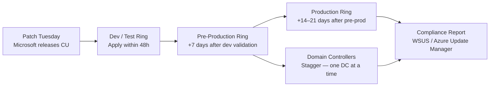

# Windows Server — Install & Upgrade


<div class="kb-summary">
Installation, upgrade, patching, and decommission.
</div>

## Patch Deployment Ring Flow



```text
┌──────────────────────────────── Windows Server — Install and Upgrade ─────────────────────────────────┐
│                                                                                                       │
│  Windows Server installation and in-place upgrade procedures including AD DS promotion.               │
│                                                                                                       │
│   ┌──────────────────────────────────────────────┐  ┌─────────────────────────────────────────────┐   │
│   │                Fresh Install                 │  │               In-Place Upgrade              │   │
│   │          Boot from ISO / WDS / PXE           │  │         Support: 2016 → 2019 → 2022         │   │
│   │        Partition: C: + separate data         │  │        Compatibility check: setup.exe       │   │
│   │         Unattend.xml: silent install         │  │            Backup before upgrade            │   │
│   │        Sysprep: image generalisation         │  │         Driver compatibility verify         │   │
│   └──────────────────────────────────────────────┘  └─────────────────────────────────────────────┘   │
│                                                                                                       │
│    Fresh install preferred for major upgrades; in-place for patch-level change                        │
│                                                                                                       │
│                          ▼                                                 ▼                          │
│                                                                                                       │
│   ┌──────────────────────────────────────────────┐  ┌─────────────────────────────────────────────┐   │
│   │             DC Promotion (AD DS)             │  │            Post-Install Hardening           │   │
│   │         Install-WindowsFeature AD-DS         │  │         Apply CIS/STIG baseline GPO         │   │
│   │         Install-ADDSForest / replica         │  │           Enable Windows Defender           │   │
│   │        Raise domain/forest FFL level         │  │              Join to AD domain              │   │
│   │           Verify replication + DNS           │  │             Activate: AVMA / KMS            │   │
│   └──────────────────────────────────────────────┘  └─────────────────────────────────────────────┘   │
│                                                                                                       │
│  Physical Infrastructure (the hardware everything above runs on):                                     │
│  Physical or virtual server · ISO/WDS · KMS server · existing Domain Controllers                      │
│                                                                                                       │
│  Key terms:                                                                                           │
│                                                                                                       │
│  WDS          = Windows Deployment Services; PXE-based OS deployment                                  │
│  Unattend.xml = answer file; automates install choices for unattended setup                           │
│  Sysprep      = strips machine-specific info from image; required for cloning                         │
│  FFL          = Forest Functional Level; enables features across all domains                          │
│  DFL          = Domain Functional Level; enables domain-wide AD features                              │
│  Replica DC   = additional DC in existing domain; joined via dcpromo/PS                               │
│  STIG         = Security Technical Implementation Guide; DoD hardening standard                       │
│  KMS          = Key Management Service; volume activation server                                      │
│  AVMA         = Automatic VM Activation; VMs activate via licensed Hyper-V host                       │
│  In-place upgrade= runs setup.exe on existing OS; preserves apps + settings                           │
│  Compatibility check= setup /compat scanonly; identifies blockers before upgrade                      │
│  Generalise   = sysprep step to remove SIDs; must do before capturing image                           │
│                                                                                                       │
└───────────────────────────────────────────────────────────────────────────────────────────────────────┘
```

---

## Patching

Patch management for Windows Server using Windows Update, WSUS, and SCCM/Intune.

### Pre-Patch Checklist

```powershell
# 1. Confirm system health
Get-Service | Where-Object { $_.StartType -eq "Automatic" -and $_.Status -ne "Running" }
Get-PSDrive -PSProvider FileSystem | Where-Object { $_.Used/($_.Used+$_.Free) -gt 0.85 }

# 2. Capture current installed updates (rollback reference)
Get-HotFix | Sort-Object InstalledOn -Descending |
    Select-Object HotFixID, Description, InstalledOn |
    Export-Csv C:\Logs\pre-patch-hotfixes-$(Get-Date -Format yyyyMMdd).csv -NoTypeInformation

# 3. Capture OS version and build
[System.Environment]::OSVersion.Version
(Get-ItemProperty "HKLM:\SOFTWARE\Microsoft\Windows NT\CurrentVersion").CurrentBuild

# 4. List pending updates without installing
$Session = New-Object -ComObject Microsoft.Update.Session
$Searcher = $Session.CreateUpdateSearcher()
$Results = $Searcher.Search("IsInstalled=0")
$Results.Updates | Select-Object Title, MsrcSeverity | Format-Table -AutoSize
```

### Windows Update via PowerShell (PSWindowsUpdate)

```powershell
# Install PSWindowsUpdate module (if not present)
Install-Module -Name PSWindowsUpdate -Force -Scope AllUsers

# List available updates
Get-WindowsUpdate

# Install all updates
Install-WindowsUpdate -AcceptAll -AutoReboot

# Install security updates only
Install-WindowsUpdate -Category "Security Updates" -AcceptAll -AutoReboot

# Install specific KB
Install-WindowsUpdate -KBArticleID KB5034440 -AcceptAll
```

### WSUS — Force Client Update Cycle

```cmd
:: Detect and download from WSUS
wuauclt /detectnow
wuauclt /updatenow

:: Or via UsoClient (Windows 10/2019+)
UsoClient StartScan
UsoClient StartDownload
UsoClient StartInstall
```

```powershell
# Check WSUS server assignment
(New-Object -ComObject Microsoft.Update.ServiceManager).Services |
    Select-Object Name, ServiceID, IsDefaultAUService

# Confirm WSUS registry setting
Get-ItemProperty "HKLM:\SOFTWARE\Policies\Microsoft\Windows\WindowsUpdate" |
    Select-Object WUServer, WUStatusServer
```

### Pending Reboot Detection

```powershell
function Test-PendingReboot {
    $pending = @()
    if (Get-ItemProperty "HKLM:\SOFTWARE\Microsoft\Windows\CurrentVersion\WindowsUpdate\Auto Update\RebootRequired" -EA SilentlyContinue) {
        $pending += "WindowsUpdate"
    }
    if (Get-ItemProperty "HKLM:\SYSTEM\CurrentControlSet\Control\Session Manager" -Name PendingFileRenameOperations -EA SilentlyContinue) {
        $pending += "PendingFileRename"
    }
    if (Get-ItemProperty "HKLM:\SOFTWARE\Microsoft\Windows\CurrentVersion\Component Based Servicing\RebootPending" -EA SilentlyContinue) {
        $pending += "CBS"
    }
    if ($pending) { "Reboot pending: $($pending -join ', ')" } else { "No reboot pending" }
}
Test-PendingReboot
```

### Post-Patch Validation

```powershell
# Confirm OS is on expected build after update
(Get-ItemProperty "HKLM:\SOFTWARE\Microsoft\Windows NT\CurrentVersion").CurrentBuild

# Confirm critical services are running
Get-Service -Name W32tm, WinRM, EventLog, Netlogon, NTDS -ErrorAction SilentlyContinue |
    Select-Object Name, Status

# Check for any new failed services
Get-Service | Where-Object { $_.StartType -eq "Automatic" -and $_.Status -ne "Running" }

# Check system log for errors post-reboot
Get-WinEvent -FilterHashtable @{
    LogName   = 'System'
    Level     = 2
    StartTime = (Get-Date).AddHours(-2)
} | Select-Object -First 10 TimeCreated, Id, Message
```

### Patch Schedule Standards

| Server Tier | Patch Frequency | Reboot Window |
|---|---|---|
| Non-production | Weekly (automated) | Immediately |
| Production non-critical | Monthly (Patch Tuesday + 7 days) | Saturday 02:00–06:00 |
| Production critical | Monthly + emergency for CVE ≥ 9.0 | Agreed maintenance window |
| Domain Controllers | Monthly — stagger DCs | Off-hours; verify replication after each |
