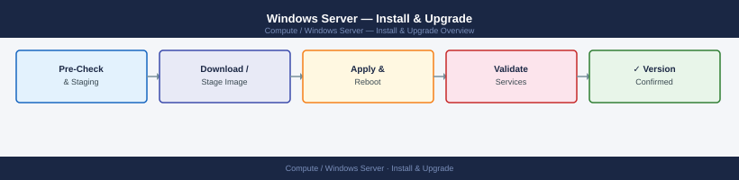
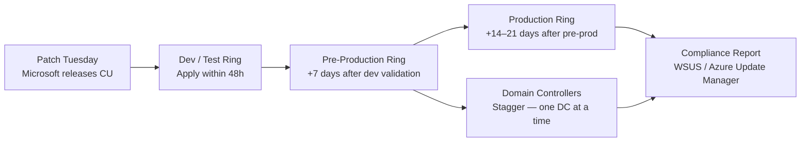

---
tags:
  - operations
  - windows
---
# Windows Server — Install & Upgrade


<div class="kb-summary">
Windows Server install and upgrade: WDS/MDT deployment, Windows Update via WSUS or SCCM, in-place upgrade procedure, and decommission checklist.

*Applies to: Windows Server 2019 / 2022*
</div>



```d2
direction: right

plan: "Plan" {shape: oval}
patch_deployment_ring_flow: "Patch Deployment Ring Flow" {shape: rectangle}
patching: "Patching" {shape: rectangle}
verify: "Verify" {shape: rectangle}
validate: "Validate" {shape: oval}

plan -> patch_deployment_ring_flow
patch_deployment_ring_flow -> patching
patching -> verify
verify -> validate
```

## Before you begin

- **Access:** Local Administrator or Domain Admin on target hosts
- **Timing:** safe to run during business hours unless a step is marked ⚠ (causes interruption)
- **Dependencies:** no active upgrades or migrations on the same infrastructure
- **Logging:** capture command output — paste into the change record on completion

---

## Patch Deployment Ring Flow




---

## Patching

Patch management for Windows Server using Windows Update, WSUS, and SCCM/Intune.

### Pre-Patch Checklist

```powershell
# 1. Confirm system health
Get-Service | Where-Object { $_.StartType -eq "Automatic" -and $_.Status -ne "Running" }
Get-PSDrive -PSProvider FileSystem | Where-Object { $_.Used/($_.Used+$_.Free) -gt 0.85 }

# 2. Capture current installed updates (rollback reference)
Get-HotFix | Sort-Object InstalledOn -Descending |
    Select-Object HotFixID, Description, InstalledOn |
    Export-Csv C:\Logs\pre-patch-hotfixes-$(Get-Date -Format yyyyMMdd).csv -NoTypeInformation

# 3. Capture OS version and build
[System.Environment]::OSVersion.Version
(Get-ItemProperty "HKLM:\SOFTWARE\Microsoft\Windows NT\CurrentVersion").CurrentBuild

# 4. List pending updates without installing
$Session = New-Object -ComObject Microsoft.Update.Session
$Searcher = $Session.CreateUpdateSearcher()
$Results = $Searcher.Search("IsInstalled=0")
$Results.Updates | Select-Object Title, MsrcSeverity | Format-Table -AutoSize
```

### Windows Update via PowerShell (PSWindowsUpdate)

```powershell
# Install PSWindowsUpdate module (if not present)
Install-Module -Name PSWindowsUpdate -Force -Scope AllUsers

# List available updates
Get-WindowsUpdate

# Install all updates
Install-WindowsUpdate -AcceptAll -AutoReboot

# Install security updates only
Install-WindowsUpdate -Category "Security Updates" -AcceptAll -AutoReboot

# Install specific KB
Install-WindowsUpdate -KBArticleID KB5034440 -AcceptAll
```

### WSUS — Force Client Update Cycle

```cmd
:: Detect and download from WSUS
wuauclt /detectnow
wuauclt /updatenow

:: Or via UsoClient (Windows 10/2019+)
UsoClient StartScan
UsoClient StartDownload
UsoClient StartInstall
```

```powershell
# Check WSUS server assignment
(New-Object -ComObject Microsoft.Update.ServiceManager).Services |
    Select-Object Name, ServiceID, IsDefaultAUService

# Confirm WSUS registry setting
Get-ItemProperty "HKLM:\SOFTWARE\Policies\Microsoft\Windows\WindowsUpdate" |
    Select-Object WUServer, WUStatusServer
```

### Pending Reboot Detection

```powershell
function Test-PendingReboot {
    $pending = @()
    if (Get-ItemProperty "HKLM:\SOFTWARE\Microsoft\Windows\CurrentVersion\WindowsUpdate\Auto Update\RebootRequired" -EA SilentlyContinue) {
        $pending += "WindowsUpdate"
    }
    if (Get-ItemProperty "HKLM:\SYSTEM\CurrentControlSet\Control\Session Manager" -Name PendingFileRenameOperations -EA SilentlyContinue) {
        $pending += "PendingFileRename"
    }
    if (Get-ItemProperty "HKLM:\SOFTWARE\Microsoft\Windows\CurrentVersion\Component Based Servicing\RebootPending" -EA SilentlyContinue) {
        $pending += "CBS"
    }
    if ($pending) { "Reboot pending: $($pending -join ', ')" } else { "No reboot pending" }
}
Test-PendingReboot
```

### Post-Patch Validation

```powershell
# Confirm OS is on expected build after update
(Get-ItemProperty "HKLM:\SOFTWARE\Microsoft\Windows NT\CurrentVersion").CurrentBuild

# Confirm critical services are running
Get-Service -Name W32tm, WinRM, EventLog, Netlogon, NTDS -ErrorAction SilentlyContinue |
    Select-Object Name, Status

# Check for any new failed services
Get-Service | Where-Object { $_.StartType -eq "Automatic" -and $_.Status -ne "Running" }

# Check system log for errors post-reboot
Get-WinEvent -FilterHashtable @{
    LogName   = 'System'
    Level     = 2
    StartTime = (Get-Date).AddHours(-2)
} | Select-Object -First 10 TimeCreated, Id, Message
```

### Patch Schedule Standards

| Server Tier | Patch Frequency | Reboot Window |
|---|---|---|
| Non-production | Weekly (automated) | Immediately |
| Production non-critical | Monthly (Patch Tuesday + 7 days) | Saturday 02:00–06:00 |
| Production critical | Monthly + emergency for CVE ≥ 9.0 | Agreed maintenance window |
| Domain Controllers | Monthly — stagger DCs | Off-hours; verify replication after each |

---

## Verify

- Confirm the operation completed without errors in the log or management UI
- Verify the expected state change is visible (service running, object created, config applied)
- Document the outcome in the change record

---

## See also

- [Windows Server — Deploy](../../deploy/)
