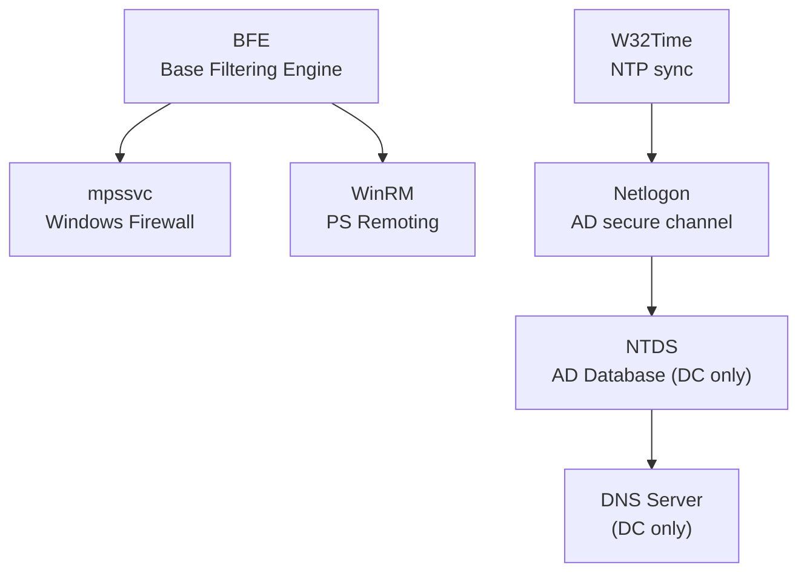
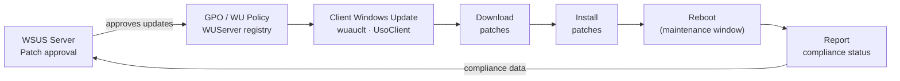

# Windows Server — Procedures


<div class="kb-summary">
Day-to-day operational tasks and how-to guides.
</div>

## Key Infrastructure Service Dependencies


```text
┌─────────────────────────────── Windows Server — Operations Procedures ────────────────────────────────┐
│                                                                                                       │
│  Standard procedures: user provisioning, server decommission, patch process, and AD cleanup.          │
│                                                                                                       │
│   ┌──────────────────────────────────────────────┐  ┌─────────────────────────────────────────────┐   │
│   │              User Provisioning               │  │             Server Decommission             │   │
│   │       Create AD user + set attributes        │  │          Remove from all AD groups          │   │
│   │         Add to role-based AD groups          │  │           Disable computer account          │   │
│   │          Set mailbox: Exchange/365           │  │            Migrate data + shares            │   │
│   │         MFA: enrol TOTP / smart card         │  │           Delete after 30-day hold          │   │
│   └──────────────────────────────────────────────┘  └─────────────────────────────────────────────┘   │
│                                                                                                       │
│    Provisioning via AD group membership drives access; decom must clear AD object                     │
│                                                                                                       │
│                          ▼                                                 ▼                          │
│                                                                                                       │
│   ┌──────────────────────────────────────────────┐  ┌─────────────────────────────────────────────┐   │
│   │               Patch Procedure                │  │                  AD Cleanup                 │   │
│   │         Download from WSUS / catalog         │  │          Inactive computers: 90-day         │   │
│   │        Test on non-prod server first         │  │       Stale users: disable then delete      │   │
│   │        Schedule window + notify users        │  │        Empty groups: quarterly review       │   │
│   │        Apply + verify + reboot check         │  │           SPNs: check for orphans           │   │
│   └──────────────────────────────────────────────┘  └─────────────────────────────────────────────┘   │
│                                                                                                       │
│  Physical Infrastructure (the hardware everything above runs on):                                     │
│  Domain Controllers · WSUS server · Exchange/365 · backup system                                      │
│                                                                                                       │
│  Key terms:                                                                                           │
│                                                                                                       │
│  Role-based groups= AD security groups named by role; drive resource access                           │
│  Smart card     = hardware MFA token; requires certificate enrollment                                 │
│  Computer account= AD object for server; disable before decommission                                  │
│  30-day hold    = quarantine period before deleting decommissioned object                             │
│  WSUS           = Windows Server Update Services; centralised patch repo                              │
│  Patch window   = agreed maintenance window; communicated to stakeholders                             │
│  Inactive computers= lastLogonTimestamp > 90 days; candidate for disable                              │
│  SPN            = Service Principal Name; Kerberos service identifier; orphans cause auth fail        │
│  Stale user     = account not used in > 90 days; disable before delete                                │
│  Empty group    = AD group with no members; clean up to reduce audit noise                            │
│  mailbox        = Exchange/365 mailbox; license must be unassigned on decom                           │
│  TOTP MFA       = time-based one-time password; enforced via Azure AD CA                              │
│                                                                                                       │
└───────────────────────────────────────────────────────────────────────────────────────────────────────┘
```
```powershell

---

## Service Management

```powershell
# Check service status
Get-Service -Name <ServiceName>
Get-Service -Name <ServiceName> | Select-Object *

# Start / stop / restart
Start-Service -Name <ServiceName>
Stop-Service -Name <ServiceName>
Restart-Service -Name <ServiceName> -Force

# Set startup type
Set-Service -Name <ServiceName> -StartupType Automatic
Set-Service -Name <ServiceName> -StartupType Disabled
Set-Service -Name <ServiceName> -StartupType Manual
```

### Listing Services

```powershell
# All running services
Get-Service | Where-Object { $_.Status -eq "Running" }

# Automatic-start services that are stopped
Get-Service | Where-Object { $_.StartType -eq "Automatic" -and $_.Status -ne "Running" } |
    Select-Object Name, DisplayName, Status

# All services with start type
Get-Service | Select-Object Name, DisplayName, Status, StartType | Sort-Object StartType, Name
```

### Service Account and Dependencies

```powershell
# View service account via WMI
Get-CimInstance Win32_Service -Filter "Name='wuauserv'" |
    Select-Object Name, StartName, State, StartMode

# All services not running as LocalSystem or NetworkService
Get-CimInstance Win32_Service |
    Where-Object { $_.StartName -notin @("LocalSystem","NT AUTHORITY\NetworkService","NT AUTHORITY\LocalService") } |
    Select-Object Name, StartName, State

# Service dependencies
(Get-Service -Name <ServiceName>).DependentServices
(Get-Service -Name <ServiceName>).ServicesDependedOn
```

### Key Infrastructure Services

| Service Name | Display Name | Role |
|---|---|---|
| W32Time | Windows Time | Time sync with AD / NTP |
| Netlogon | Netlogon | AD domain authentication |
| NTDS | Active Directory Domain Services | DC — AD database |
| DNS | DNS Server | DNS resolution |
| WinRM | Windows Remote Management | PowerShell remoting |
| EventLog | Windows Event Log | Event logging |
| wuauserv | Windows Update | Patch management |
| CryptSvc | Cryptographic Services | Certificate store |
| BFE | Base Filtering Engine | Windows Firewall core |
| mpssvc | Windows Defender Firewall | Host firewall |
| WinDefend | Windows Defender Antivirus | AV (if not replaced) |

### Remote Service Management

```powershell
# Check service on a remote server
Get-Service -Name <ServiceName> -ComputerName <servername>

# Restart service on remote server
Invoke-Command -ComputerName <servername> -ScriptBlock { Restart-Service -Name <ServiceName> -Force }

# Check multiple servers at once
$servers = @("srv01","srv02","srv03")
$servers | ForEach-Object {
    $svc = Get-Service -Name <ServiceName> -ComputerName $_ -ErrorAction SilentlyContinue
    [PSCustomObject]@{ Server = $_; Status = $svc.Status; StartType = $svc.StartType }
}
```

### Service Logs via Event Viewer

```powershell
# Service start/stop events (Event ID 7036)
Get-WinEvent -FilterHashtable @{ LogName='System'; Id=7036 } -MaxEvents 20 |
    Select-Object TimeCreated, Message | Format-List

# Unexpected service termination (Event ID 7034)
Get-WinEvent -FilterHashtable @{ LogName='System'; Id=7034 } -MaxEvents 10 |
    Select-Object TimeCreated, Message | Format-List
```

## Patching

Patch management for Windows Server using Windows Update, WSUS, and SCCM/Intune.

### Patch Management Flow



### Pre-Patch Checklist

```powershell
# 1. Confirm system health
Get-Service | Where-Object { $_.StartType -eq "Automatic" -and $_.Status -ne "Running" }
Get-PSDrive -PSProvider FileSystem | Where-Object { $_.Used/($_.Used+$_.Free) -gt 0.85 }

# 2. Capture current installed updates (rollback reference)
Get-HotFix | Sort-Object InstalledOn -Descending |
    Select-Object HotFixID, Description, InstalledOn |
    Export-Csv C:\Logs\pre-patch-hotfixes-$(Get-Date -Format yyyyMMdd).csv -NoTypeInformation

# 3. Capture OS version and build
[System.Environment]::OSVersion.Version
(Get-ItemProperty "HKLM:\SOFTWARE\Microsoft\Windows NT\CurrentVersion").CurrentBuild

# 4. List pending updates without installing
$Session = New-Object -ComObject Microsoft.Update.Session
$Searcher = $Session.CreateUpdateSearcher()
$Results = $Searcher.Search("IsInstalled=0")
$Results.Updates | Select-Object Title, MsrcSeverity | Format-Table -AutoSize
```

### Windows Update via PowerShell (PSWindowsUpdate)

```powershell
# Install PSWindowsUpdate module (if not present)
Install-Module -Name PSWindowsUpdate -Force -Scope AllUsers

# List available updates
Get-WindowsUpdate

# Install all updates
Install-WindowsUpdate -AcceptAll -AutoReboot

# Install security updates only
Install-WindowsUpdate -Category "Security Updates" -AcceptAll -AutoReboot

# Install specific KB
Install-WindowsUpdate -KBArticleID KB5034440 -AcceptAll
```

### WSUS — Force Client Update Cycle

```cmd
:: Detect and download from WSUS
wuauclt /detectnow
wuauclt /updatenow

:: Or via UsoClient (Windows 10/2019+)
UsoClient StartScan
UsoClient StartDownload
UsoClient StartInstall
```

### Pending Reboot Detection

```powershell
function Test-PendingReboot {
    $pending = @()
    if (Get-ItemProperty "HKLM:\SOFTWARE\Microsoft\Windows\CurrentVersion\WindowsUpdate\Auto Update\RebootRequired" -EA SilentlyContinue) {
        $pending += "WindowsUpdate"
    }
    if (Get-ItemProperty "HKLM:\SYSTEM\CurrentControlSet\Control\Session Manager" -Name PendingFileRenameOperations -EA SilentlyContinue) {
        $pending += "PendingFileRename"
    }
    if (Get-ItemProperty "HKLM:\SOFTWARE\Microsoft\Windows\CurrentVersion\Component Based Servicing\RebootPending" -EA SilentlyContinue) {
        $pending += "CBS"
    }
    if ($pending) { "Reboot pending: $($pending -join ', ')" } else { "No reboot pending" }
}
Test-PendingReboot
```

### Post-Patch Validation

```powershell
# Confirm OS is on expected build after update
(Get-ItemProperty "HKLM:\SOFTWARE\Microsoft\Windows NT\CurrentVersion").CurrentBuild

# Confirm critical services are running
Get-Service -Name W32tm, WinRM, EventLog, Netlogon, NTDS -ErrorAction SilentlyContinue |
    Select-Object Name, Status

# Check for any new failed services
Get-Service | Where-Object { $_.StartType -eq "Automatic" -and $_.Status -ne "Running" }

# Check system log for errors post-reboot
Get-WinEvent -FilterHashtable @{
    LogName   = 'System'
    Level     = 2
    StartTime = (Get-Date).AddHours(-2)
} | Select-Object -First 10 TimeCreated, Id, Message
```

### Patch Schedule Standards

| Server Tier | Patch Frequency | Reboot Window |
|---|---|---|
| Non-production | Weekly (automated) | Immediately |
| Production non-critical | Monthly (Patch Tuesday + 7 days) | Saturday 02:00–06:00 |
| Production critical | Monthly + emergency for CVE ≥ 9.0 | Agreed maintenance window |
| Domain Controllers | Monthly — stagger DCs | Off-hours; verify replication after each |
