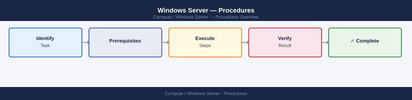
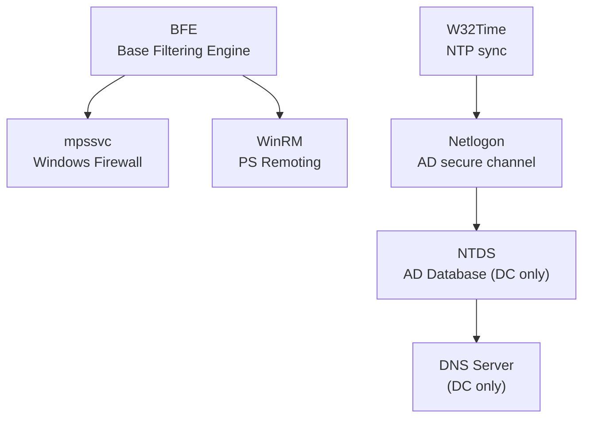
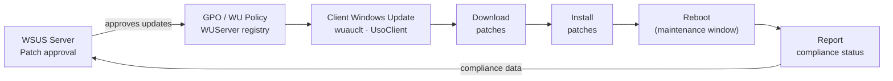

---
tags:
  - operations
  - windows
---
# Windows Server — Procedures


<div class="kb-summary">
Windows Server operational procedures: disk management, role and feature install, IIS/MSMQ configuration, performance counter review, and patching runbook.

*Applies to: Windows Server 2019 / 2022*
</div>



```d2
direction: right

hub: "Windows Server\nOperations" {shape: hexagon}
key_infrastructure_service_dependenc: "Key Infrastructure Service Dependencies" {shape: rectangle}
service_management: "Service Management" {shape: rectangle}
patching: "Patching" {shape: rectangle}
install_a_windows_server_role: "Install a Windows Server Role" {shape: rectangle}
configure_ntp: "Configure NTP" {shape: rectangle}
add_a_disk_and_format: "Add a Disk and Format" {shape: rectangle}

hub -> key_infrastructure_service_dependenc
hub -> service_management
hub -> patching
hub -> install_a_windows_server_role
hub -> configure_ntp
hub -> add_a_disk_and_format
```

## Before you begin

- **Access:** Local Administrator or Domain Admin on target hosts
- **Timing:** safe to run during business hours unless a step is marked ⚠ (causes interruption)
- **Dependencies:** no active upgrades or migrations on the same infrastructure
- **Logging:** capture command output — paste into the change record on completion

---

## Key Infrastructure Service Dependencies




---

## Service Management

```powershell
# Check service status
Get-Service -Name <ServiceName>
Get-Service -Name <ServiceName> | Select-Object *

# Start / stop / restart
Start-Service -Name <ServiceName>
Stop-Service -Name <ServiceName>
Restart-Service -Name <ServiceName> -Force

# Set startup type
Set-Service -Name <ServiceName> -StartupType Automatic
Set-Service -Name <ServiceName> -StartupType Disabled
Set-Service -Name <ServiceName> -StartupType Manual
```

### Listing Services

```powershell
# All running services
Get-Service | Where-Object { $_.Status -eq "Running" }

# Automatic-start services that are stopped
Get-Service | Where-Object { $_.StartType -eq "Automatic" -and $_.Status -ne "Running" } |
    Select-Object Name, DisplayName, Status

# All services with start type
Get-Service | Select-Object Name, DisplayName, Status, StartType | Sort-Object StartType, Name
```

### Service Account and Dependencies

```powershell
# View service account via WMI
Get-CimInstance Win32_Service -Filter "Name='wuauserv'" |
    Select-Object Name, StartName, State, StartMode

# All services not running as LocalSystem or NetworkService
Get-CimInstance Win32_Service |
    Where-Object { $_.StartName -notin @("LocalSystem","NT AUTHORITY\NetworkService","NT AUTHORITY\LocalService") } |
    Select-Object Name, StartName, State

# Service dependencies
(Get-Service -Name <ServiceName>).DependentServices
(Get-Service -Name <ServiceName>).ServicesDependedOn
```

### Key Infrastructure Services

| Service Name | Display Name | Role |
|---|---|---|
| W32Time | Windows Time | Time sync with AD / NTP |
| Netlogon | Netlogon | AD domain authentication |
| NTDS | Active Directory Domain Services | DC — AD database |
| DNS | DNS Server | DNS resolution |
| WinRM | Windows Remote Management | PowerShell remoting |
| EventLog | Windows Event Log | Event logging |
| wuauserv | Windows Update | Patch management |
| CryptSvc | Cryptographic Services | Certificate store |
| BFE | Base Filtering Engine | Windows Firewall core |
| mpssvc | Windows Defender Firewall | Host firewall |
| WinDefend | Windows Defender Antivirus | AV (if not replaced) |

### Remote Service Management

```powershell
# Check service on a remote server
Get-Service -Name <ServiceName> -ComputerName <servername>

# Restart service on remote server
Invoke-Command -ComputerName <servername> -ScriptBlock { Restart-Service -Name <ServiceName> -Force }

# Check multiple servers at once
$servers = @("srv01","srv02","srv03")
$servers | ForEach-Object {
    $svc = Get-Service -Name <ServiceName> -ComputerName $_ -ErrorAction SilentlyContinue
    [PSCustomObject]@{ Server = $_; Status = $svc.Status; StartType = $svc.StartType }
}
```

### Service Logs via Event Viewer

```powershell
# Service start/stop events (Event ID 7036)
Get-WinEvent -FilterHashtable @{ LogName='System'; Id=7036 } -MaxEvents 20 |
    Select-Object TimeCreated, Message | Format-List

# Unexpected service termination (Event ID 7034)
Get-WinEvent -FilterHashtable @{ LogName='System'; Id=7034 } -MaxEvents 10 |
    Select-Object TimeCreated, Message | Format-List
```

## Patching

Patch management for Windows Server using Windows Update, WSUS, and SCCM/Intune.

### Patch Management Flow



### Pre-Patch Checklist

```powershell
# 1. Confirm system health
Get-Service | Where-Object { $_.StartType -eq "Automatic" -and $_.Status -ne "Running" }
Get-PSDrive -PSProvider FileSystem | Where-Object { $_.Used/($_.Used+$_.Free) -gt 0.85 }

# 2. Capture current installed updates (rollback reference)
Get-HotFix | Sort-Object InstalledOn -Descending |
    Select-Object HotFixID, Description, InstalledOn |
    Export-Csv C:\Logs\pre-patch-hotfixes-$(Get-Date -Format yyyyMMdd).csv -NoTypeInformation

# 3. Capture OS version and build
[System.Environment]::OSVersion.Version
(Get-ItemProperty "HKLM:\SOFTWARE\Microsoft\Windows NT\CurrentVersion").CurrentBuild

# 4. List pending updates without installing
$Session = New-Object -ComObject Microsoft.Update.Session
$Searcher = $Session.CreateUpdateSearcher()
$Results = $Searcher.Search("IsInstalled=0")
$Results.Updates | Select-Object Title, MsrcSeverity | Format-Table -AutoSize
```

### Windows Update via PowerShell (PSWindowsUpdate)

```powershell
# Install PSWindowsUpdate module (if not present)
Install-Module -Name PSWindowsUpdate -Force -Scope AllUsers

# List available updates
Get-WindowsUpdate

# Install all updates
Install-WindowsUpdate -AcceptAll -AutoReboot

# Install security updates only
Install-WindowsUpdate -Category "Security Updates" -AcceptAll -AutoReboot

# Install specific KB
Install-WindowsUpdate -KBArticleID KB5034440 -AcceptAll
```

### WSUS — Force Client Update Cycle

```cmd
:: Detect and download from WSUS
wuauclt /detectnow
wuauclt /updatenow

:: Or via UsoClient (Windows 10/2019+)
UsoClient StartScan
UsoClient StartDownload
UsoClient StartInstall
```

### Pending Reboot Detection

```powershell
function Test-PendingReboot {
    $pending = @()
    if (Get-ItemProperty "HKLM:\SOFTWARE\Microsoft\Windows\CurrentVersion\WindowsUpdate\Auto Update\RebootRequired" -EA SilentlyContinue) {
        $pending += "WindowsUpdate"
    }
    if (Get-ItemProperty "HKLM:\SYSTEM\CurrentControlSet\Control\Session Manager" -Name PendingFileRenameOperations -EA SilentlyContinue) {
        $pending += "PendingFileRename"
    }
    if (Get-ItemProperty "HKLM:\SOFTWARE\Microsoft\Windows\CurrentVersion\Component Based Servicing\RebootPending" -EA SilentlyContinue) {
        $pending += "CBS"
    }
    if ($pending) { "Reboot pending: $($pending -join ', ')" } else { "No reboot pending" }
}
Test-PendingReboot
```

### Post-Patch Validation

```powershell
# Confirm OS is on expected build after update
(Get-ItemProperty "HKLM:\SOFTWARE\Microsoft\Windows NT\CurrentVersion").CurrentBuild

# Confirm critical services are running
Get-Service -Name W32tm, WinRM, EventLog, Netlogon, NTDS -ErrorAction SilentlyContinue |
    Select-Object Name, Status

# Check for any new failed services
Get-Service | Where-Object { $_.StartType -eq "Automatic" -and $_.Status -ne "Running" }

# Check system log for errors post-reboot
Get-WinEvent -FilterHashtable @{
    LogName   = 'System'
    Level     = 2
    StartTime = (Get-Date).AddHours(-2)
} | Select-Object -First 10 TimeCreated, Id, Message
```

### Patch Schedule Standards

| Server Tier | Patch Frequency | Reboot Window |
|---|---|---|
| Non-production | Weekly (automated) | Immediately |
| Production non-critical | Monthly (Patch Tuesday + 7 days) | Saturday 02:00–06:00 |
| Production critical | Monthly + emergency for CVE ≥ 9.0 | Agreed maintenance window |
| Domain Controllers | Monthly — stagger DCs | Off-hours; verify replication after each |

---

## Install a Windows Server Role

Install a role or feature using PowerShell or Server Manager and perform any required post-install configuration.

```powershell
# List all available roles and features
Get-WindowsFeature | Where-Object Installed -eq $false | Select-Object Name, DisplayName | Format-Table -AutoSize

# Install a role — example: IIS Web Server
Install-WindowsFeature -Name Web-Server -IncludeManagementTools

# Install multiple features at once
Install-WindowsFeature -Name Web-Server, Web-Asp-Net45, Web-Http-Logging -IncludeManagementTools

# Install with all sub-features
Install-WindowsFeature -Name AD-Domain-Services -IncludeAllSubFeature -IncludeManagementTools

# Check if a reboot is required after install
(Install-WindowsFeature -Name <FeatureName>).RestartNeeded
```

```powershell
# Server Manager GUI alternative — launch from PowerShell
ServerManager.exe

# Verify the feature is installed
Get-WindowsFeature -Name Web-Server | Select-Object Name, Installed, InstallState

# Remove a feature
Uninstall-WindowsFeature -Name <FeatureName> -Remove
```

Post-install steps vary by role — for example, AD DS requires `Install-ADDSForest` or `Install-ADDSDomainController` after the binaries are installed.

---

## Configure NTP

Configure Windows Time service to synchronise with a specified NTP server. Required on member servers and especially critical on Domain Controllers.

```cmd
:: Stop the time service before reconfiguring
net stop w32tm

:: Configure manual NTP peers (use multiple servers separated by spaces)
w32tm /config /manualpeerlist:"ntp1.example.local,0x8 ntp2.example.local,0x8" /syncfromflags:manual /reliable:yes /update

:: Start the time service
net start w32tm

:: Force an immediate sync
w32tm /resync /force

:: Verify sync status
w32tm /query /status
w32tm /query /peers
```

```powershell
# PowerShell equivalents
Set-Service -Name w32tm -StartupType Automatic
Start-Service w32tm

# Check current source and offset
w32tm /query /status | Select-String "Source|Offset|Stratum"

# Sync health check — should show "Source: ntp1.example.local" and Stratum < 5
w32tm /query /status
```

On domain-joined servers, NTP is typically managed by the DC hierarchy (PDC Emulator syncs to external NTP). Only configure manual peers on the PDC Emulator and isolated servers.

---

## Add a Disk and Format

Bring a new disk online, initialise it, partition it, format it, and assign a drive letter.

```powershell
# List all disks and their status
Get-Disk | Select-Object Number, FriendlyName, OperationalStatus, PartitionStyle,
    @{N="SizeGB"; E={[math]::Round($_.Size/1GB, 1)}}

# Bring the disk online (if Offline)
Set-Disk -Number <DiskNumber> -IsOffline $false

# Initialise as GPT (recommended for disks > 2 TB and all new deployments)
Initialize-Disk -Number <DiskNumber> -PartitionStyle GPT

# Create a new partition using all available space
New-Partition -DiskNumber <DiskNumber> -UseMaximumSize -AssignDriveLetter

# Format as NTFS with a label
Format-Volume -DriveLetter <Letter> -FileSystem NTFS -NewFileSystemLabel "DataDisk" -Confirm:$false
```

```cmd
:: diskpart alternative for scripted use
diskpart
list disk
select disk <n>
online disk
attributes disk clear readonly
convert gpt
create partition primary
format fs=ntfs label="DataDisk" quick
assign letter=D
exit
```

```powershell
# Verify the new volume
Get-PSDrive -PSProvider FileSystem | Where-Object Name -eq <Letter>
Get-Volume -DriveLetter <Letter>
```

---

## Configure Windows Firewall Rule

Create an inbound or outbound firewall rule using PowerShell. Rules can target specific ports, protocols, programs, or services.

```powershell
# Allow inbound TCP on a specific port — example: HTTPS (443)
New-NetFirewallRule `
    -DisplayName "Allow HTTPS Inbound" `
    -Direction Inbound `
    -Protocol TCP `
    -LocalPort 443 `
    -Action Allow `
    -Profile Domain,Private

# Block outbound TCP to a remote port
New-NetFirewallRule `
    -DisplayName "Block Telnet Outbound" `
    -Direction Outbound `
    -Protocol TCP `
    -RemotePort 23 `
    -Action Block `
    -Profile Any

# Allow a specific program
New-NetFirewallRule `
    -DisplayName "Allow MyApp" `
    -Direction Inbound `
    -Program "C:\Program Files\MyApp\myapp.exe" `
    -Action Allow `
    -Profile Domain
```

```powershell
# List all custom firewall rules
Get-NetFirewallRule | Where-Object { $_.Owner -eq $null } |
    Select-Object DisplayName, Direction, Action, Enabled, Profile | Format-Table -AutoSize

# Disable a rule by name
Disable-NetFirewallRule -DisplayName "Allow HTTPS Inbound"

# Remove a rule
Remove-NetFirewallRule -DisplayName "Allow HTTPS Inbound"

# Check rules affecting a specific port
Get-NetFirewallRule | Get-NetFirewallPortFilter | Where-Object LocalPort -eq 443
```

Profile selection: `Domain` = domain-joined network, `Private` = home/trusted network, `Public` = untrusted network. Use `Any` only when necessary.

---

## Configure Windows Event Log Forwarding

Set up Event Log forwarding so source computers push events to a central collector using Windows Event Forwarding (WEF).

On the **collector** server:

```cmd
:: Enable WinRM on the collector
winrm quickconfig -q

:: Configure the Windows Event Collector service
wecutil qc /q
```

On the **source** computers (via GPO or locally):

```cmd
:: Enable WinRM on source machines
winrm quickconfig -q

:: Add the collector computer account to the local Event Log Readers group
net localgroup "Event Log Readers" "<DOMAIN>\<CollectorServer>$" /add
```

Create a subscription on the **collector**:

```powershell
# Create a subscription XML file, then import it
wecutil cs C:\WEF\subscription.xml

# List existing subscriptions
wecutil es

# Check subscription status
wecutil gr <SubscriptionName>

# Retry a subscription that is not receiving events
wecutil rs <SubscriptionName>
```

```powershell
# Verify events are arriving on the collector
Get-WinEvent -LogName "ForwardedEvents" -MaxEvents 20 |
    Select-Object TimeCreated, MachineName, Id, Message | Format-List
```

Events appear in the `ForwardedEvents` log on the collector. Use source-initiated subscriptions (pull model via GPO) for large deployments.

---

## Join a Domain

Join a Windows Server to an Active Directory domain, with optional Organisational Unit (OU) placement.

```powershell
# Join a domain — will prompt for domain admin credentials
Add-Computer -DomainName "corp.example.local" -Restart

# Join and place the computer account in a specific OU
Add-Computer `
    -DomainName "corp.example.local" `
    -OUPath "OU=Servers,OU=IT,DC=corp,DC=example,DC=local" `
    -Credential (Get-Credential) `
    -Restart

# Join without immediately rebooting (reboot manually)
Add-Computer `
    -DomainName "corp.example.local" `
    -Credential (Get-Credential) `
    -Force
```

```powershell
# Verify domain membership after reboot
(Get-WmiObject Win32_ComputerSystem).Domain
[System.DirectoryServices.ActiveDirectory.Domain]::GetCurrentDomain()

# Check Netlogon service is running (required for domain auth)
Get-Service -Name Netlogon | Select-Object Name, Status

# Confirm the computer account exists in AD (run from a DC or AD tools machine)
Get-ADComputer -Identity <ComputerName> | Select-Object Name, DistinguishedName, Enabled
```

Pre-requisites: DNS must resolve the domain name, time must be within 5 minutes of the DC (Kerberos requirement), and the joining account must have permissions to create computer objects in the target OU.

---

## Apply Windows Updates

Install Windows Updates using the PSWindowsUpdate PowerShell module or WSUS, and verify the system state after patching.

```powershell
# Install PSWindowsUpdate module if not present
Install-Module -Name PSWindowsUpdate -Force -Scope AllUsers -Confirm:$false

# List available updates without installing
Get-WindowsUpdate

# Install all available updates and auto-reboot if required
Install-WindowsUpdate -AcceptAll -AutoReboot

# Install security updates only
Install-WindowsUpdate -Category "Security Updates" -AcceptAll -AutoReboot

# Install a specific KB
Install-WindowsUpdate -KBArticleID KB5034440 -AcceptAll

# Check pending reboot state
Test-Path 'HKLM:\SOFTWARE\Microsoft\Windows\CurrentVersion\WindowsUpdate\Auto Update\RebootRequired'
```

```powershell
# WSUS / built-in Windows Update — force a scan and install cycle
UsoClient StartScan
UsoClient StartDownload
UsoClient StartInstall

# List recently installed hotfixes
Get-HotFix | Sort-Object InstalledOn -Descending | Select-Object -First 10 HotFixID, Description, InstalledOn

# Verify OS build after patching
(Get-ItemProperty "HKLM:\SOFTWARE\Microsoft\Windows NT\CurrentVersion").CurrentBuild
(Get-ItemProperty "HKLM:\SOFTWARE\Microsoft\Windows NT\CurrentVersion").UBR
```

```powershell
# Post-patch: confirm critical services are still running
Get-Service -Name W32tm, WinRM, EventLog, Netlogon -ErrorAction SilentlyContinue |
    Select-Object Name, Status

# Check for new failed auto-start services
Get-Service | Where-Object { $_.StartType -eq "Automatic" -and $_.Status -ne "Running" }
```

---

## Configure Remote Desktop (RDP)

Enable Remote Desktop Protocol on a Windows Server, configure the firewall, and enforce Network Level Authentication (NLA).

```powershell
# Enable RDP by clearing the deny flag in the registry
Set-ItemProperty `
    -Path 'HKLM:\SYSTEM\CurrentControlSet\Control\Terminal Server' `
    -Name "fDenyTSConnections" `
    -Value 0

# Enforce Network Level Authentication (NLA) — required for security
Set-ItemProperty `
    -Path 'HKLM:\SYSTEM\CurrentControlSet\Control\Terminal Server\WinStations\RDP-Tcp' `
    -Name "UserAuthentication" `
    -Value 1

# Allow RDP through Windows Firewall
Enable-NetFirewallRule -DisplayGroup "Remote Desktop"
# Or create the rule explicitly:
New-NetFirewallRule `
    -DisplayName "Allow RDP Inbound" `
    -Direction Inbound `
    -Protocol TCP `
    -LocalPort 3389 `
    -Action Allow `
    -Profile Domain,Private
```

```powershell
# Verify RDP is enabled
(Get-ItemProperty 'HKLM:\SYSTEM\CurrentControlSet\Control\Terminal Server').fDenyTSConnections
# 0 = RDP enabled, 1 = RDP disabled

# Check NLA setting
(Get-ItemProperty 'HKLM:\SYSTEM\CurrentControlSet\Control\Terminal Server\WinStations\RDP-Tcp').UserAuthentication
# 1 = NLA required (correct), 0 = NLA not required (insecure)

# Restart the Remote Desktop Services service to apply changes
Restart-Service -Name TermService -Force

# Confirm the service is listening on port 3389
Get-NetTCPConnection -LocalPort 3389 | Select-Object LocalAddress, LocalPort, State
```

Restrict RDP access to specific IP ranges using a firewall rule `-RemoteAddress` parameter. Disable RDP on servers that do not require it. Consider using Windows Admin Center or SSH as alternatives for server management.

---

## Verify

- Confirm the operation completed without errors in the log or management UI
- Verify the expected state change is visible (service running, object created, config applied)
- Document the outcome in the change record

---

## See also

- [Windows Server — Health Checks](../health-checks/)
- [Windows Server — CLI Reference](../cli-reference/)
- [Windows Server — Common Issues](../../troubleshooting/common-issues/)
