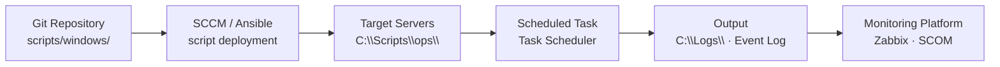
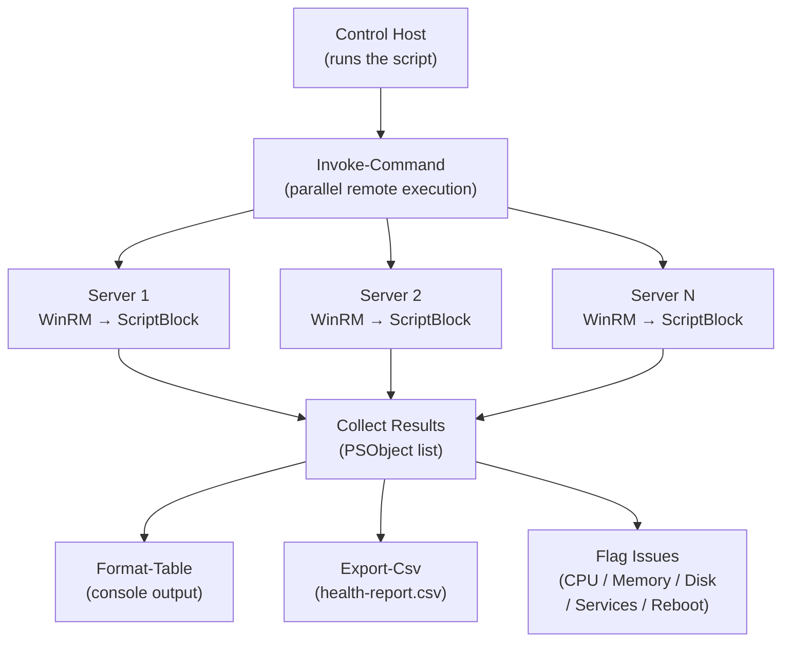

---
tags:
  - operations
  - windows
---
# Windows Server — Scripts


<div class="kb-summary">
Windows Server PowerShell scripts — remote health checks across multiple servers, certificate expiry monitoring, service health monitoring, script runner with logging, and module management.

## Script Deployment and Scheduling


```text
┌───────────────────────────────── Windows Server — Operations Scripts ─────────────────────────────────┐
│                                                                                                       │
│  PowerShell scripts for Windows Server operations: AD, disk, patching, and health checks.             │
│                                                                                                       │
│   ┌──────────────────────────────────────────────┐  ┌─────────────────────────────────────────────┐   │
│   │            AD Management Scripts             │  │                System Scripts               │   │
│   │           New-ADUser + Set-ADUser            │  │        Get-EventLog: filtered export        │   │
│   │         Get-ADGroupMember -Recursive         │  │           Get-Disk + Get-Partition          │   │
│   │          Search-ADAccount -Inactive          │  │             Get-WindowsUpdateLog            │   │
│   │         repadmin /replsummary parse          │  │         Restart-Service, Get-Service        │   │
│   └──────────────────────────────────────────────┘  └─────────────────────────────────────────────┘   │
│                                                                                                       │
│    Scripts in version control; test in non-prod; log all changes                                      │
│                                                                                                       │
│                          ▼                                                 ▼                          │
│                                                                                                       │
│   ┌──────────────────────────────────────────────┐  ┌─────────────────────────────────────────────┐   │
│   │            Scheduled Task Scripts            │  │               Hyper-V Scripts               │   │
│   │            Register-ScheduledTask            │  │            Get-VM + Start/Stop-VM           │   │
│   │       Log to event log: Write-EventLog       │  │           Checkpoint-VM: snapshot           │   │
│   │          Error handling: try/catch           │  │          Get-VMReplication: status          │   │
│   │           Send-MailMessage: alerts           │  │           Move-VM: live migration           │   │
│   └──────────────────────────────────────────────┘  └─────────────────────────────────────────────┘   │
│                                                                                                       │
│  Physical Infrastructure (the hardware everything above runs on):                                     │
│  Domain Controllers · WSUS · Hyper-V hosts · task scheduler on managed servers                        │
│                                                                                                       │
│  Key terms:                                                                                           │
│                                                                                                       │
│  New-ADUser   = creates AD user; must set -AccountPassword -Enabled $true                             │
│  Search-ADAccount= finds inactive/locked/expired accounts in AD                                       │
│  Get-EventLog = queries Windows Event Log; use -EntryType Error to filter                             │
│  Write-EventLog= writes entry to event log; use registered event source                               │
│  Register-ScheduledTask= creates Windows scheduled task via PowerShell                                │
│  Checkpoint-VM= creates Hyper-V checkpoint (snapshot); state + disk                                   │
│  Get-VMReplication= shows Hyper-V Replica status and lag                                              │
│  Move-VM      = live migration of running VM to another host                                          │
│  try/catch    = error handling in PowerShell; $_ contains error details                               │
│  Send-MailMessage= sends email from script; SMTP relay required                                       │
│  Get-WindowsUpdateLog= converts ETW trace to readable Windows Update log                              │
│  repadmin     = AD replication tool; output parsed by PS for reporting                                │
│                                                                                                       │
└───────────────────────────────────────────────────────────────────────────────────────────────────────┘
```

## Service Monitor

Restarts stopped automatic services and logs the event.

```powershell
<#
.SYNOPSIS
  Monitors critical services and attempts restart on failure
#>

param(
    [string[]]$Services = @('W32Time', 'EventLog', 'WinRM', 'wuauserv'),
    [string]$LogPath    = "C:\Logs\ServiceMonitor.log"
)

function Write-Log {
    param([string]$Message)
    $entry = "$(Get-Date -Format 'yyyy-MM-dd HH:mm:ss') | $Message"
    Add-Content -Path $LogPath -Value $entry
    Write-Host $entry
}

foreach ($svc in $Services) {
    $s = Get-Service -Name $svc -ErrorAction SilentlyContinue
    if (-not $s) {
        Write-Log "WARNING: Service '$svc' not found on this server"
        continue
    }
    if ($s.Status -ne 'Running') {
        Write-Log "ALERT: Service '$($s.DisplayName)' is $($s.Status) — attempting restart"
        try {
            Start-Service -Name $svc -ErrorAction Stop
            Write-Log "INFO: Service '$($s.DisplayName)' restarted successfully"
        } catch {
            Write-Log "ERROR: Failed to restart '$($s.DisplayName)': $_"
        }
    } else {
        Write-Log "OK: Service '$($s.DisplayName)' is running"
    }
}
```

## Event Log Query

Extracts events matching specific IDs for incident investigation.

```powershell
<#
.SYNOPSIS
  Query event logs for specific event IDs
#>

param(
    [string]$LogName  = "System",
    [int[]]$EventIDs  = @(7034, 7036, 1001, 6008),
    [int]$HoursBack   = 72,
    [string]$Output   = "C:\Temp\EventQuery.csv"
)

$since = (Get-Date).AddHours(-$HoursBack)

Get-WinEvent -FilterHashtable @{
    LogName   = $LogName
    Id        = $EventIDs
    StartTime = $since
} -ErrorAction SilentlyContinue |
    Select-Object TimeCreated, Id, LevelDisplayName, ProviderName,
        @{N="Message"; E={ $_.Message -replace '\s+', ' ' }} |
    Export-Csv -Path $Output -NoTypeInformation
Write-Host "Exported to $Output"
```

## Patch Status Report

Reports installed and missing patches for a list of servers.

```powershell
<#
.SYNOPSIS
  Generate patch compliance report across multiple servers
#>

param(
    [string[]]$Servers  = @($env:COMPUTERNAME),
    [string]$OutputPath = "C:\Temp\PatchReport_$(Get-Date -Format yyyyMMdd).csv"
)

$results = foreach ($server in $Servers) {
    try {
        $hotfixes = Invoke-Command -ComputerName $server -ScriptBlock {
            Get-HotFix | Sort-Object InstalledOn -Descending | Select-Object -First 5
        } -ErrorAction Stop
        foreach ($hf in $hotfixes) {
            [PSCustomObject]@{
                Server      = $server
                HotFixID    = $hf.HotFixID
                InstalledOn = $hf.InstalledOn
                Description = $hf.Description
                Status      = "OK"
            }
        }
    } catch {
        [PSCustomObject]@{
            Server      = $server
            HotFixID    = "N/A"
            InstalledOn = $null
            Description = "ERROR: $_"
            Status      = "UNREACHABLE"
        }
    }
}

$results | Export-Csv -Path $OutputPath -NoTypeInformation
Write-Host "Report saved: $OutputPath"
```

## Remote Health Check Topology


```text
┌──────────────────────────────────── PowerShell — Scripts Library ─────────────────────────────────────┐
│   ┌───────────────────────────────────────────────────────────────────────────────────────────────┐   │
│   │ PowerShell scripts library: reusable scripts for Active Directory, Azure, VMware, and storage │   │
│   │     Organised by platform: scripts/ad/, scripts/azure/, scripts/vmware/, scripts/storage/     │   │
│   │        All scripts: version header, help block, error handling, Pester test counterpart       │   │
│   └───────────────────────────────────────────────────────────────────────────────────────────────┘   │
│                                                                                                       │
│   ┌─────────────────────────────┐  ┌─────────────────────────────┐  ┌─────────────────────────────┐   │
│   │       Active Directory      │  │        Azure / Cloud        │  │        Infrastructure       │   │
│   │     New-ADUser-Bulk.ps1     │  │      Get-AzVMReport.ps1     │  │      Get-VMwareVMs.ps1      │   │
│   │  Disable-StaleAccounts.ps1  │  │      Set-AzTagsBulk.ps1     │  │     Get-DellHWAlert.ps1     │   │
│   │    Get-ADGroupMembers.ps1   │  │   New-AzResourceGroup.ps1   │  │   Test-SANConnectivity.ps1  │   │
│   │    Sync-ADAttributes.ps1    │  │   Export-AzCostReport.ps1   │  │    Invoke-VeeamReport.ps1   │   │
│   └─────────────────────────────┘  └─────────────────────────────┘  └─────────────────────────────┘   │
│                                                                                                       │
│   ┌───────────────────────────────────────────────────────────────────────────────────────────────┐   │
│   │  Script versioning = use semantic version in script header; update on every meaningful change │   │
│   │   Pester test       = scripts/tests/<ScriptName>.Tests.ps1; run: Invoke-Pester -Path tests/   │   │
│   │       Code review       = all new scripts reviewed via pull request before merge to main      │   │
│   └───────────────────────────────────────────────────────────────────────────────────────────────┘   │
└───────────────────────────────────────────────────────────────────────────────────────────────────────┘
```

**Step 5 — Run it**

```bash
cd C:\Users\YourName\Desktop
.\ad-user-audit.ps1 -OutputDir C:\Reports
```

**What you should see**

Five numbered checks run in sequence. Each prints how many accounts were found. At the end a summary table shows counts for each category. Five CSV files are saved in your output folder — open them in Excel to review the details.

---

## Certificate Expiry Monitor (PowerShell)

Scan Windows servers for expiring certificates in the LocalMachine\My store and IIS SSL bindings, flag those expiring within configurable warning and critical thresholds, and send an email report.

```powershell
#!/usr/bin/env pwsh
# cert-expiry-monitor.ps1
# Usage: ./cert-expiry-monitor.ps1 -Servers server1,server2 -SmtpServer smtp.example.com -AlertEmail ops@example.com

param(
    [Parameter(Mandatory)]
    [string[]]$Servers,

    [System.Management.Automation.PSCredential]
    $Credential,

    [int]$WarnDays  = 30,
    [int]$CritDays  = 14,
    [string]$SmtpServer  = $env:SMTP_SERVER,
    [string]$AlertEmail  = $env:ALERT_EMAIL,
    [string]$FromEmail   = "cert-monitor@$((Get-ADDomain -ErrorAction SilentlyContinue).DNSRoot)"
)

Set-StrictMode -Version Latest

$AllCerts = [System.Collections.Generic.List[PSObject]]::new()

$CertScript = {
    param($WarnDays, $CritDays)

    $findings = [System.Collections.Generic.List[PSObject]]::new()
    $now      = Get-Date

    # LocalMachine\My store
    $certs = Get-ChildItem Cert:\LocalMachine\My
    foreach ($cert in $certs) {
        $daysLeft = ($cert.NotAfter - $now).Days
        $severity = if ($daysLeft -le $CritDays) { "CRITICAL" }
                    elseif ($daysLeft -le $WarnDays) { "WARNING" }
                    else { "OK" }
        $findings.Add([PSCustomObject]@{
            Server      = $env:COMPUTERNAME
            Subject     = $cert.Subject
            Thumbprint  = $cert.Thumbprint
            Expiry      = $cert.NotAfter.ToString('yyyy-MM-dd')
            DaysLeft    = $daysLeft
            Store       = "LocalMachine\My"
            Service     = "Certificate Store"
            Severity    = $severity
        })
    }

    # IIS SSL bindings (if IIS is installed)
    try {
        Import-Module WebAdministration -ErrorAction Stop
        $sites = Get-WebSite
        foreach ($site in $sites) {
            $bindings = $site.Bindings.Collection | Where-Object { $_.Protocol -eq 'https' }
            foreach ($binding in $bindings) {
                $hash = $binding.CertificateHash
                if (-not $hash) { continue }
                $thumbprint = ($hash | ForEach-Object { $_.ToString('X2') }) -join ''
                $cert = Get-ChildItem Cert:\LocalMachine\My |
                        Where-Object { $_.Thumbprint -eq $thumbprint } |
                        Select-Object -First 1
                if (-not $cert) { continue }
                $daysLeft = ($cert.NotAfter - $now).Days
                $severity = if ($daysLeft -le $CritDays) { "CRITICAL" }
                            elseif ($daysLeft -le $WarnDays) { "WARNING" }
                            else { "OK" }
                $findings.Add([PSCustomObject]@{
                    Server      = $env:COMPUTERNAME
                    Subject     = $cert.Subject
                    Thumbprint  = $thumbprint
                    Expiry      = $cert.NotAfter.ToString('yyyy-MM-dd')
                    DaysLeft    = $daysLeft
                    Store       = "IIS Binding"
                    Service     = "$($site.Name) ($($binding.BindingInformation))"
                    Severity    = $severity
                })
            }
        }
    } catch {
        # IIS not installed or WebAdministration not available — skip silently
    }

    return $findings
}

Write-Host "`n=== Certificate Expiry Monitor ===" -ForegroundColor Cyan
Write-Host "Servers  : $($Servers -join ', ')"
Write-Host "Warn     : < $WarnDays days | Crit: < $CritDays days`n"

foreach ($Server in $Servers) {
    Write-Host "Scanning $Server..." -NoNewline
    try {
        $params = @{
            ComputerName = $Server
            ScriptBlock  = $CertScript
            ArgumentList = $WarnDays, $CritDays
        }
        if ($Credential) { $params['Credential'] = $Credential }
        $certs = Invoke-Command @params
        $AllCerts.AddRange($certs)
        Write-Host " OK ($($certs.Count) certs)" -ForegroundColor Green
    } catch {
        Write-Host " FAILED: $($_.Exception.Message)" -ForegroundColor Red
    }
}

# Display results
Write-Host ""
$AllCerts | Sort-Object DaysLeft |
    Format-Table Server, Subject, Expiry, DaysLeft, Severity, Service -AutoSize

$CritList = $AllCerts | Where-Object { $_.Severity -eq 'CRITICAL' }
$WarnList = $AllCerts | Where-Object { $_.Severity -eq 'WARNING' }

Write-Host "CRITICAL ($($CritList.Count))  |  WARNING ($($WarnList.Count))  |  Total scanned: $($AllCerts.Count)"

# Email report if there are any alerts and SMTP is configured
if (($CritList.Count -gt 0 -or $WarnList.Count -gt 0) -and $SmtpServer -and $AlertEmail) {
    $Subject = "Certificate Expiry Alert: $($CritList.Count) CRITICAL, $($WarnList.Count) WARNING"
    $Body = "Certificate Expiry Monitor Report`n"
    $Body += "Generated: $(Get-Date -Format 'yyyy-MM-dd HH:mm:ss')`n`n"

    $Body += "CRITICAL (expiring within $CritDays days):`n"
    foreach ($c in $CritList) {
        $Body += "  $($c.Server) | $($c.Subject) | Expires: $($c.Expiry) ($($c.DaysLeft) days) | $($c.Service)`n"
    }

    $Body += "`nWARNING (expiring within $WarnDays days):`n"
    foreach ($c in $WarnList) {
        $Body += "  $($c.Server) | $($c.Subject) | Expires: $($c.Expiry) ($($c.DaysLeft) days) | $($c.Service)`n"
    }

    Send-MailMessage -To $AlertEmail -From $FromEmail -Subject $Subject `
        -Body $Body -SmtpServer $SmtpServer
    Write-Host "Alert email sent to $AlertEmail"
}
```

### How to run this script — step by step

**Before you start — what you need**
- Windows PowerShell 5.1 or PowerShell 7
- WinRM enabled on the servers to scan (for remote scanning — or run locally by passing `localhost` as the server)
- SMTP server details if you want email alerts
- Admin access on the servers being scanned

**Step 1 — Save the file**

1. Open **Notepad** (Windows key → search for Notepad)
2. Copy the entire code block above
3. Click **File → Save As**
4. Set "Save as type" to **All Files**
5. Name it `cert-expiry-monitor.ps1` and save to your Desktop

**Step 2 — Fill in your details**

Parameters are passed on the command line:

| Parameter | What to enter | Example |
|---|---|---|
| `-Servers` | Comma-separated server names/IPs | `webserver01,webserver02` |
| `-WarnDays` | Days before expiry to warn | Default: `30` |
| `-CritDays` | Days before expiry for critical alert | Default: `14` |
| `-SmtpServer` | Your SMTP server address | `smtp.yourcompany.com` |
| `-AlertEmail` | Email address to send alerts to | `ops@yourcompany.com` |

**Step 3 — Open the right terminal**

- **For .ps1 (PowerShell):** Windows key → `PowerShell` → right-click → **Run as Administrator**

**Step 4 — Allow scripts to run (one-time per session)**

```powershell
Set-ExecutionPolicy -Scope Process -ExecutionPolicy Bypass
```

**Step 5 — Run it**

```bash
cd C:\Users\YourName\Desktop
.\cert-expiry-monitor.ps1 -Servers webserver01,webserver02 -SmtpServer smtp.example.com -AlertEmail ops@example.com
```

**What you should see**

A table showing every certificate found on each server, sorted by days remaining. CRITICAL certificates (expiring soon) appear first. The summary line shows counts of CRITICAL vs WARNING. If any alerts are found and SMTP is configured, an email is sent.

---

## Service Health Monitor (PowerShell)

Check that required services are running across a server fleet. Optionally attempt automatic restart for stopped services. Exits with a monitoring-compatible code.

```powershell
#!/usr/bin/env pwsh
# service-health-monitor.ps1
# Usage: ./service-health-monitor.ps1 [-AttemptRestart]
#
# Define $ServiceMap to match your environment.

param(
    [bool]$AttemptRestart = $false,
    [System.Management.Automation.PSCredential]$Credential
)

Set-StrictMode -Version Latest

# --- Define required services per server ---
# Format: 'ServerName' = @('ServiceName1', 'ServiceName2', ...)
$ServiceMap = [ordered]@{
    'webserver01'   = @('W3SVC', 'WAS', 'wuauserv')
    'appserver01'   = @('MyAppService', 'MSSQLServer', 'SQLServerAgent')
    'fileserver01'  = @('LanmanServer', 'LanmanWorkstation', 'W32Time')
    'dc01'          = @('ADWS', 'DNS', 'KDC', 'Netlogon', 'NTDS')
}

$LOGFILE = "service-monitor-$(Get-Date -Format 'yyyyMMdd-HHmmss').log"
$ExitCode = 0

function Write-Log {
    param([string]$Message, [string]$Level = "INFO")
    $entry = "[$(Get-Date -Format 'yyyy-MM-dd HH:mm:ss')] [$Level] $Message"
    Add-Content -Path $LOGFILE -Value $entry
    switch ($Level) {
        "ERROR" { Write-Host $entry -ForegroundColor Red }
        "WARN"  { Write-Host $entry -ForegroundColor Yellow }
        default { Write-Host $entry }
    }
}

Write-Log "=== Service Health Monitor ==="
Write-Log "Attempt restart: $AttemptRestart"
Write-Host ""

$AllResults = [System.Collections.Generic.List[PSObject]]::new()

foreach ($Server in $ServiceMap.Keys) {
    $RequiredServices = $ServiceMap[$Server]

    foreach ($ServiceName in $RequiredServices) {
        $result = [PSCustomObject]@{
            Server      = $Server
            Service     = $ServiceName
            Status      = "UNKNOWN"
            StartType   = "UNKNOWN"
            Restarted   = $false
            Error       = $null
        }

        try {
            $params = @{
                ComputerName = $Server
                ScriptBlock  = {
                    param($svc)
                    $s = Get-Service -Name $svc -ErrorAction Stop
                    return [PSCustomObject]@{ Status = $s.Status.ToString(); StartType = $s.StartType.ToString() }
                }
                ArgumentList = $ServiceName
            }
            if ($Credential) { $params['Credential'] = $Credential }
            $svcInfo = Invoke-Command @params

            $result.Status    = $svcInfo.Status
            $result.StartType = $svcInfo.StartType

            if ($svcInfo.Status -ne 'Running' -and $svcInfo.StartType -eq 'Automatic') {
                Write-Log "STOPPED (Automatic): $Server/$ServiceName" -Level "WARN"
                $script:ExitCode = 1

                if ($AttemptRestart) {
                    Write-Log "Attempting restart of $ServiceName on $Server..." -Level "WARN"
                    try {
                        $restartParams = @{
                            ComputerName = $Server
                            ScriptBlock  = { param($svc) Restart-Service -Name $svc -Force }
                            ArgumentList = $ServiceName
                        }
                        if ($Credential) { $restartParams['Credential'] = $Credential }
                        Invoke-Command @restartParams
                        $result.Restarted = $true
                        Write-Log "Restart submitted for $ServiceName on $Server." -Level "WARN"
                    } catch {
                        Write-Log "Restart FAILED for $ServiceName on $Server: $($_.Exception.Message)" -Level "ERROR"
                        $result.Error = $_.Exception.Message
                    }
                }
            }
        } catch {
            $result.Status = "ERROR"
            $result.Error  = $_.Exception.Message
            Write-Log "ERROR checking $ServiceName on $Server: $($_.Exception.Message)" -Level "ERROR"
            $script:ExitCode = 2
        }

        $AllResults.Add($result)
    }
}

# Print summary table
Write-Host ""
Write-Host "=== Service Status Summary ===" -ForegroundColor Cyan
$AllResults | Format-Table Server, Service, Status, StartType, Restarted -AutoSize

$NotRunning = $AllResults | Where-Object { $_.Status -ne 'Running' }
if ($NotRunning.Count -gt 0) {
    Write-Host "Not Running:" -ForegroundColor Red
    $NotRunning | ForEach-Object {
        Write-Host "  $($_.Server)/$($_.Service): $($_.Status) (Restarted: $($_.Restarted))" -ForegroundColor Red
    }
} else {
    Write-Host "All services running." -ForegroundColor Green
}

Write-Log "Check complete. ExitCode=$ExitCode | Log: $LOGFILE"
exit $ExitCode
```

### How to run this script — step by step

**Before you start — what you need**
- Windows PowerShell 5.1 or PowerShell 7
- WinRM enabled on the servers you want to check
- Admin access to start/stop services if you want to use `-AttemptRestart`

**Step 1 — Save the file**

1. Open **Notepad** (Windows key → search for Notepad)
2. Copy the entire code block above
3. Click **File → Save As**
4. Set "Save as type" to **All Files**
5. Name it `service-health-monitor.ps1` and save to your Desktop

**Step 2 — Fill in your details**

Edit the `$ServiceMap` section inside the script to match your environment:

| Section | What to enter | Where to find it |
|---|---|---|
| Server names (e.g. `'webserver01'`) | Your actual server names or IPs | Your server list |
| Service names (e.g. `'W3SVC'`) | The service names to check on each server | Run `Get-Service` on the server to see all service names |

**Step 3 — Open the right terminal**

- **For .ps1 (PowerShell):** Windows key → `PowerShell` → right-click → **Run as Administrator**

**Step 4 — Allow scripts to run (one-time per session)**

```powershell
Set-ExecutionPolicy -Scope Process -ExecutionPolicy Bypass
```

**Step 5 — Run it**

```bash
cd C:\Users\YourName\Desktop
.\service-health-monitor.ps1
```

To also try restarting any stopped automatic services:

```text
.\service-health-monitor.ps1 -AttemptRestart $true
```

**What you should see**

Timestamped log lines as each service is checked. A summary table shows every server/service combination with its status. Any stopped automatic services are highlighted in red. The script exits with code 0 (all running), 1 (some stopped), or 2 (errors connecting). A log file is also saved.

---

## Windows: PowerShell Script Runner with Logging (CMD Batch)

A batch file that launches any PowerShell script, logs all output to a timestamped file, and shows it in the console at the same time. Useful for running scripts on a schedule or double-clicking from your Desktop.

```batch
@echo off
REM ps-runner.bat
REM Launches a PowerShell script and logs all output to C:\Logs\
REM
REM Usage: Just double-click, or run from Command Prompt.
REM        Edit PS_SCRIPT and LOG_DIR below to match your setup.

set PS_SCRIPT=myscript.ps1
set LOG_DIR=C:\Logs

REM Create log directory if it doesn't exist
if not exist "%LOG_DIR%" mkdir "%LOG_DIR%"

REM Build a timestamped log filename
for /f "tokens=1-3 delims=/ " %%a in ('date /t') do set DATE_PART=%%c%%b%%a
for /f "tokens=1-2 delims=: " %%a in ('time /t') do set TIME_PART=%%a%%b
set LOGFILE=%LOG_DIR%\%PS_SCRIPT%-%DATE_PART%-%TIME_PART%.log

echo === PowerShell Script Runner ===
echo Script  : %PS_SCRIPT%
echo Log file: %LOGFILE%
echo.

REM Run the PowerShell script with execution policy bypass
REM Output goes to both the console window and the log file
powershell.exe -NoProfile -ExecutionPolicy Bypass -File "%~dp0%PS_SCRIPT%" 2>&1 | tee "%LOGFILE%"

if %errorlevel% equ 0 (
    echo.
    echo Script completed successfully.
    echo Log saved to: %LOGFILE%
) else (
    echo.
    echo Script FAILED with exit code %errorlevel%.
    echo Review the log at: %LOGFILE%
)

pause
```

### How to run this script — step by step

**Before you start — what you need**
- Windows PowerShell (already on Windows 10/11)
- The PowerShell script you want to run saved in the same folder as this batch file
- The `C:\Logs\` folder (the batch file creates it automatically if it doesn't exist)

**Step 1 — Save the file**

1. Open **Notepad** (Windows key → search for Notepad)
2. Copy the entire code block above
3. Click **File → Save As**
4. Set "Save as type" to **All Files** (important — prevents Notepad adding .txt)
5. Name it `ps-runner.bat` and save to your Desktop

**Step 2 — Fill in your details**

Open the saved file and update these values near the top:

| Variable | What to enter | Where to find it |
|---|---|---|
| `PS_SCRIPT` | Filename of the PowerShell script to run, e.g. `windows-health-check.ps1` | The `.ps1` file you want to run (must be in the same folder as this batch file) |
| `LOG_DIR` | Folder where log files are saved | Default: `C:\Logs` — will be created automatically |

**Step 3 — Open the right terminal**

- **For .bat / .cmd:** Open Command Prompt or just double-click the file

**Step 4 — Run it**

```bash
cd C:\Users\YourName\Desktop
ps-runner.bat
```

Or just double-click the file from your Desktop.

**What you should see**

The PowerShell script runs and its output appears in the Command Prompt window in real time. At the same time, everything is saved to a timestamped log file in `C:\Logs\`. When it finishes, the window shows either "completed successfully" or "FAILED" and tells you where the log file is. The window stays open so you can read it.

---

## Windows: PowerShell Module Auto-Installer (PowerShell)

Automatically check and install the PowerShell modules most commonly needed for infrastructure work. Includes an example of using Posh-SSH for SSH connections from PowerShell.

```powershell
# Install-InfraModules.ps1
# Checks and installs required PowerShell modules for infrastructure work.
# Run as Administrator for system-wide install, or without for current user only.

$RequiredModules = @(
    @{ Name = "VMware.PowerCLI";   MinVersion = "13.0.0" },
    @{ Name = "Az";                MinVersion = "10.0.0" },
    @{ Name = "AWS.Tools.Common";  MinVersion = "4.0.0"  },
    @{ Name = "Posh-SSH";          MinVersion = "3.0.0"  }
)

$InstallScope = if ($IsWindows -and ([Security.Principal.WindowsPrincipal][Security.Principal.WindowsIdentity]::GetCurrent()).IsInRole([Security.Principal.WindowsBuiltInRole]"Administrator")) {
    "AllUsers"
} else {
    "CurrentUser"
}

Write-Host "`n=== PowerShell Module Auto-Installer ===" -ForegroundColor Cyan
Write-Host "Install scope : $InstallScope"
Write-Host "Time          : $(Get-Date -Format 'yyyy-MM-dd HH:mm:ss')`n"

Write-Host ("{0,-30} {1,-15} {2,-15} {3}" -f "Module", "Required", "Installed", "Status")
Write-Host ("-" * 75)

$results = foreach ($mod in $RequiredModules) {
    $name       = $mod.Name
    $minVersion = $mod.MinVersion

    $installed = Get-Module -ListAvailable -Name $name |
                 Sort-Object Version -Descending |
                 Select-Object -First 1

    if ($installed) {
        if ([Version]$installed.Version -ge [Version]$minVersion) {
            $status = "OK"
            $color  = "Green"
        } else {
            $status = "Outdated — updating"
            $color  = "Yellow"
        }
    } else {
        $status = "Missing — installing"
        $color  = "Red"
    }

    Write-Host ("{0,-30} {1,-15} {2,-15} " -f $name, $minVersion, ($installed.Version ?? "Not installed")) -NoNewline
    Write-Host $status -ForegroundColor $color

    [PSCustomObject]@{
        Name      = $name
        Required  = $minVersion
        Installed = $installed.Version ?? "Not installed"
        Status    = $status
    }
}

Write-Host ""

# Install or update modules that need it
foreach ($r in $results) {
    if ($r.Status -ne "OK") {
        Write-Host "Installing $($r.Name)..." -ForegroundColor Yellow
        try {
            Install-Module -Name $r.Name -MinimumVersion $r.Required -Scope $InstallScope -Force -AllowClobber
            Write-Host "  $($r.Name) installed successfully." -ForegroundColor Green
        } catch {
            Write-Host "  ERROR installing $($r.Name): $_" -ForegroundColor Red
        }
    }
}

Write-Host "`nAll modules checked." -ForegroundColor Cyan

# --- Example: Using Posh-SSH for SSH from PowerShell ---
Write-Host "`n--- Posh-SSH Example (SSH from PowerShell) ---" -ForegroundColor White
Write-Host @"
# Posh-SSH lets you SSH into Linux/network devices from PowerShell.
# No need for PuTTY or plink.

# Connect to a server (prompts for username/password):
`$cred    = Get-Credential
`$session = New-SSHSession -ComputerName "192.168.1.100" -Credential `$cred

# Run a command:
`$result = Invoke-SSHCommand -SessionId `$session.SessionId -Command "df -h"
`$result.Output

# Disconnect when done:
Remove-SSHSession -SessionId `$session.SessionId
"@
```

### How to run this script — step by step

**Before you start — what you need**
- Windows PowerShell 5.1 or PowerShell 7
- Internet access so PowerShell can download modules from the PowerShell Gallery
- Running as Administrator gives system-wide install; without it installs for your user only

**Step 1 — Save the file**

1. Open **Notepad** (Windows key → search for Notepad)
2. Copy the entire code block above
3. Click **File → Save As**
4. Set "Save as type" to **All Files** (important — prevents Notepad adding .txt)
5. Name it `Install-InfraModules.ps1` and save to your Desktop

**Step 2 — Fill in your details**

The `$RequiredModules` list near the top can be edited to add or remove modules:

| Field | What to enter | Example |
|---|---|---|
| `Name` | PowerShell module name from the Gallery | `"Az"` |
| `MinVersion` | Minimum version you need | `"10.0.0"` |

**Step 3 — Open the right terminal**

- **For .ps1 (PowerShell):** Windows key → `PowerShell` → right-click → **Run as Administrator**

**Step 4 — Allow scripts to run (one-time per session)**

```powershell
Set-ExecutionPolicy -Scope Process -ExecutionPolicy Bypass
```

**Step 5 — Run it**

```bash
cd C:\Users\YourName\Desktop
.\Install-InfraModules.ps1
```

**What you should see**

A table showing each module with its required version, currently installed version, and status (OK, Outdated, or Missing). Any missing or outdated modules are automatically downloaded and installed. At the end, an example snippet shows how to use Posh-SSH to connect to a Linux server directly from PowerShell.

---

