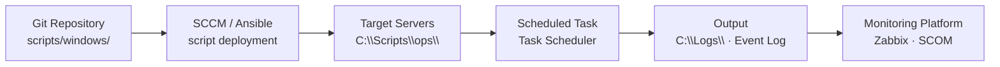

# Windows Server — Scripts

Automation scripts and reusable code.

## Script Deployment and Scheduling


┌───────────────────────────────── Windows Server — Operations Scripts ─────────────────────────────────┐
│                                                                                                       │
│  PowerShell scripts for Windows Server operations: AD, disk, patching, and health checks.             │
│                                                                                                       │
│   ┌──────────────────────────────────────────────┐  ┌─────────────────────────────────────────────┐   │
│   │            AD Management Scripts             │  │                System Scripts               │   │
│   │           New-ADUser + Set-ADUser            │  │        Get-EventLog: filtered export        │   │
│   │         Get-ADGroupMember -Recursive         │  │           Get-Disk + Get-Partition          │   │
│   │          Search-ADAccount -Inactive          │  │             Get-WindowsUpdateLog            │   │
│   │         repadmin /replsummary parse          │  │         Restart-Service, Get-Service        │   │
│   └──────────────────────────────────────────────┘  └─────────────────────────────────────────────┘   │
│                                                                                                       │
│    Scripts in version control; test in non-prod; log all changes                                      │
│                                                                                                       │
│                          ▼                                                 ▼                          │
│                                                                                                       │
│   ┌──────────────────────────────────────────────┐  ┌─────────────────────────────────────────────┐   │
│   │            Scheduled Task Scripts            │  │               Hyper-V Scripts               │   │
│   │            Register-ScheduledTask            │  │            Get-VM + Start/Stop-VM           │   │
│   │       Log to event log: Write-EventLog       │  │           Checkpoint-VM: snapshot           │   │
│   │          Error handling: try/catch           │  │          Get-VMReplication: status          │   │
│   │           Send-MailMessage: alerts           │  │           Move-VM: live migration           │   │
│   └──────────────────────────────────────────────┘  └─────────────────────────────────────────────┘   │
│                                                                                                       │
│  Physical Infrastructure (the hardware everything above runs on):                                     │
│  Domain Controllers · WSUS · Hyper-V hosts · task scheduler on managed servers                        │
│                                                                                                       │
│  Key terms:                                                                                           │
│                                                                                                       │
│  New-ADUser   = creates AD user; must set -AccountPassword -Enabled $true                             │
│  Search-ADAccount= finds inactive/locked/expired accounts in AD                                       │
│  Get-EventLog = queries Windows Event Log; use -EntryType Error to filter                             │
│  Write-EventLog= writes entry to event log; use registered event source                               │
│  Register-ScheduledTask= creates Windows scheduled task via PowerShell                                │
│  Checkpoint-VM= creates Hyper-V checkpoint (snapshot); state + disk                                   │
│  Get-VMReplication= shows Hyper-V Replica status and lag                                              │
│  Move-VM      = live migration of running VM to another host                                          │
│  try/catch    = error handling in PowerShell; $_ contains error details                               │
│  Send-MailMessage= sends email from script; SMTP relay required                                       │
│  Get-WindowsUpdateLog= converts ETW trace to readable Windows Update log                              │
│  repadmin     = AD replication tool; output parsed by PS for reporting                                │
│                                                                                                       │
└───────────────────────────────────────────────────────────────────────────────────────────────────────┘

## Disk Space Alert

Sends an alert when any drive falls below a threshold.

```powershell
<#
.SYNOPSIS
  Disk space threshold alert — email if any drive is below threshold
#>

param(
    [int]$ThresholdPct  = 15,
    [string]$SmtpServer = "smtp.internal.local",
    [string]$From       = "monitoring@internal.local",
    [string]$To         = "ops@internal.local"
)

$alerts = Get-PSDrive -PSProvider FileSystem | Where-Object {
    $total = $_.Used + $_.Free
    $total -gt 0 -and ($_.Free / $total * 100) -lt $ThresholdPct
} | ForEach-Object {
    $total  = $_.Used + $_.Free
    $pct    = [math]::Round($_.Free / $total * 100, 1)
    "$($_.Name): $([math]::Round($_.Free/1GB,1)) GB free ($pct%)"
}

if ($alerts) {
    $body = "Low disk space on $($env:COMPUTERNAME):`n`n" + ($alerts -join "`n")
    Send-MailMessage -From $From -To $To -Subject "ALERT: Disk space on $env:COMPUTERNAME" `
        -Body $body -SmtpServer $SmtpServer
}
```

## Service Monitor

Restarts stopped automatic services and logs the event.

```powershell
<#
.SYNOPSIS
  Monitors critical services and attempts restart on failure
#>

param(
    [string[]]$Services = @('W32Time', 'EventLog', 'WinRM', 'wuauserv'),
    [string]$LogPath    = "C:\Logs\ServiceMonitor.log"
)

function Write-Log {
    param([string]$Message)
    $entry = "$(Get-Date -Format 'yyyy-MM-dd HH:mm:ss') | $Message"
    Add-Content -Path $LogPath -Value $entry
    Write-Host $entry
}

foreach ($svc in $Services) {
    $s = Get-Service -Name $svc -ErrorAction SilentlyContinue
    if (-not $s) {
        Write-Log "WARNING: Service '$svc' not found on this server"
        continue
    }
    if ($s.Status -ne 'Running') {
        Write-Log "ALERT: Service '$($s.DisplayName)' is $($s.Status) — attempting restart"
        try {
            Start-Service -Name $svc -ErrorAction Stop
            Write-Log "INFO: Service '$($s.DisplayName)' restarted successfully"
        } catch {
            Write-Log "ERROR: Failed to restart '$($s.DisplayName)': $_"
        }
    } else {
        Write-Log "OK: Service '$($s.DisplayName)' is running"
    }
}
```

## Event Log Query

Extracts events matching specific IDs for incident investigation.

```powershell
<#
.SYNOPSIS
  Query event logs for specific event IDs
#>

param(
    [string]$LogName  = "System",
    [int[]]$EventIDs  = @(7034, 7036, 1001, 6008),
    [int]$HoursBack   = 72,
    [string]$Output   = "C:\Temp\EventQuery.csv"
)

$since = (Get-Date).AddHours(-$HoursBack)

Get-WinEvent -FilterHashtable @{
    LogName   = $LogName
    Id        = $EventIDs
    StartTime = $since
} -ErrorAction SilentlyContinue |
    Select-Object TimeCreated, Id, LevelDisplayName, ProviderName,
        @{N="Message"; E={ $_.Message -replace '\s+', ' ' }} |
    Export-Csv -Path $Output -NoTypeInformation
Write-Host "Exported to $Output"
```

## Patch Status Report

Reports installed and missing patches for a list of servers.

```powershell
<#
.SYNOPSIS
  Generate patch compliance report across multiple servers
#>

param(
    [string[]]$Servers  = @($env:COMPUTERNAME),
    [string]$OutputPath = "C:\Temp\PatchReport_$(Get-Date -Format yyyyMMdd).csv"
)

$results = foreach ($server in $Servers) {
    try {
        $hotfixes = Invoke-Command -ComputerName $server -ScriptBlock {
            Get-HotFix | Sort-Object InstalledOn -Descending | Select-Object -First 5
        } -ErrorAction Stop
        foreach ($hf in $hotfixes) {
            [PSCustomObject]@{
                Server      = $server
                HotFixID    = $hf.HotFixID
                InstalledOn = $hf.InstalledOn
                Description = $hf.Description
                Status      = "OK"
            }
        }
    } catch {
        [PSCustomObject]@{
            Server      = $server
            HotFixID    = "N/A"
            InstalledOn = $null
            Description = "ERROR: $_"
            Status      = "UNREACHABLE"
        }
    }
}

$results | Export-Csv -Path $OutputPath -NoTypeInformation
Write-Host "Report saved: $OutputPath"
```
