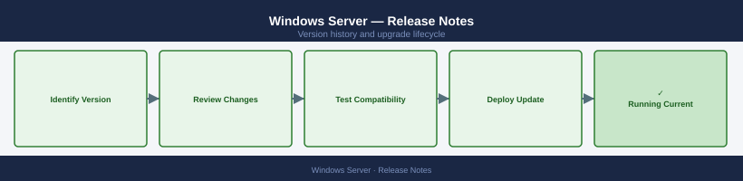

---
tags:
  - windows
---
# Windows Server — Release Notes

<div class="kb-summary">
Version history and release notes for Windows Server.
</div>



```d2
direction: right

center: "Windows Server" {shape: hexagon}
version_history: "Version History" {shape: rectangle}
key_terminology: "Key Terminology" {shape: rectangle}
upgrade_path: "Upgrade Path" {shape: rectangle}

center -> version_history
center -> key_terminology
center -> upgrade_path
```

## Version History

| Version | Released | Summary | Notes |
|---------|----------|---------|-------|
| 2025 | 2024-Q4 | Windows Server 2025 — Hotpatch GA, NVMe improvements | [Release Notes](#) |
| 2022 CU9 | 2024-Q2 | Windows Server 2022 CU9 — security patches | [Release Notes](#) |
| 2022 CU6 | 2023-Q3 | Windows Server 2022 CU6 — SMB compression improvements | [Release Notes](#) |
| 2022 GA | 2021-Q4 | Windows Server 2022 GA — Azure Arc integration | [Release Notes](#) |
| 2019 LTS | 2018-Q4 | Windows Server 2019 LTS baseline | [Release Notes](#) |

## Key Terminology

**Major Version**
: A release containing significant new features or architectural changes; may require additional planning and testing.

**Patch Release**
: A targeted fix release that addresses bugs or security issues within a major/minor version.

**EOL (End of Life)**
: Date after which the vendor no longer provides updates, security patches, or technical support.

**Upgrade Path**
: The supported sequence of versions a system must traverse to reach a target version (some versions cannot be skipped).

## Upgrade Path

Review the vendor's official upgrade documentation and compatibility matrix before beginning any version change. Validate that all dependent components (OS, drivers, integration plugins) support the target version. Perform upgrades in a staged approach: dev/test environment first, then production. Capture a snapshot or backup immediately prior to the upgrade window. After the upgrade, run post-validation health checks and confirm all services are operating normally.
