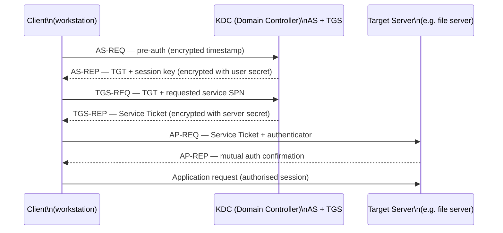

# Windows Server — Authentication


<div class="kb-summary">
Active Directory integration, Kerberos, NTLM audit, LAPS, smart card, and Credential Guard.
</div>

## Active Directory Domain Authentication

Windows Server uses Kerberos as the primary authentication protocol within an AD domain. NTLM is a legacy fallback used only when Kerberos is not available.

### Kerberos Authentication Sequence


```
┌─────────────────────────────────── Windows Server — Authentication ───────────────────────────────────┐
│                                                                                                       │
│  Authentication stack: Kerberos primary, NTLM fallback, certificate-based, MFA enforcement.           │
│                                                                                                       │
│   ┌──────────────────────────────────────────────┐  ┌─────────────────────────────────────────────┐   │
│   │           Kerberos Authentication            │  │             NTLM Authentication             │   │
│   │        Default AD protocol (port 88)         │  │          Fallback: no DC reachable          │   │
│   │            AS-REQ → AS-REP (TGT)             │  │           Challenge-response 3-way          │   │
│   │         TGS-REQ → TGS-REP (service)          │  │        Disable NTLMv1; allow v2 only        │   │
│   │        Mutual authentication built-in        │  │          Block NTLM via GPO Network         │   │
│   │         SPNs register services in AD         │  │          Monitor event 4776 for use         │   │
│   └──────────────────────────────────────────────┘  └─────────────────────────────────────────────┘   │
│                                                                                                       │
│  Kerberos preferred; NTLM restricted by GPO; both generate audit events 4624/4625.                    │
│                                                                                                       │
│                          ▼                                                 ▼                          │
│                                                                                                       │
│   ┌──────────────────────────────────────────────┐  ┌─────────────────────────────────────────────┐   │
│   │           Certificate & Smart Card           │  │           MFA & Conditional Access          │   │
│   │       PKI: Enterprise CA issues certs        │  │         Azure AD MFA per-user policy        │   │
│   │         Smart card logon: PIN + cert         │  │           Duo MFA proxy on DC/RDS           │   │
│   │          PKINIT: Kerberos via cert           │  │        Conditional access: compliant        │   │
│   │       SCEP/ACME enrollment for devices       │  │          NPS for RADIUS 802.1x auth         │   │
│   │         Autoenroll via GPO certtempl         │  │          Event 4625 lockout alerts          │   │
│   └──────────────────────────────────────────────┘  └─────────────────────────────────────────────┘   │
│                                                                                                       │
│  Physical Infrastructure (the hardware everything above runs on):                                     │
│  Domain controller servers · HSM for CA key storage · smart card readers · NPS servers                │
│                                                                                                       │
│  Key terms:                                                                                           │
│                                                                                                       │
│  Kerberos       = network auth protocol; ticket-based; default in AD domains since Win2000            │
│  TGT            = Ticket-Granting Ticket; issued by KDC AS; used to request service tickets           │
│  TGS            = Ticket-Granting Service; issues service tickets from presented TGT                  │
│  SPN            = Service Principal Name; identifies service instance for Kerberos                    │
│  NTLM           = NT LAN Manager; older challenge-response; kept for compatibility                    │
│  NTLMv2         = improved NTLM; uses HMAC-MD5; still weaker than Kerberos                            │
│  PKI            = Public Key Infrastructure; CA hierarchy issuing X.509 certificates                  │
│  PKINIT         = Kerberos extension; uses X.509 certs for initial TGT request                        │
│  NPS            = Network Policy Server; RADIUS server for 802.1x and VPN auth                        │
│  Event 4624     = successful logon audit event; includes logon type and auth package                  │
│  Event 4625     = failed logon audit event; source for lockout and brute-force alerts                 │
│  Event 4776     = NTLM authentication attempt; monitor to detect NTLM usage                           │
│  Conditional Access= Azure AD policy evaluating signals before granting resource access               │
│                                                                                                       │
└───────────────────────────────────────────────────────────────────────────────────────────────────────┘
```

REM Command-line alternative
netdom join %COMPUTERNAME% /domain:corp.local /userd:corp\administrator /passwordd:* /reboot:30
```

## Kerberos

Kerberos is the default domain authentication protocol (port 88 TCP/UDP). The Key Distribution Center (KDC) runs on each domain controller.

### Verify Kerberos Tickets

```cmd
REM View current Kerberos tickets
klist

REM Purge ticket cache and re-authenticate
klist purge
klist -li 0x3e7   # SYSTEM account tickets
```

```powershell
# Test Kerberos authentication to a specific DC
nltest /sc_verify:CORP.LOCAL

# Check KDC connectivity
Test-NetConnection -ComputerName dc01.example.local -Port 88

# View Kerberos event log errors (Event ID 4769, 4771)
Get-WinEvent -FilterHashtable @{LogName='Security'; Id=4771} -MaxEvents 20 |
  Select-Object TimeCreated, Message
```

### Kerberos Delegation

Delegation allows a service to authenticate to other services on behalf of a user. Restrict it carefully.

```powershell
# Find accounts with unconstrained delegation (high risk — should be DCs only)
Get-ADComputer -Filter {TrustedForDelegation -eq $true} -Properties TrustedForDelegation |
  Select-Object Name, TrustedForDelegation

Get-ADUser -Filter {TrustedForDelegation -eq $true} -Properties TrustedForDelegation |
  Select-Object Name

# Find accounts with constrained delegation
Get-ADComputer -Filter {msDS-AllowedToDelegateTo -ne "$null"} -Properties msDS-AllowedToDelegateTo |
  Select-Object Name, msDS-AllowedToDelegateTo
```

## NTLM — Audit and Restriction

NTLM is weaker than Kerberos and should be minimised. Audit it before blocking to avoid breaking services.

### Audit NTLM Usage

```powershell
# Enable NTLM auditing via GPO or directly in registry
# HKLM\SYSTEM\CurrentControlSet\Control\Lsa\MSV1_0
# AuditReceivingNTLMTraffic = 2 (audit all)
# AuditNTLMInDomain = 7 (audit all)

Set-ItemProperty -Path "HKLM:\SYSTEM\CurrentControlSet\Control\Lsa\MSV1_0" `
  -Name "AuditReceivingNTLMTraffic" -Value 2 -Type DWord
Set-ItemProperty -Path "HKLM:\SYSTEM\CurrentControlSet\Control\Lsa\MSV1_0" `
  -Name "AuditNTLMInDomain" -Value 7 -Type DWord

# Events appear in Applications and Services Logs > Microsoft > Windows > NTLM
Get-WinEvent -LogName "Microsoft-Windows-NTLM/Operational" -MaxEvents 50 |
  Select-Object TimeCreated, Message
```

### Restrict NTLM

GPO path: Computer Configuration > Windows Settings > Security Settings > Local Policies > Security Options

| Setting | Recommended Value |
|---|---|
| Network security: Restrict NTLM: Incoming NTLM traffic | Deny all domain accounts |
| Network security: Restrict NTLM: NTLM authentication in this domain | Deny all |
| Network security: Restrict NTLM: Outgoing NTLM traffic to remote servers | Deny all |
| Network security: LAN Manager authentication level | Send NTLMv2 response only. Refuse LM & NTLM |

```powershell
# Set LM authentication level to NTLMv2 only via registry
Set-ItemProperty -Path "HKLM:\SYSTEM\CurrentControlSet\Control\Lsa" `
  -Name "LmCompatibilityLevel" -Value 5 -Type DWord
```

## LAPS — Local Administrator Password Solution

LAPS rotates the local Administrator password on each domain-joined machine and stores it in AD. This prevents lateral movement using a shared local admin password.

### Deploy LAPS

```powershell
# On the management workstation — install LAPS tools
# Requires LAPS MSI or Windows LAPS (built into Windows Server 2019+ / Windows 11 22H2+)

# Extend the AD schema (run once as Schema Admin)
Update-LapsADSchema

# Grant computers permission to update their own password attribute
Set-LapsADComputerSelfPermission -Identity "OU=Servers,DC=corp,DC=local"

# Grant helpdesk group read access to LAPS passwords
Set-LapsADReadPasswordPermission -Identity "OU=Servers,DC=corp,DC=local" `
  -AllowedPrincipals "CORP\Helpdesk"

# Enable LAPS via GPO (Computer Configuration > Administrative Templates > LAPS)
# Or deploy via Windows LAPS settings
```

### Retrieve LAPS Password

```powershell
# Retrieve the current local admin password for a computer
Get-LapsADPassword -Identity "SERVER01" -AsPlainText

# Force immediate rotation
Reset-LapsPassword -Identity "SERVER01"

# View password expiry
Get-LapsADPassword -Identity "SERVER01" | Select-Object ComputerName, ExpirationTimestamp
```

## Smart Card / Certificate Authentication

```powershell
# Require smart card for sensitive accounts (sets flag on AD object)
Set-ADUser -Identity jsmith -SmartcardLogonRequired $true

# Verify the flag
(Get-ADUser jsmith -Properties SmartcardLogonRequired).SmartcardLogonRequired

# List all users requiring smart card
Get-ADUser -Filter {SmartcardLogonRequired -eq $true} -Properties SmartcardLogonRequired |
  Select-Object Name, SamAccountName
```

GPO: Computer Configuration > Windows Settings > Security Settings > Local Policies > Security Options
Setting: **Interactive logon: Require smart card** — set to Enabled for privileged workstations.

### Certificate Enrollment (PKI)

```powershell
# Request a certificate from the enterprise CA
certreq -enroll -machine "ServerAuthentication"

# View installed machine certificates
Get-ChildItem Cert:\LocalMachine\My | Select-Object Subject, NotAfter, Thumbprint

# Check if smart card middleware is loaded
certutil -scinfo
```

## Credential Guard

Credential Guard isolates LSA secrets (NTLM hashes, Kerberos tickets) in a Hyper-V protected container, preventing credential harvesting tools from extracting them.

### Enable Credential Guard

Requirements: UEFI Secure Boot, Hyper-V (VBS), 64-bit, Windows Server 2016+.

```powershell
# Enable via registry (persistent, requires reboot)
# LsaCfgFlags: 1 = Credential Guard with UEFI lock, 2 = Credential Guard without lock
$path = "HKLM:\SYSTEM\CurrentControlSet\Control\DeviceGuard"
New-Item -Path $path -Force
Set-ItemProperty -Path $path -Name "EnableVirtualizationBasedSecurity" -Value 1 -Type DWord
Set-ItemProperty -Path $path -Name "RequirePlatformSecurityFeatures" -Value 3 -Type DWord

$lsaPath = "HKLM:\SYSTEM\CurrentControlSet\Control\Lsa"
Set-ItemProperty -Path $lsaPath -Name "LsaCfgFlags" -Value 1 -Type DWord

# Or via GPO:
# Computer Configuration > Administrative Templates > System > Device Guard
# Setting: Turn On Virtualization Based Security > Credential Guard: Enabled with UEFI lock
```

```powershell
# Verify Credential Guard is running
Get-ComputerInfo | Select-Object -Property DeviceGuard*

# Alternative check
msinfo32  # System Summary > look for "Virtualization-based security Services Running"
```

## Service Account Authentication

```powershell
# Create a Group Managed Service Account (gMSA) — preferred over regular service accounts
# gMSA passwords are managed automatically by AD

# Create the gMSA (run on DC)
New-ADServiceAccount -Name "svc-webapp" `
  -DNSHostName "svc-webapp.example.local" `
  -PrincipalsAllowedToRetrieveManagedPassword "WebServers"   # AD computer group

# Install gMSA on the target server
Install-ADServiceAccount -Identity "svc-webapp"

# Verify installation
Test-ADServiceAccount -Identity "svc-webapp"

# Configure the service to use the gMSA
# In Services: account = corp\svc-webapp$  (note the $ suffix, no password needed)
```

## Authentication Event Monitoring

| Event ID | Description | Log |
|---|---|---|
| 4624 | Successful logon | Security |
| 4625 | Failed logon | Security |
| 4648 | Logon using explicit credentials (runas) | Security |
| 4768 | Kerberos TGT request | Security (DC) |
| 4769 | Kerberos service ticket request | Security (DC) |
| 4771 | Kerberos pre-authentication failed | Security (DC) |
| 4776 | NTLM authentication | Security |
| 4740 | Account lockout | Security |
| 4767 | Account unlocked | Security |

```powershell
# Recent failed logons
Get-WinEvent -FilterHashtable @{LogName='Security'; Id=4625} -MaxEvents 30 |
  Select-Object TimeCreated,
    @{N='User';E={$_.Properties[5].Value}},
    @{N='Workstation';E={$_.Properties[13].Value}},
    @{N='IP';E={$_.Properties[19].Value}}

# Account lockouts in the last 24 hours
Get-WinEvent -FilterHashtable @{
  LogName='Security'; Id=4740
  StartTime=(Get-Date).AddHours(-24)
} | Select-Object TimeCreated, Message
```

## Quick Reference

| Topic | Tool / Location |
|---|---|
| Kerberos tickets | `klist` |
| Domain secure channel | `Test-ComputerSecureChannel` |
| NTLM audit events | Event Viewer > Microsoft-Windows-NTLM/Operational |
| LAPS password retrieval | `Get-LapsADPassword -Identity <computername>` |
| LAPS forced rotation | `Reset-LapsPassword -Identity <computername>` |
| Smart card requirement | AD User Properties > Account > Smart card required |
| Credential Guard status | `Get-ComputerInfo | Select DeviceGuard*` |
| gMSA management | `New-ADServiceAccount`, `Install-ADServiceAccount` |
| Authentication failures | Security log, Event ID 4625 |
---

## Related Reference

- [Standard LDAP Integration](../../../../security/ldap-integration/index.md) — field reference, service account standards, TLS requirements, and connectivity testing
